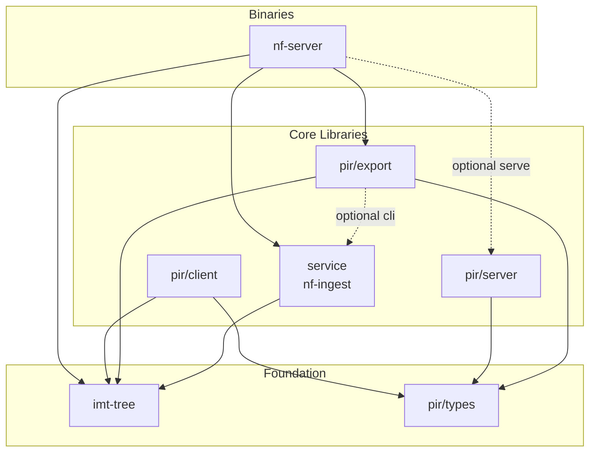

# Vote Nullifier PIR

Private Information Retrieval (PIR) system for Zcash nullifier non-membership proofs. Allows a client to prove that a nullifier does **not** exist in the on-chain nullifier set without revealing *which* nullifier it is querying — a key building block for shielded voting.

- [ZIP Specification (PR)](https://github.com/zcash/zips/pull/1198)
- [PIR Tree Specification](docs/pir-tree-spec.md)
- [PIR Parameter Selection](docs/params.md)

## Architecture

The system is organised as a Cargo workspace with eight crates split across three layers:



### Crate Descriptions

| Crate | Path | Description |
|-------|------|-------------|
| **imt-tree** | `imt-tree/` | Indexed Merkle Tree library. Builds depth-29 nullifier non-inclusion trees with Poseidon hashing, gap-range exclusion proofs, and sentinel nullifiers for circuit compatibility. |
| **pir-types** | `pir/types/` | Lightweight shared types (`YpirScenario`, `RootInfo`, `HealthInfo`) serialised over HTTP between server and client. Also contains YPIR wire-format helpers. |
| **pir-export** | `pir/export/` | Builds the depth-26 PIR tree and exports it as three binary tier files (tier0, tier1, tier2) consumed by the server and client. |
| **pir-server** | `pir/server/` | YPIR server-side logic: loads tier data, processes encrypted PIR queries, and returns encrypted responses. |
| **pir-client** | `pir/client/` | YPIR client-side logic: generates encrypted queries, decodes responses, and assembles circuit-ready `ImtProofData`. Provides an async `PirClient` API and a local in-process mode. |
| **nf-ingest** | `nf-ingest/` | Shared library for nullifier sync from lightwalletd, flat-file storage (`nullifiers.bin`), and configuration. |
| **nf-server** | `nf-server/` | Unified CLI binary with `ingest`, `export`, and `serve` subcommands. The `serve` subcommand starts the PIR HTTP server (feature-gated). |
| **pir-test** | `pir/test/` | End-to-end test harness with `small`, `local`, `server`, `compare`, and `bench` modes. |

## Pipeline

The system operates as a three-stage pipeline:

```
ingest ──> export ──> serve ──> client query
```

1. **Ingest** — Syncs nullifiers from a lightwalletd instance into `nullifiers.bin` (append-only flat file of 32-byte field elements).
2. **Export** — Builds the PIR tree from the nullifier set and writes three binary tier files (`tier0.bin`, `tier1.bin`, `tier2.bin`) plus metadata (`pir_root.json`).
3. **Serve** — Starts an HTTP server that serves tier data and answers YPIR queries. The client downloads tier 0 in plaintext, then privately retrieves tier 1 and tier 2 rows via encrypted PIR queries.

## Build & Run

Requires Rust (stable for most crates; nightly for `pir-server` with AVX-512 support).

```bash
# Build everything
cargo build --release

# Or use the Makefile for the standard pipeline:
make build          # Build nf-server binary
make bootstrap      # Download nullifier snapshot (first run)
make ingest         # Sync nullifiers from lightwalletd
make export-nf      # Build PIR tree and export tier files
make serve          # Start PIR HTTP server on port 3000

# Run tests
make test           # Unit tests for imt-tree and nf-ingest
cargo test -p pir-export  # PIR export round-trip tests
```

### Configuration

Override via environment variables or Make arguments:

| Variable | Default | Description |
|----------|---------|-------------|
| `DATA_DIR` | `.` | Directory for `nullifiers.bin`, `nullifiers.checkpoint` |
| `PIR_DATA_DIR` | `$DATA_DIR/pir-data` | Directory for tier files |
| `LWD_URL` | `https://zec.rocks:443` | Lightwalletd gRPC endpoint |
| `PORT` | `3000` | HTTP server port |
| `SYNC_HEIGHT` | chain tip | Sync up to this block height (must be a multiple of 10) |

## Deployment

See [docs/deploy-setup.md](docs/deploy-setup.md) for production deployment instructions, systemd configuration, and CI/CD workflow details.

## Storage Format

All data is stored as flat binary files:

- `nullifiers.bin` — Append-only raw 32-byte nullifier blobs
- `nullifiers.checkpoint` — 16-byte crash-recovery marker (height + byte offset, both LE u64)
- `nullifiers.index` — Height-to-offset index for subset loading
- `nullifiers.tree` — Serialised NullifierTree sidecar
- `pir-data/` — Tier files (`tier0.bin`, `tier1.bin`, `tier2.bin`, `pir_root.json`)

## PIR Write Ups

- [YPIR Security](https://x.com/akhtariev/status/2030768109196316712)
- [PIR Applications in Zcash](https://www.akhtariev.ca/blog/sync-tax)
- [Motivation for Compression/Packing](https://x.com/akhtariev/status/2030449201335705640)
- [GPU Optimizations](https://www.akhtariev.ca/blog/pir-gpu-acceleration)
