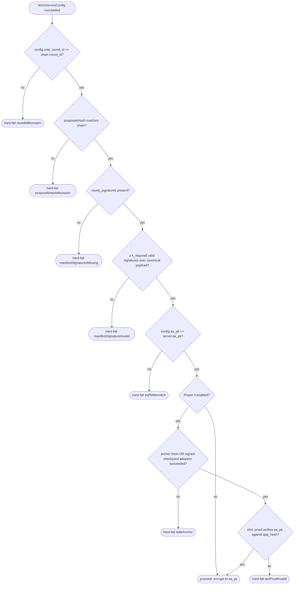

# Discovery Config & Election-Authority Key Authentication

How wallets discover vote servers and PIR endpoints, and — critically — how they
authenticate the per-round Election Authority public key (`ea_pk`) before
encrypting ballot amounts to it. The amount-privacy guarantee of the system rests
on the assumption that the `ea_pk` the wallet encrypts to is the one the chain's
TSS ceremony actually produced.

This document is the contract between three actors:

1. **Chain operators** (`vote-sdk`) — emit `ea_pk` on-chain after each round's
   ceremony.
2. **Manifest signer(s)** — operator(s) who publish off-chain attestations
   binding `(round_id, ea_pk)` and periodic chain checkpoints. See
   [runbooks/sign-round-manifest.md](runbooks/sign-round-manifest.md) and
   [runbooks/publish-checkpoint.md](runbooks/publish-checkpoint.md).
3. **Wallets** (zodl-ios, zcash-swift-wallet-sdk, third-party) — verify and
   refuse to vote when verification fails.

Two layers compose:

- **Signed round manifest** (Phase 1, this PR) — wallets check that `ea_pk` was
  attested by ≥ `k_required` independent signers whose pubkeys are baked into
  the wallet bundle. Operationally simple, ships first.
- **CometBFT light-client verification** (Phase 3, future) — wallets verify
  `ea_pk` is the value committed in chain state at `round.creation_height` via
  an IAVL proof anchored to a trusted CometBFT checkpoint. Cryptographically
  grounded; eliminates the manifest-signer single point of failure.

The two layers reinforce each other: signed checkpoints bootstrap the
light-client trust anchor, and the light-client check confirms the same
`ea_pk` the manifest signers attested to — disagreement at any layer is a
hard-fail.

## Threat model

The wallet's amount-privacy claim is: "ciphertext amounts are recoverable only
by the EA private key generated on-chain by ≥ threshold validators colluding."
That holds iff the wallet encrypts to the *correct* `ea_pk`. The threats
addressed here are about substituting a wrong `ea_pk`.

| Threat                                              | Mitigation                                                                                              |
| --------------------------------------------------- | ------------------------------------------------------------------------------------------------------- |
| Hijacked CDN returns a malicious `voting-config`    | `round_signatures[]` is verified against pubkeys baked into the wallet bundle (independent of CDN)      |
| Hijacked single vote-server RPC returns a wrong `ea_pk` | Wallet cross-checks `ea_pk` against `round_signatures` (Phase 2) and against IAVL proof (Phase 3)   |
| All vote-servers MITM'd (Kelp-style)                | Phase 3: IAVL proof against an independently-anchored CometBFT checkpoint                               |
| Manifest-signer key compromised                     | Phase 3 IAVL proof is independent of signer keys; multi-signer with `k_required ≥ 2` raises the bar     |
| Replay of a signature across forks                  | Canonical signing payload binds `valset_hash_at_round_creation_height`                                  |

**Explicit non-goal:** chain consensus failure (≥ ⅓ byzantine validators). That
is the floor of any light-client-based scheme and is accepted.

## Trust anchors (baked into the wallet bundle at build time)

```jsonc
{
  "manifest_signers": [
    {
      "id": "valarg-vote-authority",
      "alg": "ed25519",
      "pubkey": "<base64 32-byte ed25519 public key>"
    }
    // ... more signers as enrolled per runbooks/key-rotation.md
  ],
  "k_required": 1,                             // raise to 2 once a second independent signer is operational
  "trust_period_secs": 1209600,                // 14d; mirrors unbonding/2 of staking params
  "bundled_checkpoint": {                      // Phase 3 only; ignored by Phase 2 wallets
    "chain_id": "svote-1",
    "height": 0,
    "header_hash": "",
    "valset_hash": "",
    "app_hash": ""
  }
}
```

`manifest_signers`, `k_required`, and `bundled_checkpoint` change only with a
wallet release. Rotation cadence and dual-signer overlap window are documented
in [runbooks/key-rotation.md](runbooks/key-rotation.md).

## Discovery config schema

Published by the manifest publisher at
`https://valargroup.github.io/token-holder-voting-config/voting-config.json`
(GitHub Pages, see [token-holder-voting-config/README.md](../../token-holder-voting-config/README.md)).
Split into static and round-dynamic parts so a fresh round only changes the
bottom of the file.

### Static (changes ≤ once per release)

| Field                  | Type                              | Notes |
| ---------------------- | --------------------------------- | ----- |
| `config_version`       | int                               | Currently `1`. |
| `vote_servers[]`       | `[{url, label}]`                  | Chain REST + helper endpoints. |
| `pir_endpoints[]`      | `[{url, label}]`                  | Nullifier PIR endpoints. |
| `supported_versions`   | `{pir, vote_protocol, tally, vote_server}` | Versions the publisher claims are deployed. Wallet checks against `WalletCapabilities`. |

### Round-dynamic (changes once per round)

| Field             | Type             | Notes |
| ----------------- | ---------------- | ----- |
| `vote_round_id`   | hex (64 chars)   | Must match the chain's active `VoteRound.vote_round_id`. |
| `snapshot_height` | uint64           | Orchard snapshot height. |
| `vote_end_time`   | uint64           | Unix seconds. |
| `proposals[]`     | `[Proposal]`     | Must hash byte-for-byte to `VoteRound.proposals_hash`. |
| `round_signatures` | object \| null  | Phase 1+ — see below. |

### `round_signatures` schema

Optional field on `voting-config.json`. When present, wallets MUST verify it
(Phase 2 hard-fails if verification fails). When absent, Phase 2 wallets MUST
hard-fail with `manifestSignaturesMissing` — there is no silent fallback.

```jsonc
{
  "round_id": "<64 lowercase hex chars>",       // MUST equal voting-config.vote_round_id
  "ea_pk": "<base64-encoded 32-byte Pallas pubkey>",
  "valset_hash": "<64 lowercase hex chars>",     // CometBFT validator-set hash at round.creation_height
  "signed_payload_hash": "<64 lowercase hex chars>", // SHA-256 of the canonical payload below; debug aid only
  "signatures": [
    {
      "signer": "valarg-vote-authority",         // matches manifest_signers[].id
      "alg": "ed25519",
      "signature": "<base64 64-byte ed25519 signature>"
    }
  ]
}
```

**Canonical signing payload** (the bytes each signer signs over):

```
domain_sep_v1 = "shielded-vote/round-manifest/v1"

payload =
  u16_be(len(domain_sep_v1)) || domain_sep_v1 ||
  u16_be(len(chain_id))      || chain_id      ||   // "svote-1"
  u16_be(len(round_id_bytes))   || round_id_bytes      ||   // 32 bytes
  u16_be(len(ea_pk_bytes))      || ea_pk_bytes         ||   // 32 bytes (Pallas)
  u16_be(len(valset_hash_bytes))|| valset_hash_bytes        // 32 bytes
```

- `chain_id` is UTF-8 bytes.
- `round_id_bytes`, `ea_pk_bytes`, `valset_hash_bytes` are raw bytes (decode the
  hex / base64 from the JSON before signing).
- The signature is `ed25519_sign(privkey, payload)` (PureEdDSA per RFC 8032 — no
  pre-hashing). `signed_payload_hash = sha256(payload)` is included as a
  human-readable transparency aid; wallets do not have to compute it but should
  log it.

`valset_hash` binds the signature to a specific chain history. A signed
manifest from chain X cannot be replayed on a fork chain X′ unless they share
the validator set at `round.creation_height` exactly.

`k_required` distinct signers (matching by `signer` id) must each contribute a
valid signature. A duplicate `signer` id contributes only once.

## Signed checkpoint schema

Published at
`https://valargroup.github.io/token-holder-voting-config/checkpoints/latest.json`
on a 12–24h cadence. Phase 3 wallets use this to refresh their CometBFT trust
anchor without a wallet release.

```jsonc
{
  "chain_id": "svote-1",
  "height": 123456,
  "header_hash": "<64 lowercase hex chars>",
  "valset_hash": "<64 lowercase hex chars>",
  "app_hash":    "<64 lowercase hex chars>",
  "issued_at":   1730000000,
  "signatures": [
    {
      "signer": "valarg-vote-authority",
      "alg": "ed25519",
      "signature": "<base64>"
    }
  ]
}
```

**Canonical signing payload:**

```
domain_sep_ckpt_v1 = "shielded-vote/checkpoint/v1"

payload =
  u16_be(len(domain_sep_ckpt_v1)) || domain_sep_ckpt_v1 ||
  u16_be(len(chain_id))           || chain_id           ||
  u64_be(height)                                        ||
  u16_be(len(header_hash_bytes))  || header_hash_bytes  ||
  u16_be(len(valset_hash_bytes))  || valset_hash_bytes  ||
  u16_be(len(app_hash_bytes))     || app_hash_bytes     ||
  u64_be(issued_at)
```

A checkpoint is **valid** for the wallet iff:

1. `chain_id` matches the wallet's compiled-in chain id.
2. ≥ `k_required` distinct signers in `manifest_signers` produced a valid
   `ed25519` signature over the canonical payload.
3. `now() - issued_at ≤ trust_period_secs`. Stale checkpoints are not adopted.

A historical archive lives under `checkpoints/<height>.json`; the rolling
pointer is `checkpoints/latest.json`.

## Wallet verification decision tree



### Phase 2 wallet pseudocode

```swift
let cfg = try await fetchServiceConfig()        // CDN or local override
try cfg.validate()                              // version check
let session = try await fetchActiveSession()    // chain REST

// Existing checks (already in zodl-ios today).
guard cfg.voteRoundId == session.voteRoundId.hex else { throw .roundIdMismatch }
guard computeProposalsHash(cfg.proposals) == session.proposalsHash else { throw .proposalsHashMismatch }

// New in Phase 2.
guard let sigs = cfg.roundSignatures else { throw .manifestSignaturesMissing }
guard sigs.roundId == cfg.voteRoundId else { throw .manifestRoundIdMismatch }
let payload = canonicalRoundManifestPayload(
    chainId: WalletConstants.chainId,
    roundId: sigs.roundId,
    eaPK: sigs.eaPK,
    valsetHash: sigs.valsetHash
)
let validSigners = sigs.signatures.filter { sig in
    guard let signer = ManifestTrustAnchor.signers[sig.signer] else { return false }
    return signer.verify(message: payload, signature: sig.signature)
}
let distinctSignerIds = Set(validSigners.map(\.signer))
guard distinctSignerIds.count >= ManifestTrustAnchor.kRequired else { throw .manifestSignatureInvalid }

// Cross-check: server's ea_pk MUST equal the attested ea_pk byte-for-byte.
guard sigs.eaPK == session.eaPK else { throw .eaPkMismatch }
```

### Phase 3 extension (sketch)

After the Phase 2 checks succeed, the wallet additionally runs:

```
1. Refresh trust anchor:
   - If currentAnchor.lastUpdated > now - trust_period_secs, reuse it.
   - Else: fetch checkpoints/latest.json, verify k_required sigs, cross-check
     header_hash via 2+ independent RPCs at the same height; adopt if
     consistent. On disagreement: hard-fail staleAnchor.
2. From currentAnchor.height, skip-verify forward to round.creation_height
   using CometBFT's bisection algorithm (`light/verifier`). Limited to
   `trust_period_secs` of the anchor.
3. ABCI-Query the IAVL proof for `CeremonyState.ea_pk` (or `VoteRound.ea_pk`)
   at the round-creation height. Verify the proof against the verified
   `app_hash`.
4. Compare the proven `ea_pk` to `sigs.eaPK` and `session.eaPK`. All three MUST
   agree.
```

## Hard-fail UX requirements

For the privacy claim to hold, every "verification failed" branch in the tree
above MUST:

- **Block** the user from submitting the vote — no "continue anyway" button, no
  warning-only mode, no skippable sheet.
- Show an actionable message: "could not authenticate this round — please
  update the wallet" or "wait for fresh checkpoint" depending on the failure
  class.
- Log enough context (failure class, expected vs got hashes) for an operator
  to diagnose offline.
- Recovery is **only** via wallet update or republished CDN/checkpoint —
  never by the user dismissing the error.

## Versioning & forward-compat

- Bumping `manifest_signers` or `k_required` is a wallet release, not a CDN
  push — these are the trust roots.
- `round_signatures` and `checkpoints/latest.json` carry no schema-version
  field; new fields are added with backward-compatible JSON additive changes
  only. A breaking change requires a new domain separator (`/v2`).
- The `domain_sep` strings (`shielded-vote/round-manifest/v1`,
  `shielded-vote/checkpoint/v1`) are the schema-version tag — never sign two
  different payloads under the same string.

## See also

- [runbooks/sign-round-manifest.md](runbooks/sign-round-manifest.md) — how the
  round-signing operator constructs and signs the canonical payload.
- [runbooks/publish-checkpoint.md](runbooks/publish-checkpoint.md) — checkpoint
  publisher (cron / GitHub Action).
- [runbooks/key-rotation.md](runbooks/key-rotation.md) — multi-signer
  enrollment and signer-key rotation.
- [token-holder-voting-config/README.md](../../token-holder-voting-config/README.md)
  — CDN format and operator workflow.
- [vote-sdk/cmd/manifest-signer/](../cmd/manifest-signer/) — reference Go CLI.
