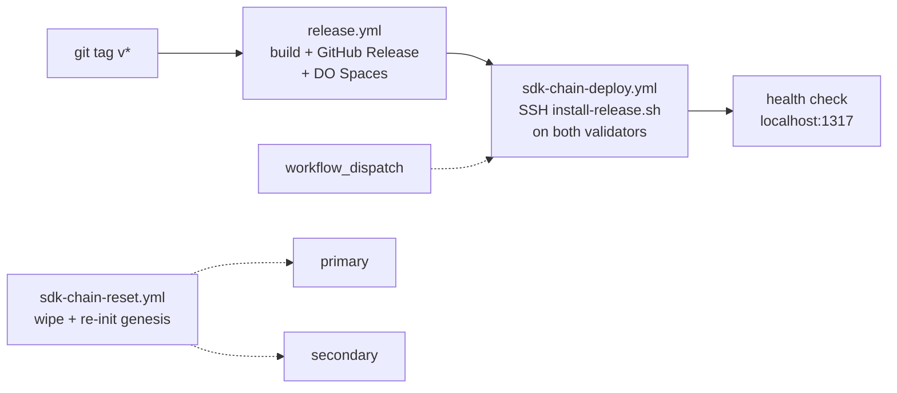

# Deploy setup for svoted

This guide covers the production two-host deployment and the dev single-host
three-validator setup.

- **Production**: Two DigitalOcean Droplets (primary + secondary), each running
  one validator. Infrastructure managed by [vote-infrastructure](https://github.com/valargroup/vote-infrastructure).
  See also [production-setup.md](production-setup.md) for bootstrap and manual operations.
- **Dev / staging**: Three validators on a single host with non-overlapping
  ports, for local development and CI testing.

---

## CI/CD workflows



| Workflow | Trigger | What it does |
|----------|---------|-------------|
| [`release.yml`](https://github.com/valargroup/vote-sdk/blob/main/.github/workflows/release.yml) | `v*` tag push | Builds `svoted` + admin UI for linux/darwin x amd64/arm64. Creates a GitHub Release with tarballs, uploads to DO Spaces (`s3://vote/`). |
| [`sdk-chain-deploy.yml`](https://github.com/valargroup/vote-sdk/blob/main/.github/workflows/sdk-chain-deploy.yml) | Manual `workflow_dispatch` | SSHes to both production hosts, runs `install-release.sh --tag <tag>` (download from Spaces, verify checksum, swap symlink, restart `svoted`), polls `localhost:1317` until healthy. Notifies Slack on failure. |
| [`sdk-chain-reset.yml`](https://github.com/valargroup/vote-sdk/blob/main/.github/workflows/sdk-chain-reset.yml) | Manual `workflow_dispatch` | Full chain reset from genesis. Wipes state on primary, runs `init.sh`, uploads genesis to DO Spaces, funds secondary from the vote-manager, joins secondary via `reset-join.sh`, verifies both hosts. |

### GitHub repository secrets

| Secret | Used by | Description |
|--------|---------|-------------|
| `PRIMARY_HOST` | deploy, reset | Hostname or IP of the primary validator. |
| `SECONDARY_HOST` | deploy, reset | Hostname or IP of the secondary validator. |
| `DEPLOY_USER` | deploy, reset | SSH username on both hosts. |
| `SSH_PRIVATE_KEY` | deploy, reset | SSH private key for authentication. |
| `VM_PRIVKEY` | reset | 64-char hex secp256k1 private key for the vote-manager account. |
| `PRIMARY_VAL_PRIVKEY` | reset | 64-char hex private key for the primary validator. |
| `SECONDARY_VAL_PRIVKEY` | reset | 64-char hex private key for the secondary validator. |
| `DOMAIN` | reset | Base domain (e.g. `valargroup.org`). |
| `DO_ACCESS_KEY` | release, reset | DigitalOcean Spaces access key. |
| `DO_SECRET_KEY` | release, reset | DigitalOcean Spaces secret key. |
| `SLACK_WEBHOOK_URL` | deploy, reset | Slack incoming webhook for failure notifications. |

---

## Production layout

Two hosts, each running a single `svoted` process under systemd with Caddy for
TLS termination. Infrastructure is provisioned by Terraform in
[vote-infrastructure](https://github.com/valargroup/vote-infrastructure).

```
/opt/shielded-vote/
  current -> releases/v1.2.3     # symlink, swapped atomically
  releases/
    v1.2.3/
      bin/svoted
      ui/dist/                   # admin UI (primary only)
  .svoted/                       # chain data (on block volume)
  install-release.sh
```

| Host | Systemd unit | REST API | Caddy hostnames |
|------|-------------|----------|-----------------|
| vote-primary | `svoted.service` + `primary.conf` override | `:1317` | `vote-chain-primary.<domain>`, `svote.<domain>`, `vote-rpc-primary.<domain>` |
| vote-secondary | `svoted.service` | `:1317` | `vote-chain-secondary.<domain>` |

The primary override adds `--serve-ui --ui-dist /opt/shielded-vote/current/ui/dist`
to serve the admin UI. The secondary runs the chain only.

See [production-setup.md](production-setup.md) for first-time bootstrap, manual
operations, and failover runbook.

---

## Dev single-host setup (3 validators)

For local development and CI testing, three validators run on the same host with
non-overlapping port sets.

### Port layout

| Validator | P2P   | RPC   | REST API | pprof |
|-----------|-------|-------|----------|-------|
| val1      | 26156 | 26157 | 1418     | 6160  |
| val2      | 26256 | 26257 | 1518     | 6260  |
| val3      | 26356 | 26357 | 1618     | 6360  |

Val1 is the genesis validator and primary API endpoint. Val2 and val3 join after
chain start via `MsgCreateValidatorWithPallasKey`.

### Systemd units

Unit files in `docs/svoted-val{1,2,3}.service`:

| Unit | Home directory | Notes |
|------|---------------|-------|
| svoted-val1 | `/opt/shielded-vote/.svoted-val1` | `--serve-ui --ui-dist /opt/shielded-vote/ui/dist` |
| svoted-val2 | `/opt/shielded-vote/.svoted-val2` | |
| svoted-val3 | `/opt/shielded-vote/.svoted-val3` | |

Install:

```bash
sudo cp docs/svoted-val{1,2,3}.service /etc/systemd/system/
sudo systemctl daemon-reload
sudo systemctl enable svoted-val1 svoted-val2 svoted-val3
```

No pre-existing chain data is needed -- `init_multi.sh --ci` initializes
everything.

### Caddy reverse proxy

Caddy proxies HTTPS traffic to val1's REST API (port 1418), which also serves
the admin UI:

```bash
sudo cp deploy/Caddyfile /etc/caddy/Caddyfile
sudo systemctl restart caddy
```

---

## Helper server configuration

The helper server runs inside `svoted` on **val1 / primary only** and shares
the REST API port. It is configured in `app.toml` under `[helper]` (written by
`init_multi.sh --ci` in dev, or `init.sh` in production):

| Key | Default | Description |
|-----|---------|-------------|
| `disable` | `false` | Set to `true` to disable the helper server entirely. |
| `api_token` | `""` | Optional token for `POST /shielded-vote/v1/shares` (`X-Helper-Token` header). |
| `db_path` | `""` | Path to SQLite database. Empty = `$HOME/helper.db`. |
| `process_interval` | `5` | How often to check for ready shares (seconds). |
| `chain_api_port` | `1418` | Port of the REST API (for `MsgRevealShare` submission). In production this is `1317`. |
| `max_concurrent_proofs` | `2` | Maximum parallel proof generation goroutines (~500 MB RAM each). |

## Admin UI

The admin UI is a React SPA (Vite + TypeScript) in `ui/`. It is served
in-process by `svoted` via the `--serve-ui --ui-dist` flags. In production,
Caddy reverse-proxies it at `https://svote.<domain>/`.

The UI uses same-origin relative paths for all API calls (`/cosmos/...`,
`/shielded-vote/...`, `/api/...`), so it works without hardcoded server URLs.
A `[ui]` section in `app.toml` (`enable`, `dist_path`) exists but is superseded
by the CLI flags on the systemd unit.

To build and test locally:

```bash
make start-admin   # builds UI then starts svoted with --serve-ui
```

## Admin server configuration

The admin server is a thin proxy that fetches the
[voting-config JSON](https://valargroup.github.io/token-holder-voting-config/voting-config.json)
from the GitHub Pages CDN. Server registration, approval, and removal happen via
PRs on the [token-holder-voting-config](https://github.com/valargroup/token-holder-voting-config)
repo -- no write endpoints here.

It runs inside `svoted` on **val1 / primary only** and shares the REST API
port. It is configured in `app.toml` under `[admin]`:

| Key | Default | Description |
|-----|---------|-------------|
| `disable` | `true` | Set to `false` to enable the config proxy. |
| `config_url` | (CDN) | GitHub Pages CDN URL for the voting-config JSON. |

A single read-only endpoint is served: `GET /api/voting-config`.

## Health checks

After services are started, CI verifies:

1. Systemd services are active
2. Chain REST API responds at `/shielded-vote/v1/rounds`
3. Helper server responds at `/shielded-vote/v1/status`
4. Admin UI responds at `/` (contains `<div id="root">`)
5. Admin API responds at `/api/voting-config`

## Checking logs

```bash
# Production (single validator per host)
journalctl -u svoted -f
journalctl -u caddy -f

# Dev (3 validators on one host)
journalctl -u svoted-val1 -f
journalctl -u svoted-val2 -f
journalctl -u svoted-val3 -f
```

## PIR server (nf-server)

The `nf-server` binary from [vote-nullifier-pir](https://github.com/valargroup/vote-nullifier-pir)
runs as a separate service (not embedded in `svoted`). See that repo's
[deploy-setup.md](https://github.com/valargroup/vote-nullifier-pir/blob/main/docs/deploy-setup.md)
for build, data bootstrap, and systemd setup.

In production, the PIR servers run on dedicated hosts (`pir-primary.<domain>`,
`pir-backup.<domain>`) managed by [vote-infrastructure](https://github.com/valargroup/vote-infrastructure).

In the dev single-host setup, `nf-server` listens on `localhost:3000` and
`svoted` communicates with it via `SVOTE_PIR_URL=http://localhost:3000` (set in
the val1 systemd unit).
