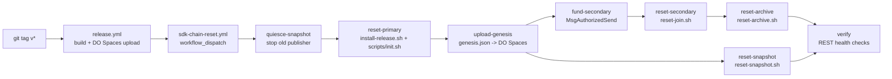

# Genesis primary bootstrap

This document covers how the **genesis validator** (`vote-primary`) is brought up. In production we bootstrap from CI against a Terraform-provisioned droplet — the manual steps that used to live here are no longer the canonical path. The same `scripts/init.sh` that CI runs is also the local-dev entrypoint, so the [Local single-host bootstrap](#local-single-host-bootstrap) at the bottom is a thin wrapper around it.

For joining additional validators to an already-running chain, see [join-chain.md](join-chain.md). For the running fleet's day-to-day operations, see [production-setup.md](../production-setup.md) and [deploy-setup.md](../deploy-setup.md).

## Production (CI + Terraform)



### Where the primary lives

The primary is one DigitalOcean droplet (`vote-primary`, `s-4vcpu-16gb-amd`) defined in [vote-infrastructure/digitalocean.tf](../../../vote-infrastructure/digitalocean.tf). Its first-boot configuration lives in [cloud-init/primary.yaml](../../../vote-infrastructure/cloud-init/primary.yaml) and installs:

- **Caddy** (apt, from Cloudsmith) terminating TLS for `svote.<domain>`, `vote-chain-primary.<domain>`, and `vote-rpc-primary.<domain>` (Caddyfile + DNS records in [vote-infrastructure/](../../../vote-infrastructure/)).
- **`/etc/systemd/system/svoted.service`** with the primary drop-in `svoted.service.d/primary.conf`, which appends `--serve-ui --ui-dist /opt/shielded-vote/current/ui/dist` so this host serves the admin UI in-process.
- **`/etc/default/svoted`** with `SVOTE_PIR_URL=https://pir.<domain>` (PIR runs on the dedicated `vote-nullifier-pir-{primary,backup}` droplets, not co-located).
- **[install-release.sh](../../../vote-infrastructure/scripts/install-release.sh)** under `/opt/shielded-vote/`. The release tarball is unpacked to `/opt/shielded-vote/releases/<tag>/` and `/opt/shielded-vote/current` is an atomically-swapped symlink. Chain state lives on a block volume bind-mounted to `/opt/shielded-vote/.svoted/`.

After `terraform apply`, the droplet is up and `svoted` is installed but the chain is not yet initialized — there is no `genesis.json`. The chain bootstrap is a separate step, driven by CI.

### Bootstrap flow

The single workflow [`sdk-chain-reset.yml`](../../.github/workflows/sdk-chain-reset.yml) (`workflow_dispatch`, takes a `tag` input) brings the entire fleet up from genesis:

1. **`quiesce-snapshot`** — SSHes to `SNAPSHOT_HOST`, stops and disables `snapshot.timer`, stops any running `snapshot.service`, and stops old snapshot-node `svoted` before primary chain state changes.
2. **`reset-primary`** — SSHes to `PRIMARY_HOST`, runs `install-release.sh --tag <tag>`, stops `svoted`, wipes `/opt/shielded-vote/.svoted/`, then runs [`scripts/init.sh`](../../scripts/init.sh) with `VAL_PRIVKEY=PRIMARY_VAL_PRIVKEY`, `VM_PRIVKEYS`, and `SVOTE_ADMIN_DISABLE=false`. Drops in `svoted.service.d/primary.conf`, starts `svoted`, polls `localhost:1317/shielded-vote/v1/rounds`.
3. **`upload-genesis`** — fetches `genesis.json` from `localhost:1317/shielded-vote/v1/genesis` on the primary, uploads it to `s3://vote/genesis.json` (DO Spaces, `https://vote.fra1.digitaloceanspaces.com/genesis.json`), and clears `s3://vote/snapshots/svote-1/` so joiners cannot restore a pre-reset snapshot. This is the canonical source joining nodes pull from.
4. **`fund-secondary`** — derives the secondary's address from `SECONDARY_VAL_PRIVKEY` (in a temp keyring) and `MsgAuthorizedSend`s 100M usvote from `vote-manager-1`.
5. **`reset-snapshot`** — SSHes to `SNAPSHOT_HOST`, installs the same tag, runs [`scripts/reset-snapshot.sh`](../../scripts/reset-snapshot.sh) to bring up a pruned non-validator node, then enables `snapshot.timer`.
6. **`reset-secondary`** — SSHes to `SECONDARY_HOST`, installs the same tag, runs [`scripts/reset-join.sh`](../../scripts/reset-join.sh) (downloads genesis from Spaces, discovers the primary's P2P NodeID via REST, syncs, calls `create-val-tx` to register).
7. **`reset-archive`** — SSHes to `EXPLORER_HOST`, runs [`scripts/reset-archive.sh`](../../scripts/reset-archive.sh) to bring up a non-validator archive node (pruning=nothing) for the explorer.

Then `verify` polls all REST endpoints. On any failure the `notify-slack` job fires.

### Required GitHub secrets

`PRIMARY_HOST`, `SECONDARY_HOST`, `EXPLORER_HOST`, `SNAPSHOT_HOST`, `DEPLOY_USER`, `SSH_PRIVATE_KEY`, `VM_PRIVKEYS`, `PRIMARY_VAL_PRIVKEY`, `SECONDARY_VAL_PRIVKEY`, `DOMAIN`, `DO_ACCESS_KEY`, `DO_SECRET_KEY`, `SENTRY_DSN`, `SLACK_WEBHOOK_URL`. Full descriptions in [deploy-setup.md § GitHub repository secrets](../deploy-setup.md#github-repository-secrets).

`VM_PRIVKEYS` is a comma-separated list of 64-char hex secp256k1 private keys; each derived address becomes a member of the any-of-N vote-manager set at genesis and the 1B usvote stake pool is split evenly across them. Generate one with `openssl rand -hex 32`.

`SNAPSHOT_HOST` is required for every reset. A chain reset invalidates old
snapshot node state, so `sdk-chain-reset.yml` always reinitializes
`vote-snapshot` from the newly uploaded genesis.

### First-time bring-up

1. `cd vote-infrastructure && terraform apply` — provisions the validators, PIR hosts, explorer/archive host, snapshot host, Cloudflare DNS, and firewalls.
2. Set the GitHub secrets above (the `*_VAL_PRIVKEY` values are the deterministic identities the workflow expects to find on the corresponding droplets).
3. Trigger the **Reset SDK Chain** workflow with the desired release tag (the tag must already be published by [`release.yml`](../../.github/workflows/release.yml) — `validate-tag` HEAD-checks DO Spaces and aborts otherwise).
4. After the workflow goes green, sanity-check:
   - `https://vote-chain-primary.<domain>/shielded-vote/v1/rounds` returns `200`
   - `https://svote.<domain>/` serves the admin UI
   - `https://vote-chain-secondary.<domain>/shielded-vote/v1/rounds` returns `200`
   - `https://explorer-api.<domain>/cosmos/base/tendermint/v1beta1/blocks/latest` returns `200`
   - `https://snapshots.<domain>/` serves the snapshot page

To wipe and reset the chain from genesis later (e.g. on a binary upgrade that breaks state compatibility), re-run the same workflow. For binary swaps that preserve state, use [`sdk-chain-deploy.yml`](../../.github/workflows/sdk-chain-deploy.yml) instead — it installs the new tag across the primary, secondary, explorer/archive, and snapshot hosts, restarting `svoted` where chain state is already initialized.

### What `scripts/init.sh` does

The same script runs in CI and locally. It wipes `$SVOTED_HOME` (preserving `nullifiers/`), runs `svoted init`, imports `validator` from `VAL_PRIVKEY` (or generates it if unset), imports each `vote-manager-N` from `VM_PRIVKEYS`, allocates 10M usvote to the validator and splits 1B usvote evenly across the vote managers, runs `gentx` for the validator's self-delegation, patches `app_state.vote.vote_manager_addresses` and zeros out the slashing fractions in genesis, then patches `app.toml` to enable the REST API on `:1317` with CORS, the gRPC ports off the Cosmos defaults (Cursor Remote-SSH conflicts with `9090`/`9091`), and writes `[helper]` / `[ui]` sections. It also generates the host's Pallas keypair (`pallas.sk`/`pallas.pk`); the per-round EA key is generated automatically by the auto-deal path during ceremony.

## EA key ceremony

The EA key ceremony runs **automatically per voting round** — when a round is created, eligible validators (bonded + registered Pallas key) are snapshotted and the block proposer auto-deals + auto-acks via `PrepareProposal`. There is no manual ceremony step. The primary's Pallas key is registered atomically when CI runs `init.sh` (inside the `gentx` self-delegation); subsequent validators register theirs via `MsgCreateValidatorWithPallasKey` during their join.

To create the first voting round, an operator opens the admin UI at `https://svote.<domain>/`, goes to **Rounds**, and uses **Create round**. See [tss-ceremony.md](../tss-ceremony.md) for the protocol details.

## Local single-host bootstrap

For local development, the same `init.sh` runs via mise. Provide a `VM_PRIVKEYS` value in `.env` (one hex key for single-vote-manager dev) and let the script generate a fresh validator key:

```bash
cp .env.example .env
echo "VM_PRIVKEYS=$(openssl rand -hex 32)" >> .env

mise install                  # toolchain (Go, Rust, Node)
mise run install              # build svoted + create-val-tx into $GOBIN
mise run chain:init           # wraps scripts/init.sh against ~/.svoted
mise run chain:start          # foreground; sets SVOTE_PIR_URL=http://localhost:3000
```

The single-host devnet binds REST on `0.0.0.0:1317`, RPC on `127.0.0.1:26657`, P2P on `0.0.0.0:26656`. Never commit `.env` — in CI the same value is provided via the `VM_PRIVKEYS` secret. For a 3-validator local devnet (val1+val2+val3 on one host with non-overlapping ports), use `mise run chain:init-multi` + `mise run chain:start-multi` and see [deploy-setup.md § Dev single-host setup](../deploy-setup.md#dev-single-host-setup-3-validators).

If you want PIR locally, run `nf-server` on `localhost:3000` per [vote-nullifier-pir](https://github.com/valargroup/vote-nullifier-pir) — `mise run chain:start` defaults `SVOTE_PIR_URL` there.

## See also

- [production-setup.md](../production-setup.md) — production layout, manual operations, failover runbook.
- [deploy-setup.md](../deploy-setup.md) — CI/CD workflow reference, GitHub secrets, helper/admin/UI configuration.
- [join-chain.md](join-chain.md) — joining the live chain as an additional validator (uses `join.sh`, not `init.sh`).
- [vote-infrastructure/README.md](https://github.com/valargroup/vote-infrastructure) — Terraform layout for droplets, DNS, and firewalls.
