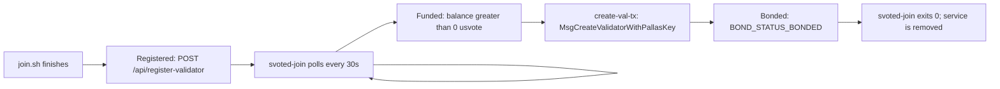

# Runbook: Join the Chain as a Validator

## Overview

Shielded-Vote is a Cosmos SDK application chain for private on-chain voting. The chain launches with a single genesis validator. Everyone else joins post-genesis via a custom message `MsgCreateValidatorWithPallasKey`, which atomically creates the validator *and* registers its Pallas key for the EA-key ceremony. See the [protocol README](../../README.md#protocol-documentation) for the full rules.

This runbook covers the operator side: standing up an `svoted` host that syncs with the live chain, reaches bonded status, and exposes a TLS-fronted REST API that iOS clients and peers can reach. A validator is a single `svoted` process plus a `svoted-join` bonding loop and a Caddy reverse proxy on the same host.

**Scope:**

- Joining the live `svote-1` chain — continue here.
- Bootstrapping the first (genesis) validator and building `genesis.json` from scratch — see [genesis-setup.md](genesis-setup.md). Intentionally out of scope here.
- Local development from a source checkout see [CONTRIBUTING.md](../../CONTRIBUTING.md).
- Custom layouts, non-Linux platforms, or auditing what `join.sh` does — see [Reference > Manual install](#manual-install-no-joinsh).

## Prerequisites

**Production target: `linux-amd64` with 2 vCPU, 8 GB RAM, and at least 50 GB SSD.**

Why these numbers:

- 2 vCPU is enough to verify incoming ZKPs and participate in ceremony/tally proposer injection without starving the CometBFT consensus thread.
- 8 GB RAM covers the helper server's concurrent proof generation (`max_concurrent_proofs = 2`, ~500 MB each) plus the chain's working set with headroom.
- 50 GB SSD holds the growing block store and the helper's SQLite database.

### Platform support

- **`linux-amd64`** — recommended production target.
- **`linux-arm64`** — supported but not recommended; useful for ARM VMs (Hetzner, Oracle Ampere). Similar performance profile to amd64 for this workload.
- **`darwin-arm64`** — recommended for local dev on Apple Silicon. Uses `launchd` instead of `systemd`.
- **`darwin-amd64`** — dev-only. Discouraged for production.

`join.sh` auto-detects the platform via `uname -s` + `uname -m`; anything outside the matrix above exits with an error.

### Hostname and TLS

`svoted` speaks plaintext HTTP on `:1317`; clients reach it over TLS via Caddy on the same host. Pick one before running the installer:

- `--domain val.example.org` or `SVOTE_DOMAIN=val.example.org` — use a real DNS name. Recommended for production operators.
- No domain set — `join.sh` auto-detects the public IP via `ifconfig.me` and uses `<ip-with-dashes>.sslip.io` (e.g. `46-101-255-48.sslip.io`). Fine for smoke-testing and short-lived deployments; not recommended for long-term production.
- `SVOTE_SKIP_CADDY=1` — skip Caddy entirely. Use this in Docker/CI or when TLS is terminated upstream (another proxy or a managed load balancer). If skipped, `VALIDATOR_URL` is empty, so the admin registration step is also skipped and the helper heartbeat is disabled.

See [TLS / reverse proxy](#tls--reverse-proxy) for the Caddy layout `join.sh` installs.

### Network requirements

`join.sh` and the running validator need the following network access:

| Direction | Destination | Purpose |
|-----------|-------------|---------|
| Outbound 443 | `vote.fra1.digitaloceanspaces.com` | `version.txt`, `svoted` + `create-val-tx` tarballs (`binaries/vote-sdk/…`), `genesis.json`, `join-loop.sh` fallback |
| Outbound 443 | `valargroup.github.io` | [`token-holder-voting-config/voting-config.json`](https://github.com/valargroup/token-holder-voting-config) — canonical seed-peer discovery (same payload wallets fetch). Override via `VOTING_CONFIG_URL` for staging mirrors. |
| Outbound 443 | `vote-chain-primary.valargroup.org` | `POST /api/register-validator` (join queue) and `POST /api/server-heartbeat` (helper liveness). Override via `SVOTE_ADMIN_URL` / `DEFAULT_ADMIN_API_BASE`. |
| Outbound 443 | `<first vote_servers[].url>` | `/cosmos/base/tendermint/v1beta1/node_info` (P2P seed) |
| Outbound 443 | `ifconfig.me` | Public-IP auto-detection (only when neither `--domain` nor `SVOTE_DOMAIN` is set) |
| Outbound 443 | `dl.cloudsmith.io`, Let's Encrypt | Caddy apt-repo install + ACME certificate issuance |
| Outbound TCP 26656 | Seed validator's P2P | CometBFT peer handshake + gossip |
| Inbound TCP 26656 | Public | CometBFT P2P — **must be reachable**; open it in your firewall/security group. Peers cannot connect if this is blocked |
| Inbound TCP 80 + 443 | Public | Caddy (HTTPS reverse proxy for the REST API, used by iOS clients and admin UI). 80 is required for Let's Encrypt HTTP-01 challenges |
| Local only | `127.0.0.1:1317` (REST), `127.0.0.1:26657` (RPC), `127.0.0.1:6060` (pprof) | Do not expose directly; Caddy proxies `1317` over TLS |

If the validator will answer PIR queries itself, also open inbound 443 for the `nf-server` routes — see [vote-nullifier-pir's server-setup runbook](https://github.com/valargroup/vote-nullifier-pir/blob/main/docs/runbooks/server-setup.md).

## Quick start

On Linux or macOS, run:

```bash
curl -fsSL https://vote.fra1.digitaloceanspaces.com/join.sh | bash
```

If you have a real DNS name pointed at this host, skip the auto-detected `sslip.io` hostname with `--domain`:

```bash
curl -fsSL https://vote.fra1.digitaloceanspaces.com/join.sh | bash -s -- --domain val.example.org
```

**NOTE: Most users should use this one-line command to get started and not install anything manually**

The installer prompts for a validator moniker unless `SVOTE_MONIKER` is set. See [Join lifecycle](#join-lifecycle) for the timeline from install to bonded, [Operating the service](#operating-the-service) for what gets installed on the host, and [Reference > Manual install](#manual-install-no-joinsh) for the equivalent manual steps.

After install, operate the service with:

```bash
# Linux
systemctl status svoted svoted-join
journalctl -u svoted -f
journalctl -u svoted-join -f

# macOS
launchctl print gui/$(id -u)/com.shielded-vote.validator
tail -f ~/.svoted/node.log
tail -f ~/.svoted/join.log
```

See [Smoke test](#smoke-test) for a post-install check.

## Join lifecycle

From install to bonded, the validator moves through three states: **registered** (pending), **funded** (balance > 0), **bonded** (part of the validator set).



The loop in [scripts/join-loop.sh](../../scripts/join-loop.sh) runs until it observes bonded status, then removes the temporary join service. The temporary service exists only to monitor for funding and submit the validator creation tx; funding acts as the vote-manager approval step.

On each iteration:

1. **Re-register.** Build `{operator_address, url, moniker, timestamp}`, sign it with `svoted sign-arbitrary --from validator --keyring-backend test`, POST to `${SVOTE_ADMIN_URL}/api/register-validator`. Idempotent — the admin stores one row per operator, updating URL/moniker on later POSTs. If the response reports `status=bonded`, exit 0 immediately.
2. **Check bonded.** `svoted query staking validators` filtered by moniker; if `BOND_STATUS_BONDED`, exit 0 and remove the join service.
3. **If not bonded, check balance.** `svoted query bank balances $VALIDATOR_ADDR`. If there is any `usvote` balance, run:
   ```bash
   create-val-tx --moniker "$MONIKER" --amount 10000000usvote --home "$SVOTE_HOME" --rpc-url tcp://localhost:26657
   ```
   `create-val-tx` signs `MsgCreateValidatorWithPallasKey` - the **only** message type that can create a validator post-genesis.
4. **Sleep 30 s** and loop.

The loop is deliberately quiet. It only writes a few kinds of lines to `join.log`:

1. `join-loop starting (moniker=...)` — once at startup.
2. `balance=<amount> usvote — attempting create-val-tx` — once funding is detected.
3. `register-validator returned bonded - exiting 0` or `validator is bonded - exiting 0` — right before exit 0 when bonded.
4. `removing launchd join service ...` — macOS only, before the plist is removed.

A healthy unfunded validator produces **only** the startup line.

Funding happens off-loop: an existing vote manager (any member of the any-of-N vote-manager set) observes the pending registration in the [admin UI](https://svote.valargroup.org/validator-join) and authorized the validator to join.

**Operator checklist while waiting:**

- Confirm the loop is alive with `systemctl is-active svoted-join` (or `pgrep -f join-loop.sh` on macOS).
- Verify the admin UI at the admin host's public URL (`${SVOTE_ADMIN_URL}/`) shows your moniker and operator address in the **Validators → Join queue** list. `last_seen_at` should advance by ~30 s each iteration (`curl "${SVOTE_ADMIN_URL%/}/api/pending-validators" | jq`).
- After bonding, open a PR against [token-holder-voting-config](https://github.com/valargroup/token-holder-voting-config) to add your URL to `vote_servers[]` so iOS clients discover you. The suggested JSON entry is printed on the final line of `join.sh`.

## Smoke test

After install, verify end-to-end:

```bash
# 1. The chain is synced.
svoted status --home ~/.svoted | jq '{network: .node_info.network, height: .sync_info.latest_block_height, catching_up: .sync_info.catching_up}'
# → network: "svote-1", catching_up: false

# 2. REST + gRPC-gateway are live locally.
curl -fsS http://127.0.0.1:1317/cosmos/base/tendermint/v1beta1/node_info | jq '.default_node_info.network'
curl -fsS http://127.0.0.1:1317/shielded-vote/v1/rounds | jq '.rounds | length'

# 3. Caddy is serving the REST API over TLS (skip if SVOTE_SKIP_CADDY=1).
curl -fsS https://<your-domain>/shielded-vote/v1/genesis > /dev/null && echo "caddy OK"

# 4. Join loop is alive.
tail -n 20 ~/.svoted/join.log   # or: journalctl -u svoted-join -n 20 --no-pager
```

See [Join lifecycle](#join-lifecycle) for what `join.log` should and shouldn't contain while you wait for funding.

## Operating the service

`join.sh` installs `svoted` plus a temporary bonding loop that monitors for funding and submits the validator creation tx. The bonding loop removes its service after the validator becomes bonded.

### Linux (systemd)

- **`/etc/systemd/system/svoted.service`** — `Type=simple`, `Restart=on-failure`, `RestartSec=5`, runs as the invoking user (not root), `ExecStart=${INSTALL_DIR}/svoted start --home ${HOME_DIR}`. Logs are appended to `~/.svoted/node.log`.
- **`/etc/systemd/system/svoted-join.service`** — same lifecycle semantics (`Restart=on-failure`, `RestartSec=30`), `Requires=svoted.service`. Exits 0 once bonded; an `ExecStopPost` cleanup hook disables the unit and removes `/etc/systemd/system/svoted-join.service` plus `/etc/default/svoted-join`.
- **`/etc/default/svoted-join`** — key/value file sourced by the unit. Contains `SVOTE_HOME`, `VALIDATOR_ADDR`, `MONIKER`, `VALIDATOR_URL`, `SVOTE_ADMIN_URL`, `SVOTE_INSTALL_DIR`. Do not indent lines — systemd's `EnvironmentFile` parser is strict about leading whitespace.

To change settings, edit the appropriate file and:

```bash
sudo systemctl daemon-reload   # only after editing a .service file itself
sudo systemctl restart svoted
sudo systemctl restart svoted-join
```

### macOS (launchd)

Three plists under `~/Library/LaunchAgents/`: `com.shielded-vote.validator.plist` (runs `svoted`), `com.shielded-vote.caddy.plist` (runs Caddy), `com.shielded-vote.join.plist` (runs `join-loop.sh` with the env from [Linux (systemd)](#linux-systemd) baked into `EnvironmentVariables`). The join plist is temporary and is removed automatically after bonding. Control the remaining services with `launchctl`:

```bash
launchctl print gui/$(id -u)/com.shielded-vote.validator
launchctl kickstart -k gui/$(id -u)/com.shielded-vote.validator   # restart
launchctl bootout   gui/$(id -u)/com.shielded-vote.join           # stop join loop
```

### Logs

| File | Source | Content |
|------|--------|---------|
| `~/.svoted/node.log` | `svoted start` | Block production, P2P, ABCI, REST handler output. Verbosity via `--log_level` on the systemd unit. |
| `~/.svoted/join.log` | `svoted-join` (`join-loop.sh`) | Per-iteration loop output (see [Join lifecycle](#join-lifecycle) for the lines it emits). |
| Caddy | `journalctl -u caddy` (Linux) / `~/.config/caddy/caddy.log` (macOS) | Access + error log. |

`journalctl -u svoted -f` / `journalctl -u svoted-join -f` follow them on Linux; use `tail -f` on macOS.

### Helper heartbeat and admin UI

Each validator POSTs a signed registration to `${admin_url}/api/register-validator` on startup, then a heartbeat to `${admin_url}/api/server-heartbeat` every 2 hours. `admin_url` defaults to `SVOTE_ADMIN_URL` (the admin host the join script discovered through). Edit `[helper] admin_url` in `app.toml` to retarget; leave empty to disable the heartbeat entirely. The pulse only runs once `helper_url` (this node's public URL) is also set.

The primary validator serves the admin UI at its public HTTPS endpoint (`${SVOTE_ADMIN_URL}/`). The Validators page lists every bonded validator and every pending join request, with the operator address, moniker, last heartbeat, and bonding state. Joining operators watch this page to confirm their registration landed and to coordinate funding with the vote-manager.

Sentry is not shipped in `svoted` itself; add if your ops playbook requires it. For structural observability, see [observability.md](../observability.md).

### `[helper]` and `[api]` reference

`join.sh` enables the Cosmos SDK REST API on `:1317` with CORS and appends a `[helper]` block to `app.toml`. The helper runs in-process alongside `svoted` and shares the REST port. Keys and defaults:

| Key | Default | Description |
|-----|---------|-------------|
| `disable` | `false` | Set `true` to disable the helper server. |
| `api_token` | `""` | Optional bearer for `POST /shielded-vote/v1/shares` (sent as `X-Helper-Token`). |
| `db_path` | `""` (= `~/.svoted/helper.db`) | SQLite path for queued shares. |
| `process_interval` | `5` | Seconds between share-processing ticks. |
| `chain_api_port` | `1317` | REST port the helper submits `MsgRevealShare` to. |
| `max_concurrent_proofs` | `2` | Parallel proof goroutines (~500 MB each). |
| `admin_url` | `${SVOTE_ADMIN_URL}` | Admin server base for `POST /api/register-validator` and `POST /api/server-heartbeat`. Empty disables the heartbeat. Legacy key `pulse_url` is still read as a fallback. |
| `helper_url` | `https://<SVOTE_DOMAIN>` | This host's public URL as seen by clients; empty disables the heartbeat. |

See [deploy-setup.md § Helper server configuration](../deploy-setup.md#helper-server-configuration) for the production reference. `[admin]` and the admin UI are disabled by default for joining validators; only the primary runs them.

## TLS / reverse proxy

`svoted` speaks plaintext HTTP on `:1317` and plaintext RPC on `:26657`; clients must reach the REST API over TLS. `join.sh` installs Caddy on the same host and writes a minimal config:

```caddyfile
val.example.org {
    reverse_proxy localhost:1317
}
```

- On Linux, Caddy is installed from the Cloudsmith apt repo and managed by `systemctl`. The Caddyfile lives at `/etc/caddy/Caddyfile`.
- On macOS, Caddy is installed via Homebrew and run as a launchd agent owned by the current user. The Caddyfile lives at `~/.config/caddy/Caddyfile`.

For the hostname-vs-sslip-vs-skip choice, see [Prerequisites > Hostname and TLS](#hostname-and-tls). When `SVOTE_SKIP_CADDY=1` *and* TLS is handled externally, set `VALIDATOR_URL` manually in `/etc/default/svoted-join` and `helper_url` in `app.toml`, then restart both services.

## Backup and disaster recovery

The validator identity lives under `~/.svoted/`. Losing these files without a backup bricks the validator — you would have to re-run `join.sh` with a new address and get re-funded. The essentials:

| Path | What it is | Recovery if lost |
|------|------------|------------------|
| `config/node_key.json` | CometBFT P2P identity (NodeID). | Regenerate; peers will reconnect via the new ID. Cosmetic only. |
| `config/priv_validator_key.json` | **CometBFT consensus signing key.** Same key on two nodes = double-sign = slashing. | **Never restore onto a second host without first confirming the other copy is offline.** Without backup, you must join as a fresh validator. |
| `keyring-test/` | BIP39-derived secp256k1 account key (`validator`) used to sign Cosmos txs including `MsgCreateValidatorWithPallasKey`. | Restore from the mnemonic printed by `svoted init-validator-keys`. |
| `pallas.sk` / `pallas.pk` | EA-ceremony Pallas keypair. Required to participate in ceremony auto-ack. | Can be rotated via `MsgRotatePallasKey` (when not in an active ceremony) — see the [Pallas Key Registration and Rotation](../../README.md#pallas-key-registration-and-rotation) section of the README. |
| `ea.sk` / `ea.pk` | Auto-deal EA keypair placeholder; overwritten per-round by the ceremony. | Regenerated on next round. |
| `data/` | Block store + app state. | Re-sync from peers; authoritative state lives on-chain. |

Back these up encrypted off-host, keeping `priv_validator_key.json` exclusive to a single live host at any time.

## Upgrading

`join.sh` is idempotent and is the supported upgrade path. Re-run it:

```bash
curl -fsSL https://vote.fra1.digitaloceanspaces.com/join.sh | bash
```

What happens:

- The script always downloads the latest `svoted` + `create-val-tx` tarball (per `${DO_BASE}/version.txt`) and verifies the checksum.
- Before replacing binaries it `systemctl stop svoted` (Linux) or `launchctl bootout` (macOS) to avoid `Text file busy`.
- It reinstalls services, re-registers with the admin, and restarts everything.
- **It wipes `~/.svoted`** if a prior install is present — so re-running `join.sh` is *not* a safe in-place chain-data upgrade.

For a chain-data-preserving binary swap, mirror the [production-setup.md](../production-setup.md) flow instead:

```bash
systemctl stop svoted
# download + checksum the tarball into a versioned directory under /opt/shielded-vote/releases/<tag>/
# then atomically swap a symlink and restart:
ln -sfn /opt/shielded-vote/releases/<new-tag> /opt/shielded-vote/current.new
mv -Tf /opt/shielded-vote/current.new /opt/shielded-vote/current
systemctl restart svoted
```

Watch the GitHub Releases feed of [valargroup/vote-sdk](https://github.com/valargroup/vote-sdk) and upgrade when a `v*` tag ships security or consensus fixes; mid-round cosmetic patches are safe to skip until the next quiet window.

## Reference

### Release artifacts

Each `v*` release publishes per-platform tarballs to **DigitalOcean Spaces**:

- `binaries/vote-sdk/shielded-vote-<version>-<platform>.tar.gz`
- `binaries/vote-sdk/shielded-vote-<version>-<platform>.tar.gz.sha256`

Plus bucket-root helpers the one-liner depends on:

- `version.txt` — single line with the latest release version.
- `join.sh` — always the latest script.
- `join-loop.sh` — latest loop; copied onto the host so the service unit can point at it.
- `genesis.json` — canonical genesis, uploaded by `sdk-chain-reset.yml` after every chain reset.

The GitHub Release for the tag also mirrors the tarballs, so operators who want to pin a specific version can substitute the GitHub URL in the Manual install steps below.

### Manual install (no `join.sh`)


**NOTE: Most users should use this one-line command to get started and not install anything manually. The manual install is provided for background on what happens under the hood**

It is also useful for custom layouts, non-Linux platforms, or when debugging the installer.

**Prerequisites:** `curl`, `jq`, and `sudo`. On minimal Ubuntu/Debian images install them first:

```bash
sudo apt-get update && sudo apt-get install -y curl jq ca-certificates
```

1. **Download and install the binaries.** `join.sh` always pulls the latest; pin a specific `TAG` here if you want a reproducible install. The tarball is downloaded under its published name so `sha256sum -c` can validate it against the companion `.sha256` file, which lists the original filename:

   ```bash
   PLATFORM=linux-amd64        # or linux-arm64, darwin-arm64, darwin-amd64
   TAG=$(curl -fsSL https://vote.fra1.digitaloceanspaces.com/version.txt | tr -d '[:space:]')
   INSTALL_DIR="$HOME/.local/bin"
   TARBALL="shielded-vote-${TAG}-${PLATFORM}.tar.gz"

   mkdir -p "$INSTALL_DIR"
   curl -fsSL -o "/tmp/${TARBALL}" \
     "https://vote.fra1.digitaloceanspaces.com/binaries/vote-sdk/${TARBALL}"
   curl -fsSL -o "/tmp/${TARBALL}.sha256" \
     "https://vote.fra1.digitaloceanspaces.com/binaries/vote-sdk/${TARBALL}.sha256"
   ( cd /tmp && sha256sum -c "${TARBALL}.sha256" )

   tar xzf "/tmp/${TARBALL}" -C /tmp \
     "shielded-vote-${TAG}-${PLATFORM}/bin/svoted" \
     "shielded-vote-${TAG}-${PLATFORM}/bin/create-val-tx"
   install -m 0755 "/tmp/shielded-vote-${TAG}-${PLATFORM}/bin/svoted"        "$INSTALL_DIR/svoted"
   install -m 0755 "/tmp/shielded-vote-${TAG}-${PLATFORM}/bin/create-val-tx" "$INSTALL_DIR/create-val-tx"
   export PATH="$INSTALL_DIR:$PATH"
   ```

2. **Discover the network** and capture the seed peer. The voting-config payload lives in [token-holder-voting-config](https://github.com/valargroup/token-holder-voting-config) (GitHub Pages CDN) — same source wallets use; override `VOTING_CONFIG_URL` for staging mirrors:

   ```bash
   VOTING_CONFIG_URL="${VOTING_CONFIG_URL:-https://valargroup.github.io/token-holder-voting-config/voting-config.json}"
   VOTING_CONFIG=$(curl -fsSL "$VOTING_CONFIG_URL")
   SEED_URL=$(echo "$VOTING_CONFIG" | jq -r '.vote_servers[0].url')

   NODE_INFO=$(curl -fsSL "$SEED_URL/cosmos/base/tendermint/v1beta1/node_info")
   NODE_ID=$(echo "$NODE_INFO" | jq -r '.default_node_info.default_node_id')
   LISTEN_ADDR=$(echo "$NODE_INFO" | jq -r '.default_node_info.listen_addr')
   SEED_HOST=$(echo "$SEED_URL" | sed -E 's|^https?://||; s|:[0-9]+$||; s|/.*||')
   P2P_PORT=$(echo "$LISTEN_ADDR" | sed -E 's|.*:([0-9]+)$|\1|')
   PERSISTENT_PEERS="${NODE_ID}@${SEED_HOST}:${P2P_PORT:-26656}"
   ```

3. **Initialize the node** and pull genesis:

   ```bash
   MONIKER="my-validator"
   HOME_DIR="$HOME/.svoted"
   rm -rf "$HOME_DIR"
   svoted init "$MONIKER" --chain-id svote-1 --home "$HOME_DIR"
   curl -fsSL -o "$HOME_DIR/config/genesis.json" https://vote.fra1.digitaloceanspaces.com/genesis.json
   svoted genesis validate-genesis --home "$HOME_DIR"
   ```

4. **Generate the validator, Pallas, and EA keys** (single command; see `svoted init-validator-keys --help`). Record the mnemonic — it is the only way to recover the Cosmos account key:

   ```bash
   svoted init-validator-keys --home "$HOME_DIR"
   VALIDATOR_ADDR=$(svoted keys show validator -a --keyring-backend test --home "$HOME_DIR")
   ```

5. **Configure and start the services** to match what `join.sh` does:

   - Set `persistent_peers = "${PERSISTENT_PEERS}"` in `config.toml`; enable `[api]` with `enabled-unsafe-cors = true` in `app.toml`; append the `[helper]` block — keys and defaults are in [`[helper]` and `[api]` reference](#helper-and-api-reference). Leave `helper_url` empty until the public URL is known.
   - Install Caddy (or your TLS terminator) — see [TLS / reverse proxy](#tls--reverse-proxy). Once the hostname is live, set `helper_url` in `app.toml` and restart `svoted`.
   - Install the systemd / launchd units described in [Operating the service](#operating-the-service): `svoted.service` runs `svoted start --home "$HOME_DIR"`; `svoted-join.service` requires `svoted.service` and runs `${INSTALL_DIR}/join-loop.sh` with `EnvironmentFile=/etc/default/svoted-join` (the file holds `SVOTE_HOME`, `VALIDATOR_ADDR`, `MONIKER`, `VALIDATOR_URL`, `SVOTE_ADMIN_URL`, `SVOTE_INSTALL_DIR`).
   - Copy [scripts/join-loop.sh](../../scripts/join-loop.sh) to `${INSTALL_DIR}/join-loop.sh`, then `systemctl enable --now svoted svoted-join`.

6. **Proceed to [Smoke test](#smoke-test)** and [Join lifecycle](#join-lifecycle).

### Files under `~/.svoted`

The `SVOTE_HOME` directory (default `~/.svoted`) groups everything a joining validator cares about. Identity files (keys, consensus signer, block store) are catalogued in [Backup and disaster recovery](#backup-and-disaster-recovery); the remaining runtime files:

| Path | Owner / writer | Purpose |
|------|----------------|---------|
| `config/genesis.json` | `svoted init` → `curl` | Canonical chain genesis; must match the on-chain state. |
| `config/config.toml` | `svoted init` + `sed` patches | CometBFT runtime; `persistent_peers` is what `join.sh` tweaks. |
| `config/app.toml` | `svoted init` + `sed` patches + `[helper]` append | App runtime; `[api]`, `[helper]`, and on the primary `[admin]` + `[ui]`. |
| `helper.db` | helper module | SQLite queue of shares waiting to be submitted. |
| `node.log` | systemd / launchd | Chain stdout+stderr. |
| `join.log` | systemd / launchd | `svoted-join` loop output. |

When in doubt for a joining validator with no important keys yet, `rm -rf ~/.svoted && join.sh` recreates everything.

### Configuration variables

All variables are read from the environment by `join.sh`, `join-loop.sh`, or the services they install. Unset = use default.

#### `join.sh`

| Variable / flag | Default | Role |
|-----------------|---------|------|
| `--domain <host>` or `SVOTE_DOMAIN` | auto-detected `<ip>.sslip.io` | Public hostname for Caddy + `VALIDATOR_URL`. |
| `SVOTE_MONIKER` | interactive prompt | Validator moniker; required for unattended installs. |
| `SVOTE_INSTALL_DIR` | `$HOME/.local/bin` | Where `svoted`, `create-val-tx`, and `join-loop.sh` are installed. |
| `SVOTE_HOME` | `$HOME/.svoted` | Chain data + config + keys. |
| `SVOTE_LOCAL_BINARIES` | `0` | When `1` and both binaries are on `$PATH`, skip the download. Used by source developers with `mise run build:install`. |
| `SVOTE_SKIP_CADDY` | `0` | `1` skips Caddy install + config. Use when TLS is handled externally. |
| `SVOTE_SKIP_SERVICE` | `0` | `1` skips service install and the sync wait — node is initialized but not started. Useful for Docker smoke tests / CI. |
| `VOTING_CONFIG_URL` | `https://valargroup.github.io/token-holder-voting-config/voting-config.json` | Canonical voting-config (same payload wallets fetch). Override for staging mirrors or fork testing. |
| `SVOTE_ADMIN_URL` | `${DEFAULT_ADMIN_API_BASE}` | Admin server base URL. Used for `POST /api/register-validator` (join queue) and written into `app.toml [helper] admin_url` for the heartbeat. Not used for voting-config discovery — that comes from `VOTING_CONFIG_URL`. |
| `SVOTE_JOIN_LOOP_SCRIPT` | bundled path → `${DO_BASE}/join-loop.sh` fallback | Override path to `join-loop.sh`; useful when `join.sh` is piped via curl and the repo's `scripts/join-loop.sh` isn't reachable. |
| `DEFAULT_ADMIN_API_BASE` | `https://vote-chain-primary.valargroup.org` | Default value for `SVOTE_ADMIN_URL` when not explicitly set. |

#### `join-loop.sh`

Read from `/etc/default/svoted-join` (Linux) or the launchd `EnvironmentVariables` block (macOS):

| Variable | Role |
|----------|------|
| `SVOTE_HOME` | Passed to `svoted` as `--home`. |
| `VALIDATOR_ADDR` | Bech32 operator address; used in signed payload + balance/bond queries. |
| `MONIKER` | Used to find the validator row in `svoted query staking validators`. |
| `VALIDATOR_URL` | Public URL advertised in `register-validator`; empty disables re-registration. |
| `SVOTE_ADMIN_URL` | Base URL for `/api/register-validator`. |
| `SVOTE_INSTALL_DIR` | Prepended to `$PATH` so `create-val-tx` resolves. |

### HTTP endpoints (operator surface)

`svoted` exposes the routes below on `:1317` (and via Caddy at `https://<SVOTE_DOMAIN>`); these are the routes ops hit during install, bonding, and debugging. The full REST + custom-wire surface — including client-facing routes (`/shielded-vote/v1/rounds`, `ceremony`, vote POSTs, `genesis`) — is catalogued in the [protocol README](../../README.md#rest-api).

| Method & path | Audience | Purpose |
|---------------|----------|---------|
| `GET /cosmos/base/tendermint/v1beta1/node_info` | Ops / peers | Chain ID, node ID, P2P listen addr. Used by the seed discovery step in `join.sh`. |
| `GET /cosmos/staking/v1beta1/validators` | Ops | Validator set + bond status. |
| `GET /cosmos/bank/v1beta1/balances/{addr}` | Ops | Account balance; `svoted-join` hits this to detect funding. |
| `POST /api/register-validator` | `svoted-join`, helper heartbeat | Pending-join queue (admin module; primary only). |
| `POST /api/server-heartbeat` | helper heartbeat | Bonded-validator liveness pulse (primary only). |
| `GET /api/pending-validators` | Admin UI / join scripts | Join-queue view (primary only). |
| `GET /api/voting-config` | Tooling / standalone watchdog | Cached copy of the GitHub Pages voting-config (refreshed in-process every minute). **Not** the canonical client path — wallets and `join.sh` fetch the same payload directly from [valargroup.github.io/token-holder-voting-config](https://valargroup.github.io/token-holder-voting-config/voting-config.json). The fleet health watchdog ([`vote-infrastructure/watchdog/`](https://github.com/valargroup/vote-infrastructure/tree/main/watchdog)) hits the CDN, not this endpoint, so it stays up if the primary `svoted` wedges. |

## Troubleshooting

Start with `journalctl -u svoted -n 200 --no-pager` / `tail -n 200 ~/.svoted/node.log` and `svoted status --home ~/.svoted | jq .sync_info`.

| Symptom | Likely cause | Action |
|---------|--------------|--------|
| `catching_up` stays `true` for >10 min, log shows "Dialing" / no peers connecting | Inbound 26656 blocked, or seed peer is unreachable | Verify firewall lets in 26656 (`ss -ltn | grep 26656`, then test from off-host); check `persistent_peers` in `~/.svoted/config/config.toml`; confirm the seed listed under `vote_servers[0].url` in [the voting-config](https://valargroup.github.io/token-holder-voting-config/voting-config.json) is up by hitting its `/cosmos/base/tendermint/v1beta1/node_info`. |
| `svoted` exits with "error initializing application: genesis doc mismatch" | Local `genesis.json` doesn't match the live chain | `rm -rf ~/.svoted && join.sh` (pulls canonical genesis fresh); or `curl -fsSL -o ~/.svoted/config/genesis.json https://vote.fra1.digitaloceanspaces.com/genesis.json && svoted genesis validate-genesis --home ~/.svoted`. |
| `join.log` repeatedly shows `balance=` (empty) | Not yet funded | Wait. The vote-manager funds from the admin UI join queue. Ping the operator running the primary and confirm your address is listed. |
| `create-val-tx` fails with `key not found: validator` | Keyring backend mismatch (os vs test) | `svoted-join` always uses `--keyring-backend test`. Confirm `svoted keys show validator -a --keyring-backend test --home ~/.svoted` returns the expected address. If you re-keyed manually, re-run `svoted init-validator-keys`. |
| `create-val-tx` fails with `account does not exist on chain` | Tx raced funding; balance hasn't settled yet | Retry — the loop re-runs every 30 s. If it persists, check `svoted query bank balances $VALIDATOR_ADDR` directly. |
| Caddy fails to obtain a certificate (`acme: error 403` or similar) | DNS doesn't resolve to this host, or 80/443 blocked | `dig <SVOTE_DOMAIN>` against a public resolver; ensure inbound 80 AND 443 are open. For automatic sslip.io, confirm `curl -fsSL https://ifconfig.me` returns your actual public IP. |
| `ERROR: No vote_servers[0].url in voting-config` | The published voting-config has an empty `vote_servers` list (usually during/after a chain reset) | Wait ~1 h, or set `VOTING_CONFIG_URL` to a mirror with a populated list and re-run. The fix is in [valargroup/token-holder-voting-config](https://github.com/valargroup/token-holder-voting-config) — a maintainer needs to add at least one server URL. |
| `ERROR: Could not fetch version from …/version.txt` | Outbound 443 to DO Spaces blocked | Test `curl -I https://vote.fra1.digitaloceanspaces.com/version.txt`; fix egress; consider `SVOTE_LOCAL_BINARIES=1` if you already have pinned binaries on `$PATH`. |
| Checksum mismatch on tarball | Corrupt download or MITM | Retry once; if it keeps happening, pull from the GitHub Release for the same tag and compare against `SHA256SUMS`. |
| `svoted` SIGILLs immediately at startup | Binary/arch mismatch | `file ~/.local/bin/svoted` — must match `uname -m`. Re-run `join.sh` so it picks the right `PLATFORM`. |
| `svoted-join` keeps running after you see `BOND_STATUS_BONDED` in `svoted query staking validators` | The moniker in `/etc/default/svoted-join` doesn't match the on-chain description | Confirm `MONIKER` matches `.validators[].description.moniker` exactly; edit the env file and restart `svoted-join`. |

For deeper investigation, raise `svoted` log verbosity (`--log_level debug` in the systemd ExecStart or `SVOTED_LOG_LEVEL=debug` if exported) and restart.

## See also

- [vote-nullifier-pir runbooks/server-setup.md](https://github.com/valargroup/vote-nullifier-pir/blob/main/docs/runbooks/server-setup.md) — running `nf-server`, which `svoted` queries via `SVOTE_PIR_URL` for nullifier non-membership proofs. Validators can either co-locate `nf-server` or point at a shared one.
- [genesis-setup.md](genesis-setup.md) — genesis-primary bootstrap (CI-driven `sdk-chain-reset.yml` + `scripts/init.sh`). Different flow; do not mix with `join.sh`.
- [observability.md](../observability.md) — logging and metrics conventions across the fleet.
- [token-holder-voting-config](https://github.com/valargroup/token-holder-voting-config) — where operators PR their public URL into `vote_servers[]` after bonding, so iOS clients discover them.
