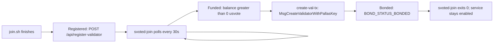

# Runbook: Join the Chain as a Validator

## Overview

Shielded-Vote is a Cosmos SDK application chain for private on-chain voting. The chain launches with a single genesis validator. Everyone else joins post-genesis via a custom message `MsgCreateValidatorWithPallasKey`, which atomically creates the validator *and* registers its Pallas key for the EA-key ceremony. See the [protocol README](../../README.md#protocol-documentation) for the full rules.

This runbook covers the operator side: standing up an `svoted` host that syncs with the live chain, reaches bonded status, and exposes a TLS-fronted REST API that iOS clients and peers can reach. A validator is a single `svoted` process plus a `svoted-join` bonding loop and a Caddy reverse proxy on the same host; see [Recommended hardware](#recommended-hardware) for the target SKU.

**Who this runbook is for:**

- **Operators** joining the existing `svote-1` chain as a new validator. Use the one-liner below and follow the runbook as written.
- **Custom-layout / non-Linux**: see [Manual install](#manual-install-no-joinsh).
- **Genesis primary bootstrap** (standing up the first validator and building `genesis.json` from scratch: use [genesis-setup.md](genesis-setup.md) instead — that flow is intentionally out of scope here.
- **Developers** iterating from a source checkout (`mise run install`, `mise run chain:init`, `SVOTE_LOCAL_BINARIES=1 ./join.sh`): see the repo [README](../../README.md) and `mise tasks`.

`join.sh` drives the joining flow in two phases:

1. **Setup** — download `svoted` + `create-val-tx`, fetch `voting-config.json` to discover the seed peer, pull `genesis.json`, `svoted init`, generate keys, patch `config.toml` / `app.toml`, install Caddy, install the `svoted` and `svoted-join` services.
2. **Bonding loop** — `svoted-join` reposts the signed registration payload to the admin API and, once a vote manager funds the validator address, runs `create-val-tx` and exits cleanly when `BOND_STATUS_BONDED` is observed. See [Join lifecycle](#join-lifecycle).

## Quick start

On Linux or macOS, run:

```bash
curl -fsSL https://vote.fra1.digitaloceanspaces.com/join.sh | bash
```

If you have a real DNS name pointed at this host, skip the auto-detected `sslip.io` hostname with `--domain`:

```bash
curl -fsSL https://vote.fra1.digitaloceanspaces.com/join.sh | bash -s -- --domain val.example.org
```

What it does:

- Downloads the latest `svoted` + `create-val-tx` release tarball from DigitalOcean Spaces and verifies it against the published SHA-256 checksum.
- Discovers the live chain via `voting-config.json` (CDN, then primary REST fallback) and pins the first `vote_servers[].url` as the seed peer.
- Pulls the canonical `genesis.json` from Spaces, validates it, runs `svoted init`, and generates the Cosmos / Pallas / EA keys.
- Configures `config.toml` (`persistent_peers`, `timeout_broadcast_tx_commit = 120s`) and `app.toml` (`[api]` + `[helper]`).
- Installs Caddy (apt on Linux, Homebrew on macOS), writes a Caddyfile for `${SVOTE_DOMAIN} { reverse_proxy localhost:1317 }`, and starts it.
- Signs and POSTs a registration payload to `${SVOTE_ADMIN_URL}/api/register-validator` so the operator shows up in the admin UI join queue.
- Installs a systemd unit (Linux) or launchd plist (macOS) for `svoted`, plus a matching `svoted-join` service that loops until bonded.

During install, prompts for a validator moniker unless `SVOTE_MONIKER` is set. After install, operate the service with:

```bash
# Linux
systemctl status svoted svoted-join
journalctl -u svoted -f
journalctl -u svoted-join -f

# macOS
launchctl print gui/$(id -u)/com.shielded-vote.validator
tail -f ~/.svoted/node.log
tail -f ~/.svoted/join.log
```

See [Smoke test](#smoke-test) for a post-install check and [Join lifecycle](#join-lifecycle) for what happens until you reach bonded.

## Recommended hardware

**Production target: `linux-amd64` with 2 vCPU, 8 GB RAM, and at least 50 GB SSD.** This matches the `vote-secondary` SKU in [production-setup.md](../production-setup.md) (`s-2vcpu-8gb-amd` + 50 GB block volume, ~\$36/mo on DigitalOcean).

Why these numbers:

- 2 vCPU is enough to verify incoming ZKPs and participate in ceremony/tally proposer injection without starving the CometBFT consensus thread. ZKP verification is ~30–60 s on a standard core; the 120 s `timeout_broadcast_tx_commit` in `config.toml` exists specifically for this reason.
- 8 GB RAM covers the helper server's concurrent proof generation (`max_concurrent_proofs = 2`, ~500 MB each) plus the chain's working set with headroom.
- 50 GB SSD holds the growing block store and the helper's SQLite database. Plan for growth proportional to traffic.

Other profiles build but are not recommended for production serving; see [Platform support](#platform-support).

## Network requirements

`join.sh` and the running validator need the following network access:

| Direction | Destination | Purpose |
|-----------|-------------|---------|
| Outbound 443 | `vote.fra1.digitaloceanspaces.com` | `version.txt`, `svoted` + `create-val-tx` tarballs (`binaries/vote-sdk/…`), `genesis.json`, `join-loop.sh` fallback |
| Outbound 443 | `valargroup.github.io` | `token-holder-voting-config/voting-config.json` (seed-peer discovery) |
| Outbound 443 | `<first vote_servers[].url>` | `/cosmos/base/tendermint/v1beta1/node_info` and `POST /api/register-validator` |
| Outbound 443 | `vote-chain-primary.valargroup.org` | Fallback `/api/voting-config` when the CDN is unreachable (override via `DEFAULT_PRIMARY_API_BASE`) |
| Outbound 443 | `ifconfig.me` | Public-IP auto-detection (only when neither `--domain` nor `SVOTE_DOMAIN` is set) |
| Outbound 443 | `dl.cloudsmith.io`, Let's Encrypt | Caddy apt-repo install + ACME certificate issuance |
| Outbound 443 | `shielded-vote.vercel.app` | Helper heartbeat pulse (override via `SVOTE_PULSE_URL`, disable by setting it empty in `app.toml`) |
| Outbound TCP 26656 | Seed validator's P2P | CometBFT peer handshake + gossip |
| Inbound TCP 26656 | Public | CometBFT P2P — **must be reachable**; open it in your firewall/security group. Peers cannot connect if this is blocked |
| Inbound TCP 80 + 443 | Public | Caddy (HTTPS reverse proxy for the REST API, used by iOS clients and admin UI). 80 is required for Let's Encrypt HTTP-01 challenges |
| Local only | `127.0.0.1:1317` (REST), `127.0.0.1:26657` (RPC), `127.0.0.1:6060` (pprof) | Do not expose directly; Caddy proxies `1317` over TLS |

If the validator will answer PIR queries itself, also open inbound 443 for the `nf-server` routes — see [vote-nullifier-pir's server-setup runbook](https://github.com/valargroup/vote-nullifier-pir/blob/main/docs/runbooks/server-setup.md).

## Platform support

- **`linux-amd64`** — recommended production target.
- **`linux-arm64`** — supported; useful for ARM VMs (Hetzner, Oracle Ampere). Similar performance profile to amd64 for this workload.
- **`darwin-arm64`** — recommended for local dev on Apple Silicon. Uses `launchd` instead of `systemd`.
- **`darwin-amd64`** — dev-only; the release tarball still ships it, but Intel Macs are not a production target.

`join.sh` auto-detects the platform via `uname -s` + `uname -m`; anything outside the matrix above exits with an error.

## Install

`join.sh` is the recommended path; the rest of this section documents what it does so you can reproduce or audit it manually.

### Release artifacts

Each `v*` release publishes per-platform tarballs to **DigitalOcean Spaces**:

- `binaries/vote-sdk/shielded-vote-<version>-<platform>.tar.gz`
- `binaries/vote-sdk/shielded-vote-<version>-<platform>.tar.gz.sha256`

Plus bucket-root helpers the one-liner depends on:

- `version.txt` — single line with the latest release version.
- `join.sh` — always the latest script.
- `join-loop.sh` — latest loop; copied onto the host so the service unit can point at it.
- `genesis.json` — canonical genesis, uploaded by `sdk-chain-reset.yml` after every chain reset.

The GitHub Release for the tag also mirrors the tarballs, so operators who want to pin a specific version can substitute the GitHub URL in the [Manual install](#manual-install-no-joinsh) step below.

### Manual install (no `join.sh`)

For custom layouts, non-Linux platforms, or when debugging the installer:

**Prerequisites:** `curl`, `jq`, and `sudo`. On minimal Ubuntu/Debian images install them first:

```bash
sudo apt-get update && sudo apt-get install -y curl jq ca-certificates
```

1. **Download and install the binaries.** `join.sh` always pulls the latest; pin a specific `TAG` here if you want a reproducible install. The tarball is downloaded under its published name so `sha256sum -c` can validate it against the companion `.sha256` file, which lists the original filename:

   ```bash
   PLATFORM=linux-amd64        # or linux-arm64, darwin-arm64, darwin-amd64
   TAG=$(curl -fsSL https://vote.fra1.digitaloceanspaces.com/version.txt | tr -d '[:space:]')
   INSTALL_DIR="$HOME/.local/bin"
   TARBALL="shielded-vote-${TAG}-${PLATFORM}.tar.gz"

   mkdir -p "$INSTALL_DIR"
   curl -fsSL -o "/tmp/${TARBALL}" \
     "https://vote.fra1.digitaloceanspaces.com/binaries/vote-sdk/${TARBALL}"
   curl -fsSL -o "/tmp/${TARBALL}.sha256" \
     "https://vote.fra1.digitaloceanspaces.com/binaries/vote-sdk/${TARBALL}.sha256"
   ( cd /tmp && sha256sum -c "${TARBALL}.sha256" )

   tar xzf "/tmp/${TARBALL}" -C /tmp \
     "shielded-vote-${TAG}-${PLATFORM}/bin/svoted" \
     "shielded-vote-${TAG}-${PLATFORM}/bin/create-val-tx"
   install -m 0755 "/tmp/shielded-vote-${TAG}-${PLATFORM}/bin/svoted"        "$INSTALL_DIR/svoted"
   install -m 0755 "/tmp/shielded-vote-${TAG}-${PLATFORM}/bin/create-val-tx" "$INSTALL_DIR/create-val-tx"
   export PATH="$INSTALL_DIR:$PATH"
   ```

2. **Discover the network** and capture the seed peer:

   ```bash
   VOTING_CONFIG=$(curl -fsSL https://valargroup.github.io/token-holder-voting-config/voting-config.json)
   SEED_URL=$(echo "$VOTING_CONFIG" | jq -r '.vote_servers[0].url')

   NODE_INFO=$(curl -fsSL "$SEED_URL/cosmos/base/tendermint/v1beta1/node_info")
   NODE_ID=$(echo "$NODE_INFO" | jq -r '.default_node_info.default_node_id')
   LISTEN_ADDR=$(echo "$NODE_INFO" | jq -r '.default_node_info.listen_addr')
   SEED_HOST=$(echo "$SEED_URL" | sed -E 's|^https?://||; s|:[0-9]+$||; s|/.*||')
   P2P_PORT=$(echo "$LISTEN_ADDR" | sed -E 's|.*:([0-9]+)$|\1|')
   PERSISTENT_PEERS="${NODE_ID}@${SEED_HOST}:${P2P_PORT:-26656}"
   ```

3. **Initialize the node** and pull genesis:

   ```bash
   MONIKER="my-validator"
   HOME_DIR="$HOME/.svoted"
   rm -rf "$HOME_DIR"
   svoted init "$MONIKER" --chain-id svote-1 --home "$HOME_DIR"
   curl -fsSL -o "$HOME_DIR/config/genesis.json" https://vote.fra1.digitaloceanspaces.com/genesis.json
   svoted genesis validate-genesis --home "$HOME_DIR"
   ```

4. **Generate the validator, Pallas, and EA keys** (single command; see `svoted init-validator-keys --help`). Record the mnemonic — it is the only way to recover the Cosmos account key:

   ```bash
   svoted init-validator-keys --home "$HOME_DIR"
   VALIDATOR_ADDR=$(svoted keys show validator -a --keyring-backend test --home "$HOME_DIR")
   ```

5. **Patch `config.toml` + `app.toml`**:

   ```bash
   CONFIG_TOML="$HOME_DIR/config/config.toml"
   APP_TOML="$HOME_DIR/config/app.toml"

   sed -i.bak "s|persistent_peers = \"\"|persistent_peers = \"${PERSISTENT_PEERS}\"|" "$CONFIG_TOML"
   sed -i.bak 's/^timeout_broadcast_tx_commit = .*/timeout_broadcast_tx_commit = "120s"/' "$CONFIG_TOML"

   sed -i.bak '/\[api\]/,/\[.*\]/ s/enable = false/enable = true/' "$APP_TOML"
   sed -i.bak '/\[api\]/,/\[.*\]/ s/enabled-unsafe-cors = false/enabled-unsafe-cors = true/' "$APP_TOML"
   sed -i.bak "s|\\\$HOME/.svoted|${HOME_DIR}|g" "$APP_TOML"
   rm -f "$CONFIG_TOML.bak" "$APP_TOML.bak"
   ```

   Append the `[helper]` block — the shipped template doesn't include it. Leave `helper_url` empty until the Caddy hostname is known; it's re-patched in step 7. This matches the `HELPERCFG` block written by [join.sh](../../join.sh):

   ```bash
   cat >> "$APP_TOML" <<'HELPERCFG'

   ###############################################################################
   ###                         Helper Server                                   ###
   ###############################################################################

   [helper]

   disable = false
   api_token = ""
   db_path = ""
   process_interval = 5
   chain_api_port = 1317
   max_concurrent_proofs = 2
   pulse_url = "https://shielded-vote.vercel.app"
   helper_url = ""
   HELPERCFG
   ```

6. **Install the systemd unit and start `svoted`**:

   ```bash
   sudo tee /etc/systemd/system/svoted.service > /dev/null <<UNIT
   [Unit]
   Description=Shielded-Vote validator (${MONIKER})
   After=network.target

   [Service]
   Type=simple
   User=$(whoami)
   ExecStart=${INSTALL_DIR}/svoted start --home ${HOME_DIR}
   Restart=on-failure
   RestartSec=5
   StandardOutput=append:${HOME_DIR}/node.log
   StandardError=append:${HOME_DIR}/node.log

   [Install]
   WantedBy=multi-user.target
   UNIT

   sudo systemctl daemon-reload
   sudo systemctl enable --now svoted
   ```

   Wait until `svoted status --home "$HOME_DIR" | jq -r .sync_info.catching_up` returns `false` before continuing.

7. **Set up Caddy** (HTTPS on `$SVOTE_DOMAIN` → `localhost:1317`), then patch `helper_url` in `app.toml` to the public URL and `systemctl restart svoted`. The Caddyfile layout is a two-line `reverse_proxy` block — see the snippet under [TLS / reverse proxy](#tls--reverse-proxy).

8. **Install `svoted-join`** to drive bonding. Copy [scripts/join-loop.sh](../../scripts/join-loop.sh) to `$INSTALL_DIR/join-loop.sh`, then register the systemd unit and environment file as `join.sh` does:

   ```bash
   sudo tee /etc/default/svoted-join > /dev/null <<ENV
   SVOTE_HOME=${HOME_DIR}
   VALIDATOR_ADDR=${VALIDATOR_ADDR}
   MONIKER=${MONIKER}
   VALIDATOR_URL=https://${SVOTE_DOMAIN}
   SVOTE_ADMIN_URL=${SEED_URL}
   SVOTE_INSTALL_DIR=${INSTALL_DIR}
   ENV

   sudo tee /etc/systemd/system/svoted-join.service > /dev/null <<UNIT
   [Unit]
   Description=Shielded-Vote join loop (${MONIKER})
   After=svoted.service
   Requires=svoted.service

   [Service]
   Type=simple
   User=$(whoami)
   EnvironmentFile=/etc/default/svoted-join
   ExecStart=${INSTALL_DIR}/join-loop.sh
   Restart=on-failure
   RestartSec=30
   SuccessExitStatus=0
   StandardOutput=append:${HOME_DIR}/join.log
   StandardError=append:${HOME_DIR}/join.log

   [Install]
   WantedBy=multi-user.target
   UNIT

   sudo systemctl daemon-reload
   sudo systemctl enable --now svoted-join
   ```

9. **Proceed to [Smoke test](#smoke-test)** and [Join lifecycle](#join-lifecycle).

## Smoke test

After install, verify end-to-end:

```bash
# 1. The chain is synced.
svoted status --home ~/.svoted | jq '{network: .node_info.network, height: .sync_info.latest_block_height, catching_up: .sync_info.catching_up}'
# → network: "svote-1", catching_up: false

# 2. REST + gRPC-gateway are live locally.
curl -fsS http://127.0.0.1:1317/cosmos/base/tendermint/v1beta1/node_info | jq '.default_node_info.network'
curl -fsS http://127.0.0.1:1317/shielded-vote/v1/rounds | jq '.rounds | length'

# 3. Caddy is serving the REST API over TLS (skip if SVOTE_SKIP_CADDY=1).
curl -fsS https://<your-domain>/shielded-vote/v1/genesis > /dev/null && echo "caddy OK"

# 4. Join loop is alive.
tail -n 20 ~/.svoted/join.log   # or: journalctl -u svoted-join -n 20 --no-pager
```

The join loop is deliberately quiet. It only writes three kinds of lines to `join.log`:

1. `join-loop starting (moniker=...)` — once at startup.
2. `balance=<amount> usvote — attempting create-val-tx` — once funding is detected.
3. `register-validator returned bonded — exiting 0` — right before exit 0 when bonded.

A healthy unfunded validator produces **only** the startup line. To confirm the loop is alive while waiting for funding, check the service itself (`systemctl is-active svoted-join` / `pgrep -f join-loop.sh`) and look for your `operator_address` on the primary's pending list (`curl "${SVOTE_ADMIN_URL%/}/api/pending-validators" | jq`); `last_seen_at` should advance by ~30 s each iteration. See [Join lifecycle](#join-lifecycle).

## Join lifecycle

From install to bonded, the validator moves through three states: **registered** (pending), **funded** (balance > 0), **bonded** (part of the validator set).



The loop in [scripts/join-loop.sh](../../scripts/join-loop.sh) runs forever until it observes bonded status. On each iteration:

1. **Re-register.** Build `{operator_address, url, moniker, timestamp}`, sign it with `svoted sign-arbitrary --from validator --keyring-backend test`, POST to `${SVOTE_ADMIN_URL}/api/register-validator`. Idempotent — the admin stores one row per operator, updating URL/moniker on later POSTs. If the response reports `status=bonded`, exit 0 immediately.
2. **Check bonded.** `svoted query staking validators` filtered by moniker; if `BOND_STATUS_BONDED`, exit 0.
3. **If not bonded, check balance.** `svoted query bank balances $VALIDATOR_ADDR`. If there is any `usvote` balance, run:
   ```bash
   create-val-tx --moniker "$MONIKER" --amount 10000000usvote --home "$SVOTE_HOME" --rpc-url tcp://localhost:26657
   ```
   `create-val-tx` signs `MsgCreateValidatorWithPallasKey` (wire tag `0x09`) — the **only** message type that can create a validator post-genesis. Raw `MsgCreateValidator` is blocked by the ante handler.
4. **Sleep 30 s** and loop.

Funding happens off-loop: an existing vote manager (any member of the any-of-N vote-manager set) observes the pending registration in the admin UI and sends `usvote` via `MsgAuthorizedSend` — the only authorized transfer path on this chain. See the [MsgAuthorizedSend authorization rules](../../README.md#msgauthorizedsend-authorization-rules) in the README.

**Operator checklist while waiting:**

- Confirm the loop is alive with `systemctl is-active svoted-join` (or `pgrep -f join-loop.sh` on macOS). `join.log` stays quiet after the startup line until funding arrives — see the log-behavior note under [Smoke test](#smoke-test).
- Verify the admin UI at the seed node's public URL (`https://<seed>/`, or `https://shielded-vote.vercel.app/` if configured) shows your moniker and operator address in the **Validators → Join queue** list.
- After bonding, open a PR against [token-holder-voting-config](https://github.com/valargroup/token-holder-voting-config) to add your URL to `vote_servers[]` so iOS clients discover you. The suggested JSON entry is printed on the final line of `join.sh`.

## Configuring the service

`join.sh` installs two services so `svoted` and the bonding loop survive SSH disconnects, reboots, and operator shell exits.

### Linux (systemd)

- **`/etc/systemd/system/svoted.service`** — `Type=simple`, `Restart=on-failure`, `RestartSec=5`, runs as the invoking user (not root), `ExecStart=${INSTALL_DIR}/svoted start --home ${HOME_DIR}`. Logs are appended to `~/.svoted/node.log`.
- **`/etc/systemd/system/svoted-join.service`** — same lifecycle semantics (`Restart=on-failure`, `RestartSec=30`), `Requires=svoted.service`. Exits 0 once bonded; the unit stays enabled but becomes a no-op on reboot.
- **`/etc/default/svoted-join`** — key/value file sourced by the unit. Contains `SVOTE_HOME`, `VALIDATOR_ADDR`, `MONIKER`, `VALIDATOR_URL`, `SVOTE_ADMIN_URL`, `SVOTE_INSTALL_DIR`. Do not indent lines — systemd's `EnvironmentFile` parser is strict about leading whitespace.

To change settings, edit the appropriate file and:

```bash
sudo systemctl daemon-reload   # only after editing a .service file itself
sudo systemctl restart svoted
sudo systemctl restart svoted-join
```

### macOS (launchd)

- `~/Library/LaunchAgents/com.shielded-vote.validator.plist` — runs `svoted start --home ~/.svoted`, `RunAtLoad=true`, `KeepAlive={SuccessfulExit=false}`.
- `~/Library/LaunchAgents/com.shielded-vote.caddy.plist` — runs `caddy run --config ~/.config/caddy/Caddyfile`, `KeepAlive=true`.
- `~/Library/LaunchAgents/com.shielded-vote.join.plist` — runs `join-loop.sh` with the environment above baked into `EnvironmentVariables`.

Control them with `launchctl`:

```bash
launchctl print gui/$(id -u)/com.shielded-vote.validator
launchctl kickstart -k gui/$(id -u)/com.shielded-vote.validator   # restart
launchctl bootout   gui/$(id -u)/com.shielded-vote.join           # stop join loop
```

### `[helper]` and `[api]` sections

`join.sh` enables the Cosmos SDK REST API on `:1317` with CORS and appends a `[helper]` block to `app.toml`. The helper runs in-process alongside `svoted` and shares the REST port. Keys and defaults:

| Key | Default | Description |
|-----|---------|-------------|
| `disable` | `false` | Set `true` to disable the helper server. |
| `api_token` | `""` | Optional bearer for `POST /shielded-vote/v1/shares` (sent as `X-Helper-Token`). |
| `db_path` | `""` (= `~/.svoted/helper.db`) | SQLite path for queued shares. |
| `process_interval` | `5` | Seconds between share-processing ticks. |
| `chain_api_port` | `1317` | REST port the helper submits `MsgRevealShare` to. |
| `max_concurrent_proofs` | `2` | Parallel proof goroutines (~500 MB each). |
| `pulse_url` | `https://shielded-vote.vercel.app` | Heartbeat target; empty disables. |
| `helper_url` | `https://<SVOTE_DOMAIN>` | This host's public URL as seen by clients; empty disables the heartbeat. |

See [deploy-setup.md § Helper server configuration](../deploy-setup.md#helper-server-configuration) for the production reference. `[admin]` and the admin UI are disabled by default for joining validators; only the primary runs them.

## TLS / reverse proxy

`svoted` speaks plaintext HTTP on `:1317` and plaintext RPC on `:26657`; clients must reach the REST API over TLS. `join.sh` installs Caddy on the same host and writes a minimal config:

```caddyfile
val.example.org {
    reverse_proxy localhost:1317
}
```

- On Linux, Caddy is installed from the Cloudsmith apt repo and managed by `systemctl`. The Caddyfile lives at `/etc/caddy/Caddyfile`.
- On macOS, Caddy is installed via Homebrew and run as a launchd agent owned by the current user. The Caddyfile lives at `~/.config/caddy/Caddyfile`.

Hostname resolution:

- `--domain val.example.org` or `SVOTE_DOMAIN=val.example.org` — use a real DNS name. Recommended for production operators.
- No domain set — `join.sh` auto-detects the public IP via `ifconfig.me` and uses `<ip-with-dashes>.sslip.io` (e.g. `46-101-255-48.sslip.io`). Fine for smoke-testing and short-lived deployments; not recommended for long-term production.
- `SVOTE_SKIP_CADDY=1` — skip Caddy entirely. Use this in Docker/CI or when TLS is terminated upstream (another proxy or a managed load balancer). If skipped, `VALIDATOR_URL` is empty, so the admin registration step is also skipped and the helper heartbeat is disabled.

When `SVOTE_SKIP_CADDY=1` *and* TLS is handled externally, set `VALIDATOR_URL` manually in `/etc/default/svoted-join` and `helper_url` in `app.toml`, then restart both services.

## Observability

**Logs.** Two log files under `~/.svoted/`:

| File | Source | Content |
|------|--------|---------|
| `node.log` | `svoted start` | Block production, P2P, ABCI, REST handler output. Verbosity via `--log_level` on the systemd unit. |
| `join.log` | `svoted-join` (`join-loop.sh`) | One timestamped line per 30 s tick; `register-validator` responses; `create-val-tx` output when funded. |
| `caddy.log` | Caddy (macOS launchd only) | Access + error log. On Linux, Caddy logs via `journalctl -u caddy`. |

`journalctl -u svoted -f` / `journalctl -u svoted-join -f` follow them on Linux; use `tail -f` on macOS.

**Helper heartbeat.** Each validator POSTs periodic pulses to `pulse_url` with its height + last-seen timestamp. The default target is the public dashboard at [shielded-vote.vercel.app](https://shielded-vote.vercel.app/); override via `SVOTE_PULSE_URL` or by editing `[helper] pulse_url` in `app.toml`. Leave empty to disable.

**Admin UI.** The primary validator serves the admin UI at its public HTTPS endpoint (`https://<primary>/`). The Validators page lists every bonded validator and every pending join request, with the operator address, moniker, last heartbeat, and bonding state. Joining operators watch this page to confirm their registration landed and to coordinate funding with the vote-manager.

**Sentry.** Not shipped in `svoted` itself; add if your ops playbook requires it. For structural observability, see [observability.md](../observability.md).

## Backup and disaster recovery

The validator identity lives under `~/.svoted/`. Losing these files without a backup bricks the validator — you would have to re-run `join.sh` with a new address and get re-funded. The essentials:

| Path | What it is | Recovery if lost |
|------|------------|------------------|
| `config/node_key.json` | CometBFT P2P identity (NodeID). | Regenerate; peers will reconnect via the new ID. Cosmetic only. |
| `config/priv_validator_key.json` | **CometBFT consensus signing key.** Same key on two nodes = double-sign = slashing. | **Never restore onto a second host without first confirming the other copy is offline.** Without backup, you must join as a fresh validator. |
| `keyring-test/` | BIP39-derived secp256k1 account key (`validator`) used to sign Cosmos txs including `MsgCreateValidatorWithPallasKey`. | Restore from the mnemonic printed by `svoted init-validator-keys`. |
| `pallas.sk` / `pallas.pk` | EA-ceremony Pallas keypair. Required to participate in ceremony auto-ack. | Can be rotated via `MsgRotatePallasKey` (when not in an active ceremony) — see the [Pallas Key Registration and Rotation](../../README.md#pallas-key-registration-and-rotation) section of the README. |
| `ea.sk` / `ea.pk` | Auto-deal EA keypair placeholder; overwritten per-round by the ceremony. | Regenerated on next round. |
| `data/` | Block store + app state. | Re-sync from peers; authoritative state lives on-chain. |

Back up `config/node_key.json`, `config/priv_validator_key.json`, `keyring-test/`, `pallas.sk`, and the mnemonic printed at install time. Store them encrypted off-host; `priv_validator_key.json` is the critical one to keep exclusive.

## Upgrading

`join.sh` is idempotent and is the supported upgrade path. Re-run it:

```bash
curl -fsSL https://vote.fra1.digitaloceanspaces.com/join.sh | bash
```

What happens:

- The script always downloads the latest `svoted` + `create-val-tx` tarball (per `${DO_BASE}/version.txt`) and verifies the checksum.
- Before replacing binaries it `systemctl stop svoted` (Linux) or `launchctl bootout` (macOS) to avoid `Text file busy`.
- It reinstalls services, re-registers with the admin, and restarts everything.
- **It wipes `~/.svoted`** if a prior install is present — so re-running `join.sh` is *not* a safe in-place chain-data upgrade.

For a chain-data-preserving binary swap, mirror the [production-setup.md](../production-setup.md) flow instead:

```bash
systemctl stop svoted
# download + checksum the tarball into a versioned directory under /opt/shielded-vote/releases/<tag>/
# then atomically swap a symlink and restart:
ln -sfn /opt/shielded-vote/releases/<new-tag> /opt/shielded-vote/current.new
mv -Tf /opt/shielded-vote/current.new /opt/shielded-vote/current
systemctl restart svoted
```

Watch the GitHub Releases feed of [valargroup/vote-sdk](https://github.com/valargroup/vote-sdk) and upgrade when a `v*` tag ships security or consensus fixes; mid-round cosmetic patches are safe to skip until the next quiet window.

## Configuration reference

All variables are read from the environment by `join.sh`, `join-loop.sh`, or the services they install. Unset = use default.

### `join.sh`

| Variable / flag | Default | Role |
|-----------------|---------|------|
| `--domain <host>` or `SVOTE_DOMAIN` | auto-detected `<ip>.sslip.io` | Public hostname for Caddy + `VALIDATOR_URL`. |
| `SVOTE_MONIKER` | interactive prompt | Validator moniker; required for unattended installs. |
| `SVOTE_INSTALL_DIR` | `$HOME/.local/bin` | Where `svoted`, `create-val-tx`, and `join-loop.sh` are installed. |
| `SVOTE_HOME` | `$HOME/.svoted` | Chain data + config + keys. |
| `SVOTE_LOCAL_BINARIES` | `0` | When `1` and both binaries are on `$PATH`, skip the download. Used by source developers with `mise run build:install`. |
| `SVOTE_SKIP_CADDY` | `0` | `1` skips Caddy install + config. Use when TLS is handled externally. |
| `SVOTE_SKIP_SERVICE` | `0` | `1` skips service install and the sync wait — node is initialized but not started. Useful for Docker smoke tests / CI. |
| `VOTING_CONFIG_URL` | — | If set, fetch `voting-config` from `${VOTING_CONFIG_URL}/api/voting-config` instead of the CDN → primary bootstrap. |
| `SVOTE_ADMIN_URL` | first `vote_servers[].url` | Base for `POST /api/register-validator`. |
| `SVOTE_PULSE_URL` | `VOTING_CONFIG_URL` if set, else `https://shielded-vote.vercel.app` | Helper heartbeat target; written into `app.toml [helper] pulse_url`. |
| `SVOTE_JOIN_LOOP_SCRIPT` | bundled path → `${DO_BASE}/join-loop.sh` fallback | Override path to `join-loop.sh`; useful when `join.sh` is piped via curl and the repo's `scripts/join-loop.sh` isn't reachable. |
| `CDN_VOTING_CONFIG_JSON` | `https://valargroup.github.io/token-holder-voting-config/voting-config.json` | Primary CDN URL for discovery. |
| `DEFAULT_PRIMARY_API_BASE` | `https://vote-chain-primary.valargroup.org` | Fallback for `/api/voting-config` if the CDN fails. |
| `DEFAULT_PULSE_URL` | `https://shielded-vote.vercel.app` | Ultimate fallback for `pulse_url`. |

### `join-loop.sh`

Read from `/etc/default/svoted-join` (Linux) or the launchd `EnvironmentVariables` block (macOS):

| Variable | Role |
|----------|------|
| `SVOTE_HOME` | Passed to `svoted` as `--home`. |
| `VALIDATOR_ADDR` | Bech32 operator address; used in signed payload + balance/bond queries. |
| `MONIKER` | Used to find the validator row in `svoted query staking validators`. |
| `VALIDATOR_URL` | Public URL advertised in `register-validator`; empty disables re-registration. |
| `SVOTE_ADMIN_URL` | Base URL for `/api/register-validator`. |
| `SVOTE_INSTALL_DIR` | Prepended to `$PATH` so `create-val-tx` resolves. |

## Files under `~/.svoted`

The `SVOTE_HOME` directory (default `~/.svoted`) groups everything a joining validator cares about:

| Path | Owner / writer | Purpose |
|------|----------------|---------|
| `config/genesis.json` | `svoted init` → `curl` | Canonical chain genesis; must match the on-chain state. |
| `config/node_key.json` | `svoted init` | CometBFT P2P identity. |
| `config/priv_validator_key.json` | `svoted init` | Consensus signing key. Double-signing = slash. |
| `config/config.toml` | `svoted init` + `sed` patches | CometBFT runtime; `persistent_peers` and `timeout_broadcast_tx_commit` are what `join.sh` tweaks. |
| `config/app.toml` | `svoted init` + `sed` patches + `[helper]` append | App runtime; `[api]`, `[helper]`, and on the primary `[admin]` + `[ui]`. |
| `data/` | `svoted start` | Block store, LevelDB state, CometBFT WAL. Growing. |
| `keyring-test/` | `svoted init-validator-keys` | `validator` Cosmos account key; mnemonic printed at install. |
| `pallas.sk` / `pallas.pk` | `svoted init-validator-keys` | EA-ceremony long-lived keypair; registered via `MsgCreateValidatorWithPallasKey`. |
| `ea.sk` / `ea.pk` | `svoted init-validator-keys` (placeholder) | Overwritten per-round by the auto-deal path. |
| `helper.db` | helper module | SQLite queue of shares waiting to be submitted. |
| `node.log` | systemd / launchd | Chain stdout+stderr. |
| `join.log` | systemd / launchd | `svoted-join` loop output. |

When in doubt for a joining validator with no important keys yet, `rm -rf ~/.svoted && join.sh` recreates everything.

## HTTP endpoints

`svoted` exposes the routes below on `:1317` (and via Caddy at `https://<SVOTE_DOMAIN>`). The **Audience** column shows who calls each route in normal operation; the full REST + custom-wire surface is catalogued in the [protocol README](../../README.md#rest-api).

| Method & path | Audience | Purpose |
|---------------|----------|---------|
| `GET /cosmos/base/tendermint/v1beta1/node_info` | Ops / peers | Chain ID, node ID, P2P listen addr. Used by the seed discovery step in `join.sh`. |
| `GET /cosmos/staking/v1beta1/validators` | Ops | Validator set + bond status. |
| `GET /cosmos/bank/v1beta1/balances/{addr}` | Ops | Account balance; `svoted-join` hits this to detect funding. |
| `GET /shielded-vote/v1/rounds` | Clients | All voting rounds. |
| `GET /shielded-vote/v1/rounds/active` | Clients | Currently active round. |
| `GET /shielded-vote/v1/ceremony` | Ops / clients | Current EA-key ceremony state. |
| `GET /shielded-vote/v1/genesis` | Joining validators | `genesis.json` as served by this node (used when re-joining from this peer instead of Spaces). |
| `POST /shielded-vote/v1/delegate-vote`, `/cast-vote`, `/reveal-share` | Clients | Custom-wire vote messages. |
| `POST /api/register-validator` | `svoted-join` | Pending-join queue (admin module; primary only). |
| `GET /api/pending-validators`, `GET /api/voting-config` | Admin UI / join scripts | Join-queue view + CDN-proxied discovery (primary only). |

## Troubleshooting

Start with `journalctl -u svoted -n 200 --no-pager` / `tail -n 200 ~/.svoted/node.log` and `svoted status --home ~/.svoted | jq .sync_info`.

| Symptom | Likely cause | Action |
|---------|--------------|--------|
| `catching_up` stays `true` for >10 min, log shows "Dialing" / no peers connecting | Inbound 26656 blocked, or seed peer is unreachable | Verify firewall lets in 26656 (`ss -ltn | grep 26656`, then test from off-host); check `persistent_peers` in `~/.svoted/config/config.toml`; confirm the seed from `voting-config.json` is up by hitting its `/cosmos/base/tendermint/v1beta1/node_info`. |
| `svoted` exits with "error initializing application: genesis doc mismatch" | Local `genesis.json` doesn't match the live chain | `rm -rf ~/.svoted && join.sh` (pulls canonical genesis fresh); or `curl -fsSL -o ~/.svoted/config/genesis.json https://vote.fra1.digitaloceanspaces.com/genesis.json && svoted genesis validate-genesis --home ~/.svoted`. |
| `join.log` repeatedly shows `balance=` (empty) | Not yet funded | Wait. The vote-manager funds from the admin UI join queue. Ping the operator running the primary and confirm your address is listed. |
| `create-val-tx` fails with `key not found: validator` | Keyring backend mismatch (os vs test) | `svoted-join` always uses `--keyring-backend test`. Confirm `svoted keys show validator -a --keyring-backend test --home ~/.svoted` returns the expected address. If you re-keyed manually, re-run `svoted init-validator-keys`. |
| `create-val-tx` fails with `account does not exist on chain` | Tx raced funding; balance hasn't settled yet | Retry — the loop re-runs every 30 s. If it persists, check `svoted query bank balances $VALIDATOR_ADDR` directly. |
| Caddy fails to obtain a certificate (`acme: error 403` or similar) | DNS doesn't resolve to this host, or 80/443 blocked | `dig <SVOTE_DOMAIN>` against a public resolver; ensure inbound 80 AND 443 are open. For automatic sslip.io, confirm `curl -fsSL https://ifconfig.me` returns your actual public IP. |
| `ERROR: No vote_servers[0].url in voting-config` | Upstream config is empty (usually during/after a chain reset) | Wait ~1 h or set `VOTING_CONFIG_URL` to a host you know is up (e.g. the primary's REST URL); `/api/voting-config` on the primary returns the current snapshot. |
| `ERROR: Could not fetch version from …/version.txt` | Outbound 443 to DO Spaces blocked | Test `curl -I https://vote.fra1.digitaloceanspaces.com/version.txt`; fix egress; consider `SVOTE_LOCAL_BINARIES=1` if you already have pinned binaries on `$PATH`. |
| Checksum mismatch on tarball | Corrupt download or MITM | Retry once; if it keeps happening, pull from the GitHub Release for the same tag and compare against `SHA256SUMS`. |
| `svoted` SIGILLs immediately at startup | Binary/arch mismatch | `file ~/.local/bin/svoted` — must match `uname -m`. Re-run `join.sh` so it picks the right `PLATFORM`. |
| `svoted-join` keeps running after you see `BOND_STATUS_BONDED` in `svoted query staking validators` | The moniker in `/etc/default/svoted-join` doesn't match the on-chain description | Confirm `MONIKER` matches `.validators[].description.moniker` exactly; edit the env file and restart `svoted-join`. |

For deeper investigation, raise `svoted` log verbosity (`--log_level debug` in the systemd ExecStart or `SVOTED_LOG_LEVEL=debug` if exported) and restart.

## See also

- [vote-nullifier-pir runbooks/server-setup.md](https://github.com/valargroup/vote-nullifier-pir/blob/main/docs/runbooks/server-setup.md) — running `nf-server`, which `svoted` queries via `SVOTE_PIR_URL` for nullifier non-membership proofs. Validators can either co-locate `nf-server` or point at a shared one.
- [genesis-setup.md](genesis-setup.md) — genesis-primary bootstrap (CI-driven `sdk-chain-reset.yml` + `scripts/init.sh`). Different flow; do not mix with `join.sh`.
- [production-setup.md](../production-setup.md) — Terraform + CI-driven DO Droplet deployment for the primary / secondary pair.
- [deploy-setup.md](../deploy-setup.md) — CI/CD workflows, GitHub secrets, helper/admin configuration reference.
- [observability.md](../observability.md) — logging and metrics conventions across the fleet.
- [token-holder-voting-config](https://github.com/valargroup/token-holder-voting-config) — where operators PR their public URL into `vote_servers[]` after bonding, so iOS clients discover them.
