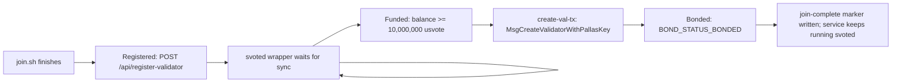

# Runbook: Join the Chain as a Validator

## Overview

Shielded-Vote is a Cosmos SDK application chain for private on-chain voting. The chain launches with a single genesis validator. Everyone else joins post-genesis via a custom message `MsgCreateValidatorWithPallasKey`, which atomically creates the validator *and* registers its Pallas key for the EA-key ceremony. See the [protocol README](../../README.md#protocol-documentation) for the full rules.

This runbook covers the operator side: standing up an `svoted` host that restores the latest Zvote snapshot when one is published, catches up with the live chain, reaches bonded status, and exposes a TLS-fronted REST API that iOS clients and peers can reach. A validator is a single `svoted` service, managed by a small wrapper while joining, plus a Caddy reverse proxy on the same host.

**Scope:**

- Joining the live `svote-1` chain — continue here.
- Bootstrapping the first (genesis) validator and building `genesis.json` from scratch — see [genesis-setup.md](genesis-setup.md). Intentionally out of scope here.
- Local development from a source checkout see [CONTRIBUTING.md](../../CONTRIBUTING.md).
- Custom layouts, non-Linux platforms, or auditing what `join.sh` does — see [Reference > Manual install](#manual-install-no-joinsh).

## Prerequisites

**Production target: `linux-amd64` with 2 vCPU, 8 GB RAM, and at least 50 GB SSD.**

Why these numbers:

- 2 vCPU is enough to verify incoming ZKPs and participate in ceremony/tally proposer injection without starving the CometBFT consensus thread.
- 8 GB RAM covers the helper server's concurrent proof generation (`max_concurrent_proofs = 2`, ~500 MB each) plus the chain's working set with headroom.
- 50 GB SSD holds the growing block store and the helper's SQLite database.

### Platform support

- **`linux-amd64`** — recommended production target.
- **`linux-arm64`** — supported but not recommended; useful for ARM VMs (Hetzner, Oracle Ampere). Similar performance profile to amd64 for this workload.
- **`darwin-arm64`** — recommended for local dev on Apple Silicon. Uses `launchd` instead of `systemd`.
- **`darwin-amd64`** — dev-only. Discouraged for production.

`join.sh` auto-detects the platform via `uname -s` + `uname -m`; anything outside the matrix above exits with an error.

### Hostname and TLS

`svoted` speaks plaintext HTTP on `:1317`; clients reach it over TLS through a reverse proxy or load balancer. `join.sh` prompts for one of three HTTPS exposure modes unless you set `SVOTE_SKIP_CADDY` or `SVOTE_DOMAIN` ahead of time:

- **Default — skip Caddy.** `join.sh` does not install or configure TLS unless you opt in. Terminate TLS upstream (load balancer, managed certificate, your own reverse proxy). The operator address still appears in the admin join queue for funding; the public URL can be supplied later when the validator is added to `vote_servers[]`. Equivalent to `SVOTE_SKIP_CADDY=1`.
- `--domain val.example.org` or `SVOTE_DOMAIN=val.example.org` — install Caddy and request a Let's Encrypt cert for that hostname. The DNS record must be static and already pointed at this host; we do not rotate URLs after the operator advertises one in `vote_servers[]`. Configure DNS like:
  ```text
  val.example.org.  A  <your-server-public-IPv4>
  ```
- Auto sslip.io + Caddy — pick option 3 in the interactive menu when running `... | bash`. Suitable for trials only; if the host's public IPv4 changes, the URL breaks and you must re-run `join.sh` and PR a new entry into [token-holder-voting-config](https://github.com/valargroup/token-holder-voting-config).

If Caddy setup fails after you opt in, `join.sh` still registers the operator for funding with an empty URL and prints a `Public URL: missing` warning. If you explicitly pass `--domain` or `SVOTE_DOMAIN`, Caddy setup is treated as required and failures stop the installer unless `SVOTE_ALLOW_NO_PUBLIC_URL=1` is set.

See [TLS / reverse proxy](#tls--reverse-proxy) for the Caddy layout `join.sh` installs when you opt in.

### Network requirements

`join.sh` and the running validator need the following network access:

| Direction | Destination | Purpose |
|-----------|-------------|---------|
| Outbound 443 | `vote.fra1.digitaloceanspaces.com` | `version.txt`, `svoted` + `create-val-tx` tarballs (`binaries/vote-sdk/…`), `genesis.json`, `svoted-wrapper.sh` fallback |
| Outbound 443 | `snapshots.valargroup.org` | Latest Zvote snapshot metadata and archive URL used to bootstrap chain data before peer catch-up |
| Outbound 443 | `valargroup.github.io` | [`token-holder-voting-config/voting-config.json`](https://github.com/valargroup/token-holder-voting-config) — canonical seed-peer discovery (same payload wallets fetch). Override via `VOTING_CONFIG_URL` for staging mirrors. |
| Outbound 443 | `vote-chain-primary.valargroup.org` | `POST /api/register-validator` (join queue). Override via `SVOTE_ADMIN_URL` / `DEFAULT_ADMIN_API_BASE`. |
| Outbound 443 | `<first vote_servers[].url>` | `/cosmos/base/tendermint/v1beta1/node_info` (P2P seed) |
| Outbound 443 | `ifconfig.me`, `api.ipify.org` | Public IPv4 auto-detection (only when choosing auto sslip.io + Caddy) |
| Outbound 443 | `dl.cloudsmith.io`, Let's Encrypt | Caddy apt-repo install + ACME certificate issuance (only when opting into Caddy) |
| Outbound TCP 26656 | Seed validator's P2P | CometBFT peer handshake + gossip |
| Inbound TCP 26656 | Public | CometBFT P2P — **must be reachable**; open it in your firewall/security group. Peers cannot connect if this is blocked |
| Inbound TCP 80 + 443 | Public | HTTPS reverse proxy for the REST API, used by iOS clients and admin UI. 80 is required for Let's Encrypt HTTP-01 challenges when using Caddy |
| Local only | `127.0.0.1:1317` (REST), `127.0.0.1:26657` (RPC), `127.0.0.1:6060` (pprof) | Do not expose directly; proxy `1317` over TLS |

If the validator will answer PIR queries itself, also open inbound 443 for the `nf-server` routes — see [vote-nullifier-pir's server-setup runbook](https://github.com/valargroup/vote-nullifier-pir/blob/main/docs/runbooks/server-setup.md).

## Quick start

On Linux or macOS, run:

```bash
curl -fsSL https://vote.fra1.digitaloceanspaces.com/join.sh | bash
```

By default, the installer skips Caddy and leaves `VALIDATOR_URL` empty so you can terminate TLS with your own load balancer or reverse proxy. The operator address still enters the admin join queue for funding.

For production hosts where you want `join.sh` to install Caddy, point a stable DNS name at this host first:

```text
val.example.org.  A  <your-server-public-IPv4>
```

Then pass that hostname with `--domain`:

```bash
curl -fsSL https://vote.fra1.digitaloceanspaces.com/join.sh | bash -s -- --domain val.example.org
```

**NOTE: Most users should use this one-line command to get started and not install anything manually**

The installer prompts for a validator moniker unless `SVOTE_MONIKER` is set, prompts for the TLS mode unless `SVOTE_SKIP_CADDY` or `SVOTE_DOMAIN` is set, restores the latest Zvote snapshot when one is published, then catches up from peers. If no snapshot metadata exists yet after a chain reset, it continues from genesis. See [Join lifecycle](#join-lifecycle) for the timeline from install to bonded, [Operating the service](#operating-the-service) for what gets installed on the host, and [Reference > Manual install](#manual-install-no-joinsh) for the equivalent manual steps.

After install, operate the service with:

```bash
# Linux
systemctl status svoted
journalctl -u svoted -f

# macOS
launchctl print gui/$(id -u)/com.shielded-vote.validator
tail -f ~/.svoted/node.log
```

See [Smoke test](#smoke-test) for a post-install check.

## Join lifecycle

From install to bonded, the validator moves through three states: **registered** (pending), **funded** (balance >= 10,000,000 usvote), **bonded** (part of the validator set).



The wrapper in [scripts/svoted-wrapper.sh](../../scripts/svoted-wrapper.sh) runs `svoted`, waits until the local node is synced, monitors for funding, and submits the validator creation tx. Funding acts as the vote-manager approval step.

Before service install, `join.sh` builds `{operator_address, url, moniker, timestamp}`, signs it with `svoted sign-arbitrary --from validator --keyring-backend test`, and POSTs it once to `${SVOTE_ADMIN_URL}/api/register-validator`. The admin stores one pending row per operator with `requested_at`; `url` may be empty, which still lets vote managers see the operator address for funding. The admin UI marks those rows as `Needs public URL`.

On each wrapper iteration:

1. **Check bonded by valoper.** If `BOND_STATUS_BONDED`, write `~/.svoted/join-complete` and skip join logic for this and future service runs.
2. **If not bonded, check balance.** `svoted query bank balances $VALIDATOR_ADDR`. Once the balance has at least the self-delegation amount, run:
   ```bash
   create-val-tx --moniker "$MONIKER" --amount 10000000usvote --home "$SVOTE_HOME" --rpc-url tcp://localhost:26657
   ```
   `create-val-tx` signs `MsgCreateValidatorWithPallasKey` - the **only** message type that can create a validator post-genesis.
3. **Sleep 30 s** and loop.

Funding happens outside the wrapper: an existing vote manager (any member of the any-of-N vote-manager set) observes the pending registration in the [admin UI](https://svote.valargroup.org/validator-join) and authorizes the validator to join by funding its operator account.

**Operator checklist while waiting:**

- Confirm the service is alive with `systemctl is-active svoted` or `launchctl print gui/$(id -u)/com.shielded-vote.validator`.
- Verify the admin UI at the admin host's public URL (`${SVOTE_ADMIN_URL}/`) shows your moniker and operator address in the **Validators → Join queue** list.
- After bonding, open a PR against [token-holder-voting-config](https://github.com/valargroup/token-holder-voting-config) to add your URL to `vote_servers[]` so iOS clients discover you. The suggested JSON entry is printed on the final line of `join.sh`.

## Smoke test

After install, verify end-to-end:

```bash
# 1. The chain is synced.
svoted status --home ~/.svoted | jq '{network: .node_info.network, height: .sync_info.latest_block_height, catching_up: .sync_info.catching_up}'
# → network: "svote-1", catching_up: false

# 2. REST + gRPC-gateway are live locally.
curl -fsS http://127.0.0.1:1317/cosmos/base/tendermint/v1beta1/node_info | jq '.default_node_info.network'
curl -fsS http://127.0.0.1:1317/shielded-vote/v1/rounds | jq '.rounds | length'

# 3. Caddy is serving the REST API over TLS (skip if SVOTE_SKIP_CADDY=1).
curl -fsS https://<your-domain>/shielded-vote/v1/genesis > /dev/null && echo "caddy OK"

# 4. Validator wrapper is alive.
journalctl -u svoted -n 20 --no-pager   # or: tail -n 20 ~/.svoted/node.log
```

See [Join lifecycle](#join-lifecycle) for what the wrapper does while you wait for funding.

## Operating the service

`join.sh` installs one `svoted` service. The service runs `scripts/svoted-wrapper.sh`, which starts `svoted`, monitors funding while joining, submits the validator creation tx, and writes `~/.svoted/join-complete` after bonding.

### Linux (systemd)

- **`/etc/systemd/system/svoted.service`** — `Type=simple`, `Restart=on-failure`, `RestartSec=5`, runs as the invoking user (not root), `ExecStart=${INSTALL_DIR}/svoted-wrapper.sh`. Logs are appended to `~/.svoted/node.log`.

To change settings, edit the appropriate file and:

```bash
sudo systemctl daemon-reload   # only after editing a .service file itself
sudo systemctl restart svoted
```

### macOS (launchd)

Two plists under `~/Library/LaunchAgents/`: `com.shielded-vote.validator.plist` (runs `svoted-wrapper.sh`, which starts `svoted`) and `com.shielded-vote.caddy.plist` (runs Caddy when configured). Control the services with `launchctl`:

```bash
launchctl print gui/$(id -u)/com.shielded-vote.validator
launchctl kickstart -k gui/$(id -u)/com.shielded-vote.validator   # restart
```

### Logs

| File | Source | Content |
|------|--------|---------|
| `~/.svoted/node.log` | `svoted-wrapper.sh` + `svoted start` | Join automation, block production, P2P, ABCI, REST handler output. Verbosity via `--log_level` on the systemd unit. |
| Caddy | `journalctl -u caddy` (Linux) / `~/.config/caddy/caddy.log` (macOS) | Access + error log. |

`journalctl -u svoted -f` follows it on Linux; use `tail -f ~/.svoted/node.log` on macOS.

### Admin UI

After `join.sh` performs the one-time signed registration, the pending request is stored by the primary admin server. The primary validator serves the admin UI at its public HTTPS endpoint (`${SVOTE_ADMIN_URL}/`). The Validators page lists every bonded validator and every pending join request, with the operator address, moniker, requested time, and bonding state. Joining operators watch this page to confirm their registration landed and to coordinate funding with the vote-manager.

Sentry is not shipped in `svoted` itself; add if your ops playbook requires it. For structural observability, see [observability.md](../observability.md).

### `[helper]` and `[api]` reference

`join.sh` enables the Cosmos SDK REST API on `:1317` with CORS and appends a `[helper]` block to `app.toml`. The helper runs in-process alongside `svoted` and shares the REST port. Keys and defaults:

| Key | Default | Description |
|-----|---------|-------------|
| `disable` | `false` | Set `true` to disable the helper server. |
| `api_token` | `""` | Optional bearer for `POST /shielded-vote/v1/shares` (sent as `X-Helper-Token`). |
| `db_path` | `""` (= `~/.svoted/helper.db`) | SQLite path for queued shares. |
| `process_interval` | `5` | Seconds between share-processing ticks. |
| `chain_api_port` | `1317` | REST port the helper submits `MsgRevealShare` to. |
| `max_concurrent_proofs` | `2` | Parallel proof goroutines (~500 MB each). |

See [deploy-setup.md § Helper server configuration](../deploy-setup.md#helper-server-configuration) for the production reference. `[admin]` and the admin UI are disabled by default for joining validators; only the primary runs them.

## TLS / reverse proxy

`svoted` speaks plaintext HTTP on `:1317` and plaintext RPC on `:26657`; clients must reach the REST API over TLS. When you opt into Caddy, `join.sh` installs it on the same host and writes a minimal config:

```caddyfile
val.example.org {
    reverse_proxy localhost:1317
}
```

- On Linux, Caddy is installed from the Cloudsmith apt repo and managed by `systemctl`. The Caddyfile lives at `/etc/caddy/Caddyfile`.
- On macOS, Caddy is installed via Homebrew and run as a launchd agent owned by the current user. The Caddyfile lives at `~/.config/caddy/Caddyfile`.

For the hostname-vs-sslip-vs-skip choice, see [Prerequisites > Hostname and TLS](#hostname-and-tls).

## Backup and disaster recovery

The validator identity lives under `~/.svoted/`. Losing these files without a backup bricks the validator — you would have to re-run `join.sh` with a new address and get re-funded. The essentials:

| Path | What it is | Recovery if lost |
|------|------------|------------------|
| `config/node_key.json` | CometBFT P2P identity (NodeID). | Regenerate; peers will reconnect via the new ID. Cosmetic only. |
| `config/priv_validator_key.json` | **CometBFT consensus signing key.** Same key on two nodes = double-sign = slashing. | **Never restore onto a second host without first confirming the other copy is offline.** Without backup, you must join as a fresh validator. |
| `keyring-test/` | BIP39-derived secp256k1 account key (`validator`) used to sign Cosmos txs including `MsgCreateValidatorWithPallasKey`. | Restore from the mnemonic printed by `svoted init-validator-keys`. |
| `pallas.sk` / `pallas.pk` | EA-ceremony Pallas keypair. Required to participate in ceremony auto-ack. | Can be rotated via `MsgRotatePallasKey` (when not in an active ceremony) — see the [Pallas Key Registration and Rotation](../../README.md#pallas-key-registration-and-rotation) section of the README. |
| `ea.sk` / `ea.pk` | Auto-deal EA keypair placeholder; overwritten per-round by the ceremony. | Regenerated on next round. |
| `data/` | Block store + app state. | Restore the latest Zvote snapshot, then catch up from peers; authoritative state lives on-chain. |

Back these up encrypted off-host, keeping `priv_validator_key.json` exclusive to a single live host at any time.

## Upgrading

`join.sh` is idempotent and is the supported upgrade path. Re-run it:

```bash
curl -fsSL https://vote.fra1.digitaloceanspaces.com/join.sh | bash
```

What happens:

- The script always downloads the latest `svoted` + `create-val-tx` tarball (per `${DO_BASE}/version.txt`) and verifies the checksum.
- Before replacing binaries it `systemctl stop svoted` (Linux) or `launchctl bootout` (macOS) to avoid `Text file busy`.
- It reinstalls services, registers once with the admin join queue, and restarts everything.
- **It wipes `~/.svoted`** if a prior install is present — so re-running `join.sh` is *not* a safe in-place chain-data upgrade.

For a chain-data-preserving binary swap, mirror the [production-setup.md](../production-setup.md) flow instead:

```bash
systemctl stop svoted
# download + checksum the tarball into a versioned directory under /opt/shielded-vote/releases/<tag>/
# then atomically swap a symlink and restart:
ln -sfn /opt/shielded-vote/releases/<new-tag> /opt/shielded-vote/current.new
mv -Tf /opt/shielded-vote/current.new /opt/shielded-vote/current
systemctl restart svoted
```

Watch the GitHub Releases feed of [valargroup/vote-sdk](https://github.com/valargroup/vote-sdk) and upgrade when a `v*` tag ships security or consensus fixes; mid-round cosmetic patches are safe to skip until the next quiet window.

## Reference

### Release artifacts

Each `v*` release publishes per-platform tarballs to **DigitalOcean Spaces**:

- `binaries/vote-sdk/shielded-vote-<version>-<platform>.tar.gz`
- `binaries/vote-sdk/shielded-vote-<version>-<platform>.tar.gz.sha256`

Plus bucket-root helpers the one-liner depends on:

- `version.txt` — single line with the latest release version.
- `join.sh` — always the latest script.
- `svoted-wrapper.sh` — latest service wrapper; copied onto the host so the service unit can point at it.
- `genesis.json` — canonical genesis, uploaded by `sdk-chain-reset.yml` after every chain reset.

The GitHub Release for the tag also mirrors the tarballs, so operators who want to pin a specific version can substitute the GitHub URL in the Manual install steps below.

### Manual install (no `join.sh`)


**NOTE: Most users should use this one-line command to get started and not install anything manually. The manual install is provided for background on what happens under the hood**

It is also useful for custom layouts, non-Linux platforms, or when debugging the installer.

**Prerequisites:** `curl`, `jq`, `lz4`, and `sudo`. On minimal Ubuntu/Debian images install them first:

```bash
sudo apt-get update && sudo apt-get install -y curl jq lz4 ca-certificates
```

1. **Download and install the binaries.** `join.sh` always pulls the latest; pin a specific `TAG` here if you want a reproducible install. The tarball is downloaded under its published name so `sha256sum -c` can validate it against the companion `.sha256` file, which lists the original filename:

   ```bash
   PLATFORM=linux-amd64        # or linux-arm64, darwin-arm64, darwin-amd64
   TAG=$(curl -fsSL https://vote.fra1.digitaloceanspaces.com/version.txt | tr -d '[:space:]')
   INSTALL_DIR="$HOME/.local/bin"
   TARBALL="shielded-vote-${TAG}-${PLATFORM}.tar.gz"

   mkdir -p "$INSTALL_DIR"
   curl -fsSL -o "/tmp/${TARBALL}" \
     "https://vote.fra1.digitaloceanspaces.com/binaries/vote-sdk/${TARBALL}"
   curl -fsSL -o "/tmp/${TARBALL}.sha256" \
     "https://vote.fra1.digitaloceanspaces.com/binaries/vote-sdk/${TARBALL}.sha256"
   ( cd /tmp && sha256sum -c "${TARBALL}.sha256" )

   tar xzf "/tmp/${TARBALL}" -C /tmp \
     "shielded-vote-${TAG}-${PLATFORM}/bin/svoted" \
     "shielded-vote-${TAG}-${PLATFORM}/bin/create-val-tx"
   install -m 0755 "/tmp/shielded-vote-${TAG}-${PLATFORM}/bin/svoted"        "$INSTALL_DIR/svoted"
   install -m 0755 "/tmp/shielded-vote-${TAG}-${PLATFORM}/bin/create-val-tx" "$INSTALL_DIR/create-val-tx"
   export PATH="$INSTALL_DIR:$PATH"
   ```

2. **Discover the network** and capture the seed peer. The voting-config payload lives in [token-holder-voting-config](https://github.com/valargroup/token-holder-voting-config) (GitHub Pages CDN) — same source wallets use; override `VOTING_CONFIG_URL` for staging mirrors:

   ```bash
   VOTING_CONFIG_URL="${VOTING_CONFIG_URL:-https://valargroup.github.io/token-holder-voting-config/voting-config.json}"
   VOTING_CONFIG=$(curl -fsSL "$VOTING_CONFIG_URL")
   SEED_URL=$(echo "$VOTING_CONFIG" | jq -r '.vote_servers[0].url')

   NODE_INFO=$(curl -fsSL "$SEED_URL/cosmos/base/tendermint/v1beta1/node_info")
   NODE_ID=$(echo "$NODE_INFO" | jq -r '.default_node_info.default_node_id')
   LISTEN_ADDR=$(echo "$NODE_INFO" | jq -r '.default_node_info.listen_addr')
   SEED_HOST=$(echo "$SEED_URL" | sed -E 's|^https?://||; s|:[0-9]+$||; s|/.*||')
   P2P_PORT=$(echo "$LISTEN_ADDR" | sed -E 's|.*:([0-9]+)$|\1|')
   PERSISTENT_PEERS="${NODE_ID}@${SEED_HOST}:${P2P_PORT:-26656}"
   ```

3. **Initialize the node** and pull genesis:

   ```bash
   MONIKER="my-validator"
   HOME_DIR="$HOME/.svoted"
   rm -rf "$HOME_DIR"
   svoted init "$MONIKER" --chain-id svote-1 --home "$HOME_DIR"
   curl -fsSL -o "$HOME_DIR/config/genesis.json" https://vote.fra1.digitaloceanspaces.com/genesis.json
   svoted genesis validate-genesis --home "$HOME_DIR"
   ```

4. **Restore the latest Zvote snapshot** before generating validator keys, when metadata is published. If `latest.json` is not available yet after a reset, skip this block and let the node sync from genesis:

   ```bash
   SNAPSHOT_META=$(mktemp)
   SNAPSHOT_ARCHIVE=$(mktemp)
   VALIDATOR_STATE=$(mktemp)
   curl -fsSL -o "$SNAPSHOT_META" https://snapshots.valargroup.org/latest.json
   test "$(jq -r '.chain_id' "$SNAPSHOT_META")" = "svote-1"
   SNAPSHOT_URL=$(jq -r '.url' "$SNAPSHOT_META")
   SNAPSHOT_SUM=$(jq -r '.checksum' "$SNAPSHOT_META")
   curl -fL -o "$SNAPSHOT_ARCHIVE" "$SNAPSHOT_URL"
   if command -v sha256sum >/dev/null 2>&1; then
     ACTUAL_SUM=$(sha256sum "$SNAPSHOT_ARCHIVE" | awk '{print $1}')
   else
     ACTUAL_SUM=$(shasum -a 256 "$SNAPSHOT_ARCHIVE" | awk '{print $1}')
   fi
   test "$ACTUAL_SUM" = "$SNAPSHOT_SUM"
   cp "$HOME_DIR/data/priv_validator_state.json" "$VALIDATOR_STATE"
   rm -rf "$HOME_DIR/data"
   lz4 -dc "$SNAPSHOT_ARCHIVE" | tar -C "$HOME_DIR" -xf -
   cp "$VALIDATOR_STATE" "$HOME_DIR/data/priv_validator_state.json"
   rm -rf "$HOME_DIR/data/cs.wal"
   ```

5. **Generate the validator, Pallas, and EA keys** (single command; see `svoted init-validator-keys --help`). Record the mnemonic — it is the only way to recover the Cosmos account key:

   ```bash
   svoted init-validator-keys --home "$HOME_DIR"
   VALIDATOR_ADDR=$(svoted keys show validator -a --keyring-backend test --home "$HOME_DIR")
   VALIDATOR_VALOPER=$(svoted keys show validator --bech val -a --keyring-backend test --home "$HOME_DIR")
   ```

6. **Configure and start the services** to match what `join.sh` does:

   - Set `persistent_peers = "${PERSISTENT_PEERS}"` in `config.toml`; enable `[api]` with `enabled-unsafe-cors = true` in `app.toml`; append the `[helper]` block — keys and defaults are in [`[helper]` and `[api]` reference](#helper-and-api-reference).
   - Install Caddy (or your TLS terminator) — see [TLS / reverse proxy](#tls--reverse-proxy).
   - Install the systemd / launchd unit described in [Operating the service](#operating-the-service): `svoted.service` runs `${INSTALL_DIR}/svoted-wrapper.sh` with `SVOTE_HOME`, `VALIDATOR_ADDR`, `VALIDATOR_VALOPER`, `MONIKER`, and `SVOTE_INSTALL_DIR` in the service environment.
   - Copy [scripts/svoted-wrapper.sh](../../scripts/svoted-wrapper.sh) to `${INSTALL_DIR}/svoted-wrapper.sh`, then `systemctl enable --now svoted`.

7. **Proceed to [Smoke test](#smoke-test)** and [Join lifecycle](#join-lifecycle).

### Files under `~/.svoted`

The `SVOTE_HOME` directory (default `~/.svoted`) groups everything a joining validator cares about. Identity files (keys, consensus signer, block store) are catalogued in [Backup and disaster recovery](#backup-and-disaster-recovery); the remaining runtime files:

| Path | Owner / writer | Purpose |
|------|----------------|---------|
| `config/genesis.json` | `svoted init` → `curl` | Canonical chain genesis; must match the on-chain state. |
| `config/config.toml` | `svoted init` + `sed` patches | CometBFT runtime; `persistent_peers` is what `join.sh` tweaks. |
| `config/app.toml` | `svoted init` + `sed` patches + `[helper]` append | App runtime; `[api]`, `[helper]`, and on the primary `[admin]` + `[ui]`. |
| `helper.db` | helper module | SQLite queue of shares waiting to be submitted. |
| `node.log` | systemd / launchd | Chain stdout+stderr. |
| `join-complete` | `svoted-wrapper.sh` | Marker written after the wrapper observes bonded status. |

When in doubt for a joining validator with no important keys yet, `rm -rf ~/.svoted && join.sh` recreates everything.

### Configuration variables

All variables are read from the environment by `join.sh`, `svoted-wrapper.sh`, or the services they install. Unset = use default.

#### `join.sh`

Interactive runs without `SVOTE_DOMAIN` and without an explicit `SVOTE_SKIP_CADDY` value prompt for the TLS mode; pressing Enter, or waiting past `SVOTE_TLS_PROMPT_TIMEOUT` seconds, uses the default skip-Caddy path.

| Variable / flag | Default | Role |
|-----------------|---------|------|
| `--domain <host>` or `SVOTE_DOMAIN` | unset | Public hostname for Caddy + `VALIDATOR_URL`. When set, the installer skips the TLS menu and treats Caddy setup for this static hostname as required. |
| `SVOTE_MONIKER` | interactive prompt | Validator moniker; required for unattended installs. |
| `SVOTE_INSTALL_DIR` | `$HOME/.local/bin` | Where `svoted`, `create-val-tx`, and `svoted-wrapper.sh` are installed. |
| `SVOTE_HOME` | `$HOME/.svoted` | Chain data + config + keys. |
| `SVOTE_SNAPSHOT_BASE_URL` | `https://snapshots.valargroup.org` | Snapshot service base URL. `join.sh` fetches `${SVOTE_SNAPSHOT_BASE_URL}/latest.json` and restores the archive it declares when metadata is available. |
| `SVOTE_SKIP_SNAPSHOT` | `0` | When `1`, skip snapshot restore and sync from genesis. Default installs fall back to genesis when snapshot metadata is unavailable or empty; once metadata points to an archive, download, checksum, and extraction failures are fatal. |
| `SVOTE_LOCAL_BINARIES` | `0` | When `1` and both binaries are on `$PATH`, skip the download. Used by source developers with `mise run build:install`. |
| `SVOTE_SKIP_CADDY` | `1` (default) | Skip Caddy install + config and leave `VALIDATOR_URL` empty. Set to `0` only when running interactively to expose the menu (which can re-set this to `1` if you pick option 1). |
| `SVOTE_TLS_PROMPT_TIMEOUT` | `30` | Seconds to wait at the TLS mode prompt before defaulting to option 1 (skip Caddy). |
| `SVOTE_ALLOW_NO_PUBLIC_URL` | `0` | When `1`, explicit-domain Caddy failures continue with an empty `VALIDATOR_URL` so the operator can still enter the funding queue. |
| `SVOTE_SKIP_SERVICE` | `0` | `1` skips service install and the sync wait — node is initialized but not started. Useful for Docker smoke tests / CI. |
| `VOTING_CONFIG_URL` | `https://valargroup.github.io/token-holder-voting-config/voting-config.json` | Canonical voting-config (same payload wallets fetch). Override for staging mirrors or fork testing. |
| `SVOTE_ADMIN_URL` | `${DEFAULT_ADMIN_API_BASE}` | Admin server base URL. Used for `POST /api/register-validator` (join queue). Not used for voting-config discovery — that comes from `VOTING_CONFIG_URL`. |
| `SVOTE_WRAPPER_SCRIPT` | bundled path → `${DO_BASE}/svoted-wrapper.sh` fallback | Override path to `svoted-wrapper.sh`; useful when `join.sh` is piped via curl and the repo's `scripts/svoted-wrapper.sh` isn't reachable. |
| `DEFAULT_ADMIN_API_BASE` | `https://vote-chain-primary.valargroup.org` | Default value for `SVOTE_ADMIN_URL` when not explicitly set. |

#### `svoted-wrapper.sh`

Read from the systemd `Environment=` values (Linux) or the launchd `EnvironmentVariables` block (macOS):

| Variable | Role |
|----------|------|
| `SVOTE_HOME` | Passed to `svoted` as `--home`. |
| `VALIDATOR_ADDR` | Bech32 operator account address; used for local balance queries. |
| `VALIDATOR_VALOPER` | Bech32 validator operator address; used for bonded-state queries. |
| `MONIKER` | Passed to `create-val-tx`. |
| `SVOTE_INSTALL_DIR` | Prepended to `$PATH` so `create-val-tx` resolves. |
| `SVOTE_JOIN_STAKE_USVOTE` | Optional override for the self-delegation amount; default `10000000`. |

### HTTP endpoints (operator surface)

`svoted` exposes the routes below on `:1317` (and via Caddy at `https://<SVOTE_DOMAIN>`); these are the routes ops hit during install, bonding, and debugging. The full REST + custom-wire surface — including client-facing routes (`/shielded-vote/v1/rounds`, `ceremony`, vote POSTs, `genesis`) — is catalogued in the [protocol README](../../README.md#rest-api).

| Method & path | Audience | Purpose |
|---------------|----------|---------|
| `GET /cosmos/base/tendermint/v1beta1/node_info` | Ops / peers | Chain ID, node ID, P2P listen addr. Used by the seed discovery step in `join.sh`. |
| `GET /cosmos/staking/v1beta1/validators` | Ops | Validator set + bond status. |
| `GET /cosmos/bank/v1beta1/balances/{addr}` | Ops | Account balance; `svoted-wrapper.sh` hits this to detect funding. |
| `POST /api/register-validator` | `join.sh` | Pending-join queue (admin module; primary only). |
| `GET /api/pending-validators` | Admin UI / join scripts | Join-queue view (primary only). |
| `GET /api/voting-config` | Tooling / standalone watchdog | Cached copy of the GitHub Pages voting-config (refreshed in-process every minute). **Not** the canonical client path — wallets and `join.sh` fetch the same payload directly from [valargroup.github.io/token-holder-voting-config](https://valargroup.github.io/token-holder-voting-config/voting-config.json). The fleet health watchdog ([`vote-infrastructure/watchdog/`](https://github.com/valargroup/vote-infrastructure/tree/main/watchdog)) hits the CDN, not this endpoint, so it stays up if the primary `svoted` wedges. |

## Troubleshooting

Start with `journalctl -u svoted -n 200 --no-pager` / `tail -n 200 ~/.svoted/node.log` and `svoted status --home ~/.svoted | jq .sync_info`.

| Symptom | Likely cause | Action |
|---------|--------------|--------|
| `catching_up` stays `true` for >10 min, log shows "Dialing" / no peers connecting | Inbound 26656 blocked, or seed peer is unreachable | Verify firewall lets in 26656 (`ss -ltn | grep 26656`, then test from off-host); check `persistent_peers` in `~/.svoted/config/config.toml`; confirm the seed listed under `vote_servers[0].url` in [the voting-config](https://valargroup.github.io/token-holder-voting-config/voting-config.json) is up by hitting its `/cosmos/base/tendermint/v1beta1/node_info`. |
| `svoted` exits with "error initializing application: genesis doc mismatch" | Local `genesis.json` doesn't match the live chain | `rm -rf ~/.svoted && join.sh` (pulls canonical genesis fresh); or `curl -fsSL -o ~/.svoted/config/genesis.json https://vote.fra1.digitaloceanspaces.com/genesis.json && svoted genesis validate-genesis --home ~/.svoted`. |
| `node.log` repeatedly shows `waiting for validator funding` | Not yet funded | Wait. The vote-manager funds from the admin UI join queue. Ping the operator running the primary and confirm your address is listed. |
| `create-val-tx` fails with `key not found: validator` | Keyring backend mismatch (os vs test) | The wrapper expects the `validator` key in the test keyring. Confirm `svoted keys show validator -a --keyring-backend test --home ~/.svoted` returns the expected address. If you re-keyed manually, re-run `svoted init-validator-keys`. |
| `create-val-tx` fails with `account does not exist on chain` | Tx raced funding; balance hasn't settled yet | Retry — the loop re-runs every 30 s. If it persists, check `svoted query bank balances $VALIDATOR_ADDR` directly. |
| Caddy fails to obtain a certificate (`acme: error 403` or similar) | DNS doesn't resolve to this host, or 80/443 blocked | `dig <SVOTE_DOMAIN>` against a public resolver; ensure inbound 80 AND 443 are open. For automatic sslip.io, confirm `curl -fsSL https://ifconfig.me` returns your actual public IP. |
| `ERROR: No vote_servers[0].url in voting-config` | The published voting-config has an empty `vote_servers` list (usually during/after a chain reset) | Wait ~1 h, or set `VOTING_CONFIG_URL` to a mirror with a populated list and re-run. The fix is in [valargroup/token-holder-voting-config](https://github.com/valargroup/token-holder-voting-config) — a maintainer needs to add at least one server URL. |
| `ERROR: Could not fetch version from …/version.txt` | Outbound 443 to DO Spaces blocked | Test `curl -I https://vote.fra1.digitaloceanspaces.com/version.txt`; fix egress; consider `SVOTE_LOCAL_BINARIES=1` if you already have pinned binaries on `$PATH`. |
| Checksum mismatch on tarball | Corrupt download or MITM | Retry once; if it keeps happening, pull from the GitHub Release for the same tag and compare against `SHA256SUMS`. |
| No snapshot metadata is available | The chain was recently reset and no new snapshot has been published yet, or the snapshot service is unavailable | `join.sh` logs a warning and syncs from genesis. Confirm `curl -fsS https://snapshots.valargroup.org/latest.json | jq` once the first post-reset snapshot is expected. |
| Snapshot download, checksum, or extraction fails | Stale metadata, corrupt download, or missing `lz4` | Confirm `curl -fsS https://snapshots.valargroup.org/latest.json | jq` works from the host. Re-run after fixing egress or the snapshot service. Use `SVOTE_SKIP_SNAPSHOT=1` only for explicit genesis-sync debugging. |
| `svoted` SIGILLs immediately at startup | Binary/arch mismatch | `file ~/.local/bin/svoted` — must match `uname -m`. Re-run `join.sh` so it picks the right `PLATFORM`. |
| `join-complete` is missing after bonding | Marker was deleted or the wrapper has not restarted since bonding | Restart `svoted`; once synced, the wrapper checks the valoper address, observes `BOND_STATUS_BONDED`, and rewrites the marker. |

For deeper investigation, raise `svoted` log verbosity (`--log_level debug` in the systemd ExecStart or `SVOTED_LOG_LEVEL=debug` if exported) and restart.

## See also

- [vote-nullifier-pir runbooks/server-setup.md](https://github.com/valargroup/vote-nullifier-pir/blob/main/docs/runbooks/server-setup.md) — running `nf-server`, which `svoted` queries via `SVOTE_PIR_URL` for nullifier non-membership proofs. Validators can either co-locate `nf-server` or point at a shared one.
- [genesis-setup.md](genesis-setup.md) — genesis-primary bootstrap (CI-driven `sdk-chain-reset.yml` + `scripts/init.sh`). Different flow; do not mix with `join.sh`.
- [observability.md](../observability.md) — logging and metrics conventions across the fleet.
- [token-holder-voting-config](https://github.com/valargroup/token-holder-voting-config) — where operators PR their public URL into `vote_servers[]` after bonding, so iOS clients discover them.
