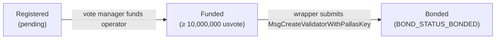

# Runbook: Join the Chain as a Validator

## Overview

Shielded-Vote is a Cosmos SDK application chain for private on-chain voting. The chain launches with a single genesis validator. Everyone else joins post-genesis via a custom validator-creating message, which atomically creates the validator and registers its Pallas key for the EA-key ceremony. The full rules live in the [protocol README](../../README.md#protocol-documentation).

This runbook covers the operator side of joining `svote-1`: standing up a host, restoring the latest vote chain snapshot, catching up with the chain, reaching bonded status, and exposing the REST API over TLS for iOS clients and peers.

A validator is one service plus an optional Caddy reverse proxy on the same host.

## Prerequisites

Production target: `linux-amd64`, 4 vCPU, 8 GB RAM, 120 GB NVMe SSD. 4 vCPU gives enough headroom for ZKP verification and ceremony/tally injection without contending with the CometBFT consensus thread.

### Platform support

| Platform | Status |
|----------|--------|
| `linux-amd64` | Recommended for production. |
| `linux-arm64` | Supported. Useful for ARM VMs (Hetzner, Oracle Ampere); similar performance to amd64 for this workload. |
| `darwin-arm64` | Recommended for local dev on Apple Silicon. Uses `launchd` instead of `systemd`. |
| `darwin-amd64` | Dev-only; not for production. |

`join.sh` detects the platform with `uname -s` and `uname -m`. Anything outside this set exits with an error.

## Quick start

The one-liner below is the supported interactive install path. Use [Manual install](#manual-install-no-joinsh) only for custom layouts or when debugging the installer.

On Linux or macOS:

```bash
curl -fsSL https://vote.fra1.digitaloceanspaces.com/join.sh | bash
```

The installer prompts for the TLS mode and waits for an explicit selection. For unattended installs, pass the mode in the curl pipeline:

```bash
# Terminate TLS upstream yourself.
curl -fsSL https://vote.fra1.digitaloceanspaces.com/join.sh | bash -s -- --tls-mode skip

# Install Caddy for a static DNS hostname.
curl -fsSL https://vote.fra1.digitaloceanspaces.com/join.sh | bash -s -- --tls-mode custom --domain val.example.org

# Install Caddy with an auto-detected <ip>.sslip.io hostname.
curl -fsSL https://vote.fra1.digitaloceanspaces.com/join.sh | bash -s -- --tls-mode auto
```

The installer prompts for a moniker and, unless TLS mode is already configured by flags or environment, for the TLS mode. It restores the latest vote chain snapshot if one is published and catches up from peers. With no snapshot metadata available — the usual case right after a chain reset — it syncs from genesis instead.

`join.sh` installs `svoted` and `create-val-tx` into `~/.local/bin` by default. If that directory is not already on your shell `PATH`, the installer adds it to your shell profile for future terminals and prints the `source ~/.zshrc` / `source ~/.bashrc` refresh command, or the one-line `export PATH="$HOME/.local/bin:$PATH"` fallback, for the current terminal.

Service controls after install:

```bash
# Linux
systemctl status svoted
journalctl -u svoted -f

# macOS
launchctl print gui/$(id -u)/com.shielded-vote.validator
tail -f ~/.svoted/node.log
```

## Join lifecycle

A joining validator moves through three states: registered (pending), funded (balance >= 10,000,000 usvote), and bonded (in the validator set).


```mermaid
flowchart LR
  registered["Registered<br/>(pending)"] -->|vote manager funds operator| funded["Funded<br/>(≥ 10,000,000 usvote)"]
  funded -->|wrapper submits MsgCreateValidatorWithPallasKey| bonded["Bonded<br/>(BOND_STATUS_BONDED)"]
```

Before installing the service, `join.sh` builds a validator-identifying payload, signs it, and POSTs it once to the admin server. The admin server stores a single pending row per operator, which surfaces in [the admin UI](https://svote.valargroup.org/validator-join) for a vote-manager to approve by funding the operator account.

The service then runs `svoted`, waits for sync, watches for funding, and submits the validator creation tx. Each iteration:

1. Query the valoper's bond status. If `BOND_STATUS_BONDED`, write `~/.svoted/join-complete` and stop running the join logic on this and future service runs.
2. Otherwise, check the balance with `svoted query bank balances <VALIDATOR_ADDR>`. Once it covers the self-delegation amount, run:
   ```bash
   create-val-tx --moniker "$MONIKER" --amount 10000000usvote --home "$SVOTE_HOME" --rpc-url tcp://localhost:26657
   ```
   `create-val-tx` signs `MsgCreateValidatorWithPallasKey`, the only message type that can create a validator post-genesis.
3. Sleep 30s and repeat.

While waiting, an operator should:

- Confirm the service is alive (`systemctl is-active svoted` on Linux, `launchctl print gui/$(id -u)/com.shielded-vote.validator` on macOS).
- Confirm the admin UI lists their moniker and operator address under **Validators → Join queue**.

After bonding, open a PR against [token-holder-voting-config](https://github.com/valargroup/token-holder-voting-config) adding the validator's URL to `vote_servers[]` so iOS clients can discover it. `join.sh` prints the suggested JSON entry on its final line.

## Smoke test

After install:

```bash
# Chain is synced.
svoted status --home ~/.svoted | jq '{network: .node_info.network, height: .sync_info.latest_block_height, catching_up: .sync_info.catching_up}'
# expect: network: "svote-1", catching_up: false

# REST + gRPC-gateway are live locally.
curl -fsS http://127.0.0.1:1317/cosmos/base/tendermint/v1beta1/node_info | jq '.default_node_info.network'
curl -fsS http://127.0.0.1:1317/shielded-vote/v1/rounds | jq '.rounds | length'

# Caddy is serving the REST API over TLS (skip if SVOTE_SKIP_CADDY=1).
curl -fsS https://<your-domain>/shielded-vote/v1/genesis > /dev/null && echo "caddy OK"

# Wrapper is alive.
journalctl -u svoted -n 20 --no-pager   # Linux
tail -n 20 ~/.svoted/node.log           # macOS
```

## Operating the service

`join.sh` installs a single `svoted` service that runs [`scripts/svoted-wrapper.sh`](../../scripts/svoted-wrapper.sh); the wrapper's join-time behavior is in [Join lifecycle](#join-lifecycle).

### Linux (systemd)

`/etc/systemd/system/svoted.service`, running as the invoking user (not root). `ExecStart` is `${INSTALL_DIR}/svoted-wrapper.sh`, and stdout/stderr go to journald so `journalctl -u svoted -f` shows wrapper and chain output.

After editing the unit, reload and restart:

```bash
sudo systemctl daemon-reload   # only when the .service file itself changed
sudo systemctl restart svoted
```

### macOS (launchd)

Two plists live under `~/Library/LaunchAgents/`:

- `com.shielded-vote.validator.plist` runs `svoted-wrapper.sh`.
- `com.shielded-vote.caddy.plist` runs Caddy, when configured.

Control them with `launchctl`:

```bash
launchctl print gui/$(id -u)/com.shielded-vote.validator
launchctl kickstart -k gui/$(id -u)/com.shielded-vote.validator   # restart
```

### Logs

| Log | Source | Content |
|-----|--------|---------|
| `journalctl -u svoted` | Linux systemd service | Join automation, block production, P2P, ABCI, REST handler output. Verbosity via `--log_level` on the systemd unit. |
| `~/.svoted/node.log` | macOS launchd service | Join automation, block production, P2P, ABCI, REST handler output. |
| Caddy | `journalctl -u caddy` (Linux) / `~/.config/caddy/caddy.log` (macOS) | Access + error log. |

Follow with `journalctl -u svoted -f` on Linux or `tail -f ~/.svoted/node.log` on macOS.

### Admin UI

The primary validator serves the admin UI [here](https://svote.valargroup.org/vote-status). Its Validators page lists every bonded validator and every pending join request with operator address, moniker, requested time, and bonding state.

`svoted` does not ship Sentry; add it if your ops playbook requires it. For structural observability, see [observability.md](../observability.md).

### `[helper]` and `[api]` reference

`join.sh` enables the Cosmos SDK REST API on `:1317` with CORS and appends a `[helper]` block to `app.toml`. The helper runs in-process alongside `svoted` and shares the REST port.

| Key | Default | Description |
|-----|---------|-------------|
| `disable` | `false` | Set `true` to disable the helper server. |
| `api_token` | `""` | Optional bearer for `POST /shielded-vote/v1/shares` (sent as `X-Helper-Token`). |
| `db_path` | `""` (= `~/.svoted/helper.db`) | SQLite path for queued shares. |
| `chain_api_port` | `1317` | REST port the helper submits `MsgRevealShare` to. |
| `max_concurrent_proofs` | `8` | Parallel proof goroutines (~500 MB each). |

The production reference is [deploy-setup.md § Helper server configuration](../deploy-setup.md#helper-server-configuration). `[admin]` and the admin UI are disabled for joining validators; only the primary runs them.

## TLS / reverse proxy

`svoted` speaks plaintext HTTP on `:1317` and plaintext RPC on `:26657`. Clients must reach the REST API over TLS, so something has to terminate it. Unless you set `SVOTE_TLS_MODE`, `SVOTE_SKIP_CADDY=1`, or `SVOTE_DOMAIN` ahead of time, `join.sh` prompts for one of three modes and waits for a selection:

1. **Skip Caddy** (`--tls-mode skip` or `SVOTE_TLS_MODE=skip`). `join.sh` does not install or configure TLS. Terminate it upstream — load balancer, managed certificate, or your own reverse proxy. The operator address still enters the admin join queue, and the public URL can be supplied later when the validator is added to `vote_servers[]`.
2. **Custom domain + Caddy** (`--tls-mode custom --domain val.example.org`, `--domain val.example.org`, or `SVOTE_DOMAIN=val.example.org`). `join.sh` installs Caddy and requests a Let's Encrypt cert for that hostname. The DNS record must already point at this host; URLs aren't rotated after they're advertised in `vote_servers[]`.
   ```text
   val.example.org.  A  <your-server-public-IPv4>
   ```
3. **Auto sslip.io + Caddy** (`--tls-mode auto` or `SVOTE_TLS_MODE=auto`). Useful for trials; if the host's public IPv4 changes, the URL breaks.

When you opt into Caddy, `join.sh` writes:

```caddyfile
val.example.org {
    reverse_proxy localhost:1317
}
```

On Linux, Caddy is installed from the Cloudsmith apt repo and managed by `systemctl`; its config lives at `/etc/caddy/Caddyfile`. On macOS, Caddy is installed via Homebrew and runs as a per-user launchd agent with config at `~/.config/caddy/Caddyfile`.

For TLS-setup failure modes, see [Troubleshooting > Hostname and TLS](#hostname-and-tls).

## Backup and disaster recovery

The validator identity lives under `~/.svoted/`. Losing these files without a backup bricks the validator: you have to re-run `join.sh` with a new address and get re-funded.

| Path | What it is | Recovery if lost |
|------|------------|------------------|
| `config/node_key.json` | CometBFT P2P identity (NodeID). | Regenerate; peers reconnect via the new ID. Cosmetic only. |
| `config/priv_validator_key.json` | CometBFT consensus signing key. Same key on two nodes = double-sign = slashing. | Never restore onto a second host without first confirming the other copy is offline. Without backup, join as a fresh validator. |
| `keyring-test/` | BIP39-derived secp256k1 account key (`validator`) used to sign Cosmos txs including `MsgCreateValidatorWithPallasKey`. | Restore from the mnemonic printed by `svoted init-validator-keys`. |
| `pallas.sk` / `pallas.pk` | EA-ceremony Pallas keypair, required for ceremony auto-ack. | Rotate via `MsgRotatePallasKey` outside an active ceremony. See [Pallas Key Registration and Rotation](../../README.md#pallas-key-registration-and-rotation). |
| `ea.sk` / `ea.pk` | Auto-deal EA keypair placeholder; overwritten per-round by the ceremony. | Regenerated next round. |
| `data/` | Block store + app state. | Restore the latest Zvote snapshot, then catch up from peers. Authoritative state lives on-chain. |

Back these up encrypted off-host. Keep `priv_validator_key.json` exclusive to a single live host at any time.

## Safe snapshot reset for running validators

If a bonded validator runs out of disk or needs fresh pruned chain data, do not
re-run `join.sh`: it wipes `~/.svoted` and recreates validator identity. Use the
snapshot reset script instead:

```bash
curl -fsSL https://vote.fra1.digitaloceanspaces.com/reset-validator-snapshot.sh | bash
```

The script downloads and verifies `https://snapshots.valargroup.org/latest.json`
and its snapshot archive before stopping the service. After the snapshot is
staged, it stops `svoted`, preserves the local
`data/priv_validator_state.json`, replaces only `data/`, restores the preserved
validator state, removes the restored consensus WAL, restarts the service, and
waits for `svoted status` to report `catching_up=false`.

It never touches validator identity files such as `config/priv_validator_key.json`,
`config/node_key.json`, `keyring-test/`, `pallas.*`, or `ea.*`. Missing snapshot
metadata is fatal for this recovery path; the script does not fall back to
genesis for an already-bonded validator.

Optional overrides:

| Variable | Default | Role |
|----------|---------|------|
| `SVOTE_HOME` | `$HOME/.svoted` | Existing validator home to reset. |
| `SVOTE_SNAPSHOT_BASE_URL` | `https://snapshots.valargroup.org` | Snapshot service base URL; the script reads `/latest.json`. |
| `SVOTE_SERVICE_NAME` | `svoted` | systemd service name on Linux. |
| `SVOTE_POST_RESTART_SYNC_TIMEOUT` | `600` | Seconds to wait after restart for `catching_up=false`. |
| `SVOTE_TMPDIR` | `${TMPDIR:-/tmp}` | Parent directory for staged metadata, archive, and extracted data. |

## Upgrading

`join.sh` is idempotent and is the supported upgrade path. Re-run it:

```bash
curl -fsSL https://vote.fra1.digitaloceanspaces.com/join.sh | bash
```

The script downloads the latest `svoted` + `create-val-tx` tarball (per `${DO_BASE}/version.txt`) and verifies its checksum. Before replacing binaries it stops the service to avoid `Text file busy` (`systemctl stop svoted` on Linux, `launchctl bootout` on macOS). It then reinstalls the service files, re-registers with the admin join queue, and restarts.

If a prior install is present, `join.sh` wipes `~/.svoted`. It is not a safe in-place chain-data upgrade.

For a chain-data-preserving binary swap, follow the [production-setup.md](../production-setup.md) flow:

```bash
systemctl stop svoted
# download + checksum the tarball into a versioned directory under /opt/shielded-vote/releases/<tag>/
# then atomically swap a symlink and restart:
ln -sfn /opt/shielded-vote/releases/<new-tag> /opt/shielded-vote/current.new
mv -Tf /opt/shielded-vote/current.new /opt/shielded-vote/current
systemctl restart svoted
```

Subscribe to the GitHub Releases feed of [valargroup/vote-sdk](https://github.com/valargroup/vote-sdk). Upgrade promptly on `v*` tags that ship security or consensus fixes; cosmetic mid-round patches can wait for the next coordinated window.

## Reference

### Release artifacts

Each `v*` release publishes per-platform tarballs to DigitalOcean Spaces:

- `binaries/vote-sdk/shielded-vote-<version>-<platform>.tar.gz`
- `binaries/vote-sdk/shielded-vote-<version>-<platform>.tar.gz.sha256`

The bucket also holds a few one-liner helpers:

- `version.txt`: a single line with the latest release version.
- `join.sh`: the latest installer.
- `reset-validator-snapshot.sh`: safe chain-data reset for existing validators.
- `svoted-wrapper.sh`: the latest service wrapper, copied onto the host so the service unit can point at it.
- `genesis.json`: canonical genesis, uploaded by `sdk-chain-reset.yml` after every chain reset.

The GitHub Release for each tag also mirrors the tarballs, so operators pinning a specific version can substitute the GitHub URL in the manual install steps below.

### Manual install (no `join.sh`)

Use this for custom layouts or to debug the installer. Most operators should use the one-liner instead.

Prerequisites: `curl`, `jq`, `lz4`, and `sudo`. On minimal Ubuntu/Debian images:

```bash
sudo apt-get update && sudo apt-get install -y curl jq lz4 ca-certificates
```

1. Download and install the binaries. `join.sh` always pulls the latest; pin a specific `TAG` here for a reproducible install.

   ```bash
   PLATFORM=linux-amd64        # or linux-arm64, darwin-arm64, darwin-amd64
   TAG=$(curl -fsSL https://vote.fra1.digitaloceanspaces.com/version.txt | tr -d '[:space:]')
   INSTALL_DIR="$HOME/.local/bin"
   TARBALL="shielded-vote-${TAG}-${PLATFORM}.tar.gz"

   mkdir -p "$INSTALL_DIR"
   curl -fsSL -o "/tmp/${TARBALL}" \
     "https://vote.fra1.digitaloceanspaces.com/binaries/vote-sdk/${TARBALL}"
   curl -fsSL -o "/tmp/${TARBALL}.sha256" \
     "https://vote.fra1.digitaloceanspaces.com/binaries/vote-sdk/${TARBALL}.sha256"
   ( cd /tmp && sha256sum -c "${TARBALL}.sha256" )

   tar xzf "/tmp/${TARBALL}" -C /tmp \
     "shielded-vote-${TAG}-${PLATFORM}/bin/svoted" \
     "shielded-vote-${TAG}-${PLATFORM}/bin/create-val-tx"
   install -m 0755 "/tmp/shielded-vote-${TAG}-${PLATFORM}/bin/svoted"        "$INSTALL_DIR/svoted"
   install -m 0755 "/tmp/shielded-vote-${TAG}-${PLATFORM}/bin/create-val-tx" "$INSTALL_DIR/create-val-tx"
   export PATH="$INSTALL_DIR:$PATH"
   ```

2. Discover the network and capture the seed peer. The voting-config payload lives in [token-holder-voting-config](https://github.com/valargroup/token-holder-voting-config) on GitHub Pages — the same source wallets use. Override `VOTING_CONFIG_URL` for staging mirrors.

   ```bash
   VOTING_CONFIG_URL="${VOTING_CONFIG_URL:-https://valargroup.github.io/token-holder-voting-config/voting-config.json}"
   VOTING_CONFIG=$(curl -fsSL "$VOTING_CONFIG_URL")
   SEED_URL=$(echo "$VOTING_CONFIG" | jq -r '.vote_servers[0].url')

   NODE_INFO=$(curl -fsSL "$SEED_URL/cosmos/base/tendermint/v1beta1/node_info")
   NODE_ID=$(echo "$NODE_INFO" | jq -r '.default_node_info.default_node_id')
   LISTEN_ADDR=$(echo "$NODE_INFO" | jq -r '.default_node_info.listen_addr')
   SEED_HOST=$(echo "$SEED_URL" | sed -E 's|^https?://||; s|:[0-9]+$||; s|/.*||')
   P2P_PORT=$(echo "$LISTEN_ADDR" | sed -E 's|.*:([0-9]+)$|\1|')
   PERSISTENT_PEERS="${NODE_ID}@${SEED_HOST}:${P2P_PORT:-26656}"
   ```

3. Initialize the node and pull genesis.

   ```bash
   MONIKER="my-validator"
   HOME_DIR="$HOME/.svoted"
   rm -rf "$HOME_DIR"
   svoted init "$MONIKER" --chain-id svote-1 --home "$HOME_DIR"
   curl -fsSL -o "$HOME_DIR/config/genesis.json" https://vote.fra1.digitaloceanspaces.com/genesis.json
   svoted genesis validate-genesis --home "$HOME_DIR"
   ```

4. Restore the latest vote chain snapshot before generating validator keys, if metadata is published. Skip this block if `latest.json` is not available yet after a reset and let the node sync from genesis.

   ```bash
   SNAPSHOT_META=$(mktemp)
   SNAPSHOT_ARCHIVE=$(mktemp)
   VALIDATOR_STATE=$(mktemp)
   curl -fsSL -o "$SNAPSHOT_META" https://snapshots.valargroup.org/latest.json
   test "$(jq -r '.chain_id' "$SNAPSHOT_META")" = "svote-1"
   SNAPSHOT_URL=$(jq -r '.url' "$SNAPSHOT_META")
   SNAPSHOT_SUM=$(jq -r '.checksum' "$SNAPSHOT_META")
   curl -fL -o "$SNAPSHOT_ARCHIVE" "$SNAPSHOT_URL"
   if command -v sha256sum >/dev/null 2>&1; then
     ACTUAL_SUM=$(sha256sum "$SNAPSHOT_ARCHIVE" | awk '{print $1}')
   else
     ACTUAL_SUM=$(shasum -a 256 "$SNAPSHOT_ARCHIVE" | awk '{print $1}')
   fi
   test "$ACTUAL_SUM" = "$SNAPSHOT_SUM"
   cp "$HOME_DIR/data/priv_validator_state.json" "$VALIDATOR_STATE"
   rm -rf "$HOME_DIR/data"
   lz4 -dc "$SNAPSHOT_ARCHIVE" | tar -C "$HOME_DIR" -xf -
   cp "$VALIDATOR_STATE" "$HOME_DIR/data/priv_validator_state.json"
   rm -rf "$HOME_DIR/data/cs.wal"
   ```

5. Generate the validator, Pallas, and EA keys with a single command (see `svoted init-validator-keys --help`). Record the mnemonic; it is the only way to recover the Cosmos account key.

   ```bash
   svoted init-validator-keys --home "$HOME_DIR"
   VALIDATOR_ADDR=$(svoted keys show validator -a --keyring-backend test --home "$HOME_DIR")
   VALIDATOR_VALOPER=$(svoted keys show validator --bech val -a --keyring-backend test --home "$HOME_DIR")
   ```

6. Configure and start the services to match what `join.sh` does:

   - Set `persistent_peers = "${PERSISTENT_PEERS}"` in `config.toml`, enable `[api]` with `enabled-unsafe-cors = true` in `app.toml`, and append the `[helper]` block. Keys and defaults are in the [`[helper]` and `[api]` reference](#helper-and-api-reference).
   - Install Caddy or another TLS terminator. See [TLS / reverse proxy](#tls--reverse-proxy).
   - Install the systemd or launchd unit described in [Operating the service](#operating-the-service). `svoted.service` runs `${INSTALL_DIR}/svoted-wrapper.sh` with `SVOTE_HOME`, `VALIDATOR_ADDR`, `VALIDATOR_VALOPER`, `MONIKER`, and `SVOTE_INSTALL_DIR` in the service environment.
   - Copy [scripts/svoted-wrapper.sh](../../scripts/svoted-wrapper.sh) to `${INSTALL_DIR}/svoted-wrapper.sh`, then `systemctl enable --now svoted`.

7. Run the [Smoke test](#smoke-test) and watch the [Join lifecycle](#join-lifecycle).

### Files under `~/.svoted`

Identity files (keys, consensus signer, block store) live under `SVOTE_HOME` (default `~/.svoted`) and are catalogued under [Backup and disaster recovery](#backup-and-disaster-recovery). The other runtime files:

| Path | Owner / writer | Purpose |
|------|----------------|---------|
| `config/genesis.json` | `svoted init` → `curl` | Canonical chain genesis; must match the on-chain state. |
| `config/config.toml` | `svoted init` + `sed` patches | CometBFT runtime. `persistent_peers` is what `join.sh` tweaks. |
| `config/app.toml` | `svoted init` + `sed` patches + `[helper]` append | App runtime: `[api]`, `[helper]`, and on the primary `[admin]` + `[ui]`. |
| `helper.db` | helper module | SQLite queue of shares waiting to be submitted. |
| `node.log` | launchd on macOS | Chain stdout+stderr. Linux writes service logs to journald. |
| `join-complete` | `svoted-wrapper.sh` | Marker written after the wrapper observes bonded status. |

For a joining validator with nothing valuable yet, re-running `join.sh` detects the existing install, warns that it will delete `SVOTE_HOME`, and requires confirmation before recreating everything. In unattended reset runs, set `SVOTE_FORCE_RESET=1`.

### Configuration variables

`join.sh`, `svoted-wrapper.sh`, and the services they install read these from the environment. Unset means default.

#### `join.sh`

Interactive runs without an explicit TLS mode prompt until the operator chooses one of the three modes. Pressing Enter does not choose a default. Unattended runs without `SVOTE_TLS_MODE`, `SVOTE_SKIP_CADDY=1`, or `SVOTE_DOMAIN` fail with the curl examples to use instead.

| Variable / flag | Default | Role |
|-----------------|---------|------|
| `--tls-mode <skip\|custom\|auto>` or `SVOTE_TLS_MODE` | unset | Explicit TLS mode for unattended installs. `skip` leaves `VALIDATOR_URL` empty, `custom` requires `--domain` / `SVOTE_DOMAIN`, and `auto` uses an auto-detected `<ip>.sslip.io` hostname. Numeric aliases `1`, `2`, and `3` are accepted for compatibility with the prompt. |
| `--domain <host>` or `SVOTE_DOMAIN` | unset | Public hostname for Caddy + `VALIDATOR_URL`. When set, the installer skips the TLS menu and treats Caddy setup for this static hostname as required. |
| `SVOTE_MONIKER` | interactive prompt | Validator moniker; required for unattended installs. |
| `SVOTE_INSTALL_DIR` | `$HOME/.local/bin` | Where `svoted`, `create-val-tx`, and `svoted-wrapper.sh` are installed. For downloaded release binaries, `join.sh` adds this directory to the user's future shell `PATH` if it was missing. |
| `SVOTE_HOME` | `$HOME/.svoted` | Chain data + config + keys. |
| `SVOTE_SNAPSHOT_BASE_URL` | `https://snapshots.valargroup.org` | Snapshot service base URL. `join.sh` fetches `${SVOTE_SNAPSHOT_BASE_URL}/latest.json` and restores the archive it declares when metadata is available. |
| `SVOTE_SKIP_SNAPSHOT` | `0` | When `1`, skip snapshot restore and sync from genesis. With `0` (default), missing metadata falls back to genesis but a broken archive is fatal. |
| `SVOTE_LOCAL_BINARIES` | `0` | When `1` and both binaries are on `$PATH`, skip the download. Used by source developers with `mise run build:install`. |
| `SVOTE_APT_LOCK_TIMEOUT` | `300` | Linux/apt only: seconds to wait for another apt/dpkg process before failing while auto-installing packages. |
| `SVOTE_SKIP_CADDY` | unset | Legacy shortcut equivalent to `--tls-mode skip` when set to `1`. Set to `0` only to force the interactive TLS menu when no other TLS mode is configured. |
| `SVOTE_ALLOW_NO_PUBLIC_URL` | `0` | When `1`, explicit-domain Caddy failures continue with an empty `VALIDATOR_URL` so the operator can still enter the funding queue. |
| `SVOTE_SKIP_SERVICE` | `0` | When `1`, skip service install and the sync wait. The node is initialized but not started. Useful for Docker smoke tests and CI. |
| `SVOTE_FORCE_RESET` | `0` | When `1`, allow `join.sh` to reset an existing install non-interactively. This stops the existing validator service, deletes `SVOTE_HOME`, generates a new validator identity, and rewrites/restarts the service. Use only when the old validator identity and any funded address are disposable or backed up. |
| `VOTING_CONFIG_URL` | `https://valargroup.github.io/token-holder-voting-config/voting-config.json` | Canonical voting-config (same payload wallets fetch). Override for staging mirrors or fork testing. |
| `SVOTE_ADMIN_URL` | `https://vote-chain-primary.valargroup.org` | Admin server base URL. Used for `POST /api/register-validator` (join queue). Voting-config discovery uses `VOTING_CONFIG_URL` instead. |
| `SVOTE_WRAPPER_SCRIPT` | bundled path → `${DO_BASE}/svoted-wrapper.sh` fallback | Override path to `svoted-wrapper.sh`. Useful when `join.sh` is piped via curl and the repo's `scripts/svoted-wrapper.sh` isn't reachable. |

#### `svoted-wrapper.sh`

Read from the systemd `Environment=` values (Linux) or the launchd `EnvironmentVariables` block (macOS):

| Variable | Role |
|----------|------|
| `SVOTE_HOME` | Passed to `svoted` as `--home`. |
| `VALIDATOR_ADDR` | Bech32 operator account address; used for local balance queries. |
| `VALIDATOR_VALOPER` | Bech32 validator operator address; used for bonded-state queries. |
| `MONIKER` | Passed to `create-val-tx`. |
| `SVOTE_INSTALL_DIR` | Prepended to `$PATH` so `create-val-tx` resolves. |
| `SVOTE_JOIN_STAKE_USVOTE` | Optional override for the self-delegation amount; default `10000000`. |

### HTTP endpoints (operator surface)

The routes below are the ones ops hit during install, bonding, and debugging. They're served on `:1317` (and via Caddy at `https://<SVOTE_DOMAIN>`). The full REST and custom-wire surface, including client-facing routes like `/shielded-vote/v1/rounds`, `ceremony`, vote POSTs, and `genesis`, is in the [protocol README](../../README.md#rest-api).

| Method & path | Audience | Purpose |
|---------------|----------|---------|
| `GET /cosmos/base/tendermint/v1beta1/node_info` | Ops / peers | Chain ID, node ID, P2P listen addr. Used by the seed discovery step in `join.sh`. |
| `GET /cosmos/staking/v1beta1/validators` | Ops | Validator set + bond status. |
| `GET /cosmos/bank/v1beta1/balances/{addr}` | Ops | Account balance; `svoted-wrapper.sh` hits this to detect funding. |
| `POST /api/register-validator` | `join.sh` | Pending-join queue (admin module; primary only). |
| `GET /api/pending-validators` | Admin UI / join scripts | Join-queue view (primary only). |
| `GET /api/voting-config` | Tooling | Cached copy of the canonical voting-config, refreshed in-process every minute. |

The `/api/voting-config` cache is a fallback — wallets, `join.sh`, and the fleet health watchdog ([`vote-infrastructure/watchdog/`](https://github.com/valargroup/vote-infrastructure/tree/main/watchdog)) read the [voting-config](https://valargroup.github.io/token-holder-voting-config/voting-config.json) directly from GitHub Pages so it stays available if the primary `svoted` wedges.

## Troubleshooting

Start with `journalctl -u svoted -n 200 --no-pager` (or `tail -n 200 ~/.svoted/node.log`) and `svoted status --home ~/.svoted | jq .sync_info`.

### Hostname and TLS

The three TLS modes and the Caddy layout are described in [TLS / reverse proxy](#tls--reverse-proxy). Failure modes:

- **Caddy fails after you opt in.** `join.sh` still registers the operator with an empty URL and prints `Public URL: missing`. With custom-domain mode (`--domain`, `SVOTE_DOMAIN`, or `--tls-mode custom`), Caddy is required; failures stop the installer unless `SVOTE_ALLOW_NO_PUBLIC_URL=1`.
- **sslip URL stops resolving.** The host's public IPv4 changed. Re-run `join.sh` and PR a new entry into [token-holder-voting-config](https://github.com/valargroup/token-holder-voting-config).
- **ACME cert issuance fails.** See the Caddy row under [Common issues](#common-issues).

### Network requirements

`join.sh` and the running validator need the following network access:

| Direction | Destination | Purpose |
|-----------|-------------|---------|
| Outbound 443 | `vote.fra1.digitaloceanspaces.com` | `version.txt`, `svoted` + `create-val-tx` tarballs (`binaries/vote-sdk/…`), `genesis.json`, `svoted-wrapper.sh` fallback |
| Outbound 443 | `snapshots.valargroup.org` | Latest Zvote snapshot metadata and archive URL used to bootstrap chain data before peer catch-up |
| Outbound 443 | `valargroup.github.io` | [`token-holder-voting-config/voting-config.json`](https://github.com/valargroup/token-holder-voting-config) — canonical seed-peer discovery (same payload wallets fetch). Override via `VOTING_CONFIG_URL` for staging mirrors. |
| Outbound 443 | `vote-chain-primary.valargroup.org` | `POST /api/register-validator` (join queue). Override via `SVOTE_ADMIN_URL`. |
| Outbound 443 | `<first vote_servers[].url>` | `/cosmos/base/tendermint/v1beta1/node_info` (P2P seed) |
| Outbound 443 | `ifconfig.me`, `api.ipify.org` | Public IPv4 auto-detection (only when choosing auto sslip.io + Caddy) |
| Outbound 443 | `dl.cloudsmith.io`, Let's Encrypt | Caddy apt-repo install + ACME certificate issuance (only when opting into Caddy) |
| Outbound TCP 26656 | Seed validator's P2P | CometBFT peer handshake + gossip |
| Inbound TCP 26656 | Public | CometBFT P2P. Must be reachable — peers cannot connect if it's blocked. Open it in your firewall or security group. |
| Inbound TCP 80 + 443 | Public | HTTPS reverse proxy for the REST API, used by iOS clients and admin UI. 80 is required for Let's Encrypt HTTP-01 challenges when using Caddy |
| Local only | `127.0.0.1:1317` (REST), `127.0.0.1:26657` (RPC), `127.0.0.1:6060` (pprof) | Do not expose directly; proxy `1317` over TLS |

If the validator will answer PIR queries itself, also open inbound 443 for the `nf-server` routes. See the [vote-nullifier-pir server-setup runbook](https://github.com/valargroup/vote-nullifier-pir/blob/main/docs/runbooks/server-setup.md).

### Common issues

| Symptom | Likely cause | Action |
|---------|--------------|--------|
| `catching_up` stays `true` for >10 min, log shows "Dialing" / no peers connecting | Inbound 26656 blocked, or seed peer is unreachable | Verify firewall lets in 26656 (`ss -ltn | grep 26656`, then test from off-host); check `persistent_peers` in `~/.svoted/config/config.toml`; confirm the seed listed under `vote_servers[0].url` in [the voting-config](https://valargroup.github.io/token-holder-voting-config/voting-config.json) is up by hitting its `/cosmos/base/tendermint/v1beta1/node_info`. |
| `svoted` exits with "error initializing application: genesis doc mismatch" | Local `genesis.json` doesn't match the live chain | Re-run `join.sh` and confirm the existing-install reset prompt if this is a disposable joining validator. It stops the service, deletes `~/.svoted`, and pulls canonical genesis fresh. For non-interactive reset runs, set `SVOTE_FORCE_RESET=1`. To repair only genesis manually: `curl -fsSL -o ~/.svoted/config/genesis.json https://vote.fra1.digitaloceanspaces.com/genesis.json && svoted genesis validate-genesis --home ~/.svoted`. |
| Service logs repeatedly show `waiting for validator funding` | Not yet funded | Wait. The vote-manager funds from the admin UI join queue. Ping the operator running the primary and confirm your address is listed. |
| Service logs show an old moniker or keep polling `balance=0` after a re-run | A stale wrapper process survived a previous install and is using the old service environment | Current `join.sh` restarts the rewritten service. On an affected host, run `systemctl show svoted -p Environment --no-pager`, compare `MONIKER`/`VALIDATOR_ADDR` with `journalctl -u svoted -o cat`, then `sudo systemctl restart svoted`. |
| `create-val-tx` fails with `key not found: validator` | Keyring backend mismatch (os vs test) | The wrapper expects the `validator` key in the test keyring. Confirm `svoted keys show validator -a --keyring-backend test --home ~/.svoted` returns the expected address. If you re-keyed manually, re-run `svoted init-validator-keys`. |
| `create-val-tx` fails with `account does not exist on chain` | Tx raced funding; balance hasn't settled yet | Retry; the loop re-runs every 30 s. If it persists, check `svoted query bank balances $VALIDATOR_ADDR` directly. |
| Caddy fails to obtain a certificate (`acme: error 403` or similar) | DNS doesn't resolve to this host, or 80/443 blocked | `dig <SVOTE_DOMAIN>` against a public resolver; ensure inbound 80 AND 443 are open. For automatic sslip.io, confirm `curl -fsSL https://ifconfig.me` returns your actual public IP. |
| `ERROR: No vote_servers[0].url in voting-config` | The published voting-config has an empty `vote_servers` list (usually during or after a chain reset) | Wait ~1 h, or set `VOTING_CONFIG_URL` to a mirror with a populated list and re-run. The fix is in [valargroup/token-holder-voting-config](https://github.com/valargroup/token-holder-voting-config) — a maintainer adds at least one server URL. |
| `Could not get lock /var/lib/dpkg/lock-frontend` while installing packages | Another apt job is running, often unattended upgrades or cloud-init on a fresh Linux host | Wait for that package process to finish and re-run. Current `join.sh` waits up to `SVOTE_APT_LOCK_TIMEOUT` seconds before failing. Do not remove the lock file. |
| `ERROR: Could not fetch version from …/version.txt` | Outbound 443 to DO Spaces blocked | Test `curl -I https://vote.fra1.digitaloceanspaces.com/version.txt`; fix egress; consider `SVOTE_LOCAL_BINARIES=1` if you already have pinned binaries on `$PATH`. |
| Checksum mismatch on tarball | Corrupt download or MITM | Retry once; if it keeps happening, pull from the GitHub Release for the same tag and compare against `SHA256SUMS`. |
| No snapshot metadata is available | The chain was recently reset and no new snapshot has been published yet, or the snapshot service is unavailable | `join.sh` logs a warning and syncs from genesis. Confirm `curl -fsS https://snapshots.valargroup.org/latest.json | jq` once the first post-reset snapshot is expected. |
| Snapshot download, checksum, or extraction fails | Stale metadata, corrupt download, or missing `lz4` | Confirm `curl -fsS https://snapshots.valargroup.org/latest.json | jq` works from the host. Re-run after fixing egress or the snapshot service. Use `SVOTE_SKIP_SNAPSHOT=1` only for explicit genesis-sync debugging. |
| `svoted` SIGILLs immediately at startup | Binary/arch mismatch | `file ~/.local/bin/svoted` should match `uname -m`. Re-run `join.sh` so it picks the right `PLATFORM`. |
| `join-complete` is missing after bonding | Marker was deleted or the wrapper hasn't restarted since bonding | Restart `svoted`. Once synced, the wrapper queries the valoper, observes `BOND_STATUS_BONDED`, and rewrites the marker. |

For deeper investigation, raise log verbosity (`--log_level debug` in the systemd `ExecStart`, or `SVOTED_LOG_LEVEL=debug` if exported) and restart.

## See also

- [vote-nullifier-pir runbooks/server-setup.md](https://github.com/valargroup/vote-nullifier-pir/blob/main/docs/runbooks/server-setup.md): running `nf-server`, which `svoted` queries via `SVOTE_PIR_URL` for nullifier non-membership proofs. Validators can co-locate `nf-server` or point at a shared one.
- [genesis-setup.md](genesis-setup.md): genesis-primary bootstrap, driven by `sdk-chain-reset.yml` + `scripts/init.sh`. Don't mix with `join.sh`.
- [observability.md](../observability.md): logging and metrics conventions across the fleet.
- [token-holder-voting-config](https://github.com/valargroup/token-holder-voting-config): where operators PR their public URL into `vote_servers[]` after bonding, so iOS clients discover them.
