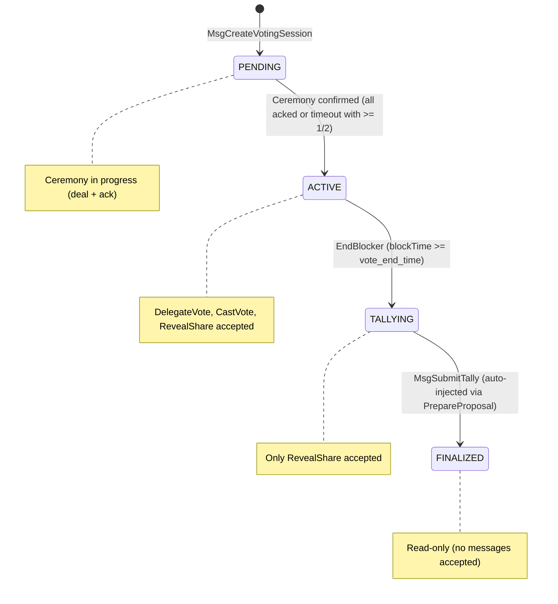

# Session Status Lifecycle

This document describes the `SessionStatus` state machine for `VoteRound`, including state transitions, per-status message acceptance rules, and the belt-and-suspenders validation strategy.

## State Machine



## SessionStatus Enum

| Value | Name | Description |
|-------|------|-------------|
| 0 | `SESSION_STATUS_UNSPECIFIED` | Default/zero value; should never appear on a stored round |
| 1 | `SESSION_STATUS_ACTIVE` | Voting is open; all message types accepted |
| 2 | `SESSION_STATUS_TALLYING` | Voting closed; only `MsgRevealShare` accepted |
| 3 | `SESSION_STATUS_FINALIZED` | Tally complete; round is read-only |
| 4 | `SESSION_STATUS_PENDING` | Ceremony in progress; round is not yet open for voting |

## Per-Status Message Acceptance

| Message Type | PENDING | ACTIVE | TALLYING | FINALIZED |
|---|---|---|---|---|
| `MsgDelegateVote` | **Rejected** | Accepted | **Rejected** | **Rejected** |
| `MsgCastVote` | **Rejected** | Accepted | **Rejected** | **Rejected** |
| `MsgRevealShare` | **Rejected** | Accepted | **Rejected** | **Rejected** |
| `MsgCreateVotingSession` | N/A | N/A | N/A | N/A |

All vote-round messages (including `MsgRevealShare`) require ACTIVE status. `MsgSubmitTally` requires TALLYING status and is handled separately. Shares that don't land on-chain before the vote window closes are rejected — accepting them during TALLYING would corrupt the tally accumulator after partial decryptions have been committed.

## Transitions

### PENDING → ACTIVE

- **Trigger (fast path)**: `MsgAckExecutiveAuthorityKey` — when ALL ceremony validators have acked
- **Trigger (timeout path)**: `EndBlocker` — DEALT phase timeout with >= 1/2 acks; non-ackers are stripped
- **Trigger (timeout reset)**: `EndBlocker` — DEALT phase timeout with < 1/2 acks; ceremony resets to REGISTERING for re-deal (round stays PENDING)
- **Action**: Sets `status = SESSION_STATUS_ACTIVE`, `ceremony_status = CEREMONY_STATUS_CONFIRMED`

### ACTIVE → TALLYING

- **Trigger**: `EndBlocker` runs at the end of every block
- **Condition**: `blockTime >= round.VoteEndTime` for rounds with `status == SESSION_STATUS_ACTIVE`
- **Action**: Sets `status = SESSION_STATUS_TALLYING` via `UpdateVoteRoundStatus`
- **Event**: Emits `round_status_change` with attributes:
  - `vote_round_id`: hex-encoded round ID
  - `old_status`: `SESSION_STATUS_ACTIVE`
  - `new_status`: `SESSION_STATUS_TALLYING`

### TALLYING → FINALIZED

- **Trigger**: `MsgSubmitTally` (auto-injected via `PrepareProposal`)
- **Condition**: Valid tally submission with decrypted accumulators
- **Action**: Sets `status = SESSION_STATUS_FINALIZED`, stores tally results

## Belt-and-Suspenders Validation

`ValidateRoundForVoting` checks **both** the persistent `status` field AND `blockTime < vote_end_time`. This guards against the window between `vote_end_time` passing and the next `EndBlocker` run:

```
ValidateRoundForVoting(ctx, roundID):
  1. Round exists?             → ErrRoundNotFound
  2. Status == ACTIVE?         → ErrRoundNotActive (catches post-transition)
  3. blockTime < vote_end_time → ErrRoundNotActive (catches pre-transition)
```

`MsgRevealShare` now uses `ValidateRoundForVoting` (same as delegation and cast-vote). Shares must land in a committed block before `vote_end_time`.

## Genesis

The `status` field is part of the `VoteRound` protobuf message, so `InitGenesis` and `ExportGenesis` automatically persist and restore it with no extra code needed.
