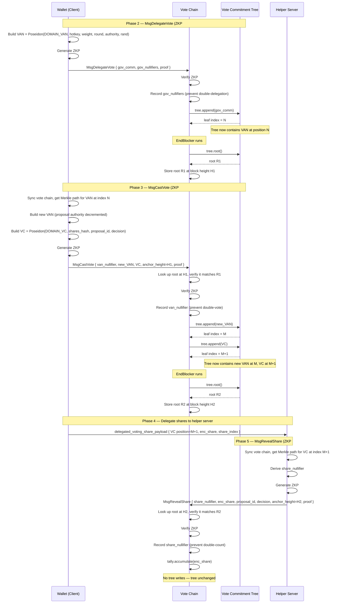
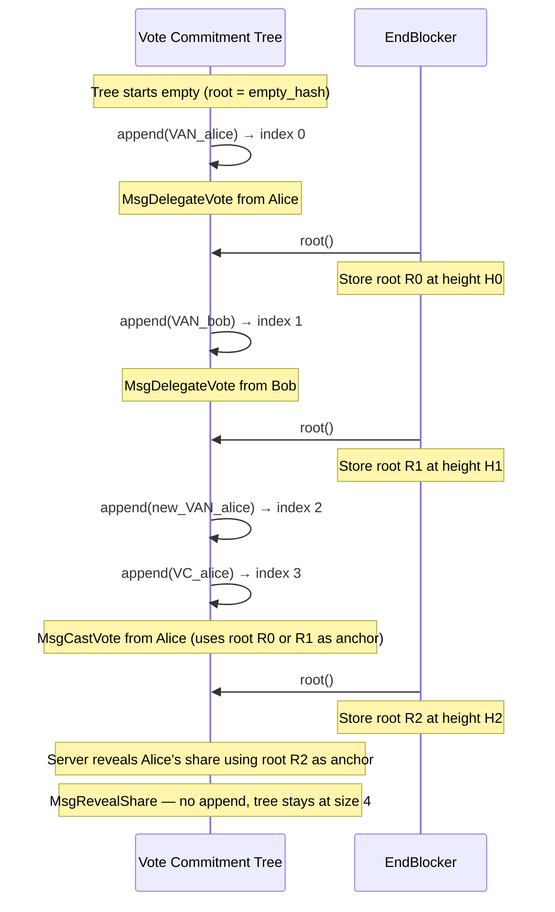

# vote-commitment-tree

Append-only Poseidon Merkle tree for the **Vote Commitment Tree** in the Zally voting protocol (Gov Steps V1).
## Role in the protocol

- **Note commitment tree (ZCash mainnet)**: We only use its root `nc_root` at snapshot height as an anchor for ZKP #1. We do not build it in this repo.
- **Vote Commitment Tree (vote chain)**: This crate implements the tree that the vote chain maintains. It is an append-only Merkle tree of fixed depth (32) whose leaves are:
  - **Vote Authority Notes (VANs)** — from `MsgDelegateVote` and the new VAN from `MsgCastVote`
  - **Vote Commitments (VCs)** — from `MsgCastVote`

Domain separation (DOMAIN_VAN = 0, DOMAIN_VC = 1) is applied when *constructing* leaf values (in circuits / chain); this crate stores and hashes already-committed field elements.

## What is an anchor?

An **anchor** is a committed Merkle root at a fixed point in time that everyone treats as the single reference for checking Merkle proofs.

**Purpose:**

1. **Fixes the tree state.** The anchor is "the root of this tree at this height." Anyone can check that a Merkle path hashes to that root, so the proof is tied to that exact tree state.

2. **Prevents fake or inconsistent trees.** Without an anchor, a prover could use a different tree (or a different root) and still produce a valid-looking path. The verifier would have no agreed root to check against. The anchor is the value the chain has **published and committed to** at a given height.

3. **Time-binds the proof.** "At snapshot height, the note commitment tree had root `nc_root`" and "at vote-chain height H, the vote commitment tree had root R" are statements that bind proofs to a specific moment. That is what "anchor" means: the root you are anchoring your proof to.

**In this protocol there are two anchors:**

- **`nc_root` (Phase 0.2)** — note commitment tree root on **ZCash mainnet** at snapshot height. ZKP #1 checks note-inclusion proofs against this published root so that they target the real main-chain tree, not an invented one.

- **Vote commitment tree root at `vote_comm_tree_anchor_height`** — tree root on the **vote chain** at a given block height. ZKP #2 (VAN membership) and ZKP #3 (VC membership) prove inclusion against this root. The chain stores the root at each height via EndBlocker; provers use the root at their chosen anchor height, and the chain verifies the proof against the stored value.

In one sentence: **the anchor is the agreed Merkle root (and its height) that all inclusion proofs are verified against, so proofs are bound to a single, committed tree state.**

## How the note commitment tree works in ZCash

To understand the vote commitment tree, it helps to understand the structure it mirrors.

### Structure

ZCash maintains a separate **append-only Merkle tree** per shielded pool (Sprout depth 29, Sapling depth 32, Orchard depth 32). Each tree stores **note commitments** — one per shielded output created on-chain. A note commitment is a hash that binds the note's contents (recipient address, value, randomness) without revealing them.

```
                       root
                      /    \
                   h01      h23
                  /   \    /   \
                h0    h1  h2   h3        ← internal nodes: MerkleCRH(layer, left, right)
               /  \  / \  / \  / \
              c0 c1 c2 c3 c4 c5 c6 c7   ← leaf layer: note commitments (or Uncommitted)
              ↑           ↑
           note 0       note 4
```

Key properties:

- **Append-only.** Notes are added at the next available leaf position. No deletions. The tree only grows.
- **Uncommitted leaves.** Unused slots hold a distinguished "Uncommitted" value (e.g. `Fp::one()` for Orchard). This makes empty subtrees deterministic.
- **Layer-tagged hashing.** Internal nodes are `MerkleCRH(layer, left, right)`. For Orchard this is Sinsemilla; for our vote tree it is Poseidon (without the layer tag — just `Poseidon(left, right)`).
- **Root = anchor.** The root at a given block height is the anchor used in spend proofs. A spender proves their note is in the tree by providing a Merkle path from leaf to root, and the verifier checks that root matches a published anchor.

### How the wallet syncs the tree (ZCash mainchain)

The wallet does not store the full tree. It uses **ShardTree** (from the `incrementalmerkletree` / `shardtree` crates) — a sparse representation that only materializes the subtrees needed for witnesses.

**Step 1 — Download compact blocks.** The wallet connects to lightwalletd and streams `CompactBlock` messages. Each contains compact transactions, and each compact transaction contains note commitments:
- Sapling: `cmu` (u-coordinate of Jubjub point)
- Orchard: `cmx` (x-coordinate of Pallas point)

**Step 2 — Trial-decrypt.** For each note commitment, the wallet tries to decrypt the associated ciphertext with its viewing keys. If decryption succeeds, the wallet "marks" that note's position in the tree (via `Retention::Marked`) so the tree retains the subtree needed for a future witness.

**Step 3 — Insert into ShardTree.** The commitments are batch-inserted into the local ShardTree:
```
commitments = [(Node::from_cmx(cmx), Retention)]   // one per output in the block
tree.insert_tree(subtree_from_commitments)
tree.checkpoint(block_height)                        // snapshot for future rollbacks
```

**Step 4 — Subtree root acceleration.** lightwalletd also serves pre-computed subtree roots (one per 2^16 leaves). The wallet inserts these via `put_sapling_subtree_roots` / `put_orchard_subtree_roots`, which fills in the "cap" of the tree without needing every leaf — this is how fast-sync works.

**Step 5 — Witness generation.** When the wallet wants to spend a note, it calls:
```
tree.witness_at_checkpoint_id_caching(note_position, anchor_height)
    → Option<MerklePath>
```
This returns the sibling hashes from the leaf to the root at the given checkpoint height.

### Summary of the ZCash wallet tree API surface

| API | What it does |
|---|---|
| `CompactBlock` (from lightwalletd) | Delivers `cmx` / `cmu` per output per block |
| `ShardTree::insert_tree(subtree)` | Batch-insert note commitments from scanned blocks |
| `ShardTree::checkpoint(height)` | Snapshot current tree state for witness queries |
| `put_subtree_roots(roots)` | Fast-sync: insert pre-computed subtree roots |
| `witness_at_checkpoint_id_caching(pos, height)` | Get Merkle path for a marked note at an anchor height |
| `ShardTree::root_at_checkpoint_id(height)` | Get tree root at a given checkpoint |

## How we modify this for the vote commitment tree

Our vote commitment tree is structurally the same (append-only, fixed-depth Merkle) but differs in important ways. The wallet needs new sync logic for the vote chain.

### Differences from ZCash's note commitment tree

| Aspect | ZCash mainchain | Vote commitment tree |
|---|---|---|
| Hash function | Sinsemilla (Sapling/Orchard) | **Poseidon** (cheaper in-circuit) |
| Layer tagging | Sinsemilla prepends 10-bit level prefix | **No layer tag** — `Poseidon(left, right)` is the same at every level ([rationale](#no-layer-tagging-in-poseidon-combine)) |
| Depth | 32 | 32 |
| Leaf contents | Note commitments only | **Both VANs and VCs** (domain-separated) |
| Where it lives | ZCash mainnet | **Vote chain** (Cosmos SDK) |
| Block format | CompactBlock via lightwalletd | Vote chain blocks via Tendermint RPC / custom API |
| Who inserts | ZCash consensus (every shielded output) | Vote chain consensus (MsgDelegateVote, MsgCastVote) |
| Who needs witnesses | Spender (for spend proofs) | **Voter** (ZKP #2) and **helper server** (ZKP #3) |

### Wallet sync for the vote chain tree

The wallet needs to maintain a local copy of the vote commitment tree so it can produce Merkle paths for ZKP #2. The helper server needs the same for ZKP #3. Both use `TreeClient` (see [Client-Server Architecture](#client-server-architecture) below) which syncs incrementally via the `TreeSyncApi` trait.

**Step 1 — Connect to the vote chain.** The wallet (or helper server) creates a `TreeClient` and syncs from the chain via a `TreeSyncApi` implementation. In the POC this is in-process; in production it maps to Cosmos SDK endpoints:

```rust
let mut client = TreeClient::empty();
client.sync(&server)?; // fetches block commitments, inserts leaves, checkpoints
```

Under the hood, `sync` calls `get_block_commitments(from_height, to_height)` to fetch leaves per block. For each block it inserts every leaf and calls `checkpoint(height)`. The root at each checkpoint must match the chain's stored root (consistency check).

**Step 2 — Mark your positions and generate witnesses.** The wallet knows its own VAN index from when it submitted MsgDelegateVote. It marks that position and generates a witness:

```rust
client.mark_position(my_van_index);
let witness = client.witness(my_van_index, anchor_height).unwrap();
let root = client.root_at_height(anchor_height).unwrap();
// witness.verify(my_van_leaf, root) == true
```

Similarly, when the wallet submits a MsgCastVote, it stores the VC leaf index and sends it to the helper server in the `delegated_voting_share_payload`.

**Step 3 — Helper server sync.** The helper server runs the same sync loop with its own `TreeClient`. When it receives a share payload with a VC position, it marks that position and generates a witness for ZKP #3:

```rust
let mut helper_client = TreeClient::empty();
helper_client.sync(&chain_api)?;
helper_client.mark_position(vc_index);
let witness = helper_client.witness(vc_index, anchor_height).unwrap();
```

### Sync API options

The wallet needs an endpoint that delivers vote chain commitments. Several options:

| Option | How it works | Pros | Cons |
|---|---|---|---|
| **Tendermint RPC** | Query `/block` per height, decode transactions, extract leaves | No new server code | Wallet must parse full Cosmos transactions |
| **Custom compact blocks** | Vote chain serves a compact block format (just leaves per block height) | Clean, minimal bandwidth | Requires new server endpoint |
| **Subtree root acceleration** | Serve pre-computed subtree roots (like lightwalletd) for fast-sync | Fast catch-up for late joiners | More server complexity |
| **Direct tree state query** | `GET /commitment-tree/latest` returns serialized tree or frontier | Wallet can bootstrap from a trusted snapshot | Trust assumption on the server |

The existing vote chain already has `GET /zally/v1/commitment-tree/latest` and `GET /zally/v1/commitment-tree/{height}` query endpoints (`sdk/api/query_handler.go`). These return `CommitmentTreeState` (next_index, root, height). To support wallet sync, we additionally need an endpoint that returns the **leaf values** so the wallet can build the tree locally — or a compact block format that delivers them per block.

### What we reuse from ZCash

- **The append-only Merkle tree concept** — same structure, just different hash and contents.
- **`incrementalmerkletree` / `shardtree` crates** — this crate is built directly on the same tree infrastructure as Orchard. `MerkleHashVote` implements `Hashable` (with Poseidon instead of Sinsemilla), and the tree is a `ShardTree<MemoryShardStore<...>, 32, 4>`. Wallets and helper servers only need Merkle paths for their own positions (wallet: its VAN for ZKP #2; server: delegated VCs for ZKP #3), not for arbitrary leaves — the same sparse-witness situation as Zcash.
- **Witness = Merkle path** — same concept. `tree.path(position, anchor_height)` returns siblings from leaf to root, same shape as ZCash's `MerklePath`.
- **Anchor = root at height** — same concept. `tree.root_at_height(h)` returns the root at a checkpoint. The wallet picks an anchor height, uses that root, and builds the ZKP against it.

### What is new

- **No trial decryption.** All leaves in the vote tree are public (VAN and VC values are public inputs to the chain). The wallet does not need to decrypt anything — it just appends every leaf it sees. Position discovery is trivial: the wallet knows its own VAN index from when it submitted MsgDelegateVote.
- **Sparse witnesses apply the same way as Zcash.** A wallet only needs a Merkle path for its own VAN (ZKP #2). A helper server only needs paths for the specific VCs it was delegated (ZKP #3). Neither needs paths for every leaf. Both still must receive all leaves (or subtree roots) to keep sibling hashes current, but only the subtrees touching their marked positions need to be materialized — exactly as ShardTree works for Zcash wallets.
- **Poseidon hash function.** Must match the circuit's Poseidon (P128Pow5T3 over Pallas Fp). This crate uses the same `PoseidonHasher` as `imt-tree`.

### No layer tagging in Poseidon `combine`

Orchard's Sinsemilla hashes internal nodes as `Sinsemilla(level_prefix || left || right)`, where the 10-bit level prefix acts as domain separation across tree depths. This prevents **second-preimage attacks across levels**: without a level tag, a valid internal node at level *k* could be reinterpreted as a leaf (or a node at a different level) to construct a fraudulent Merkle path that still hashes to the correct root.

Our vote commitment tree does **not** include the level in Poseidon:

```rust
// hash.rs
fn combine(_level: Level, left: &Self, right: &Self) -> Self {
    MerkleHashVote(poseidon_hash(left.0, right.0))
}
```

This is a deliberate choice. Three properties make the attack infeasible in our setting:

1. **Fixed depth enforced by circuits.** ZKP #2 and ZKP #3 hardcode `TREE_DEPTH = 32` — every Merkle path verified in-circuit has exactly 32 sibling hashes. The verifier rejects paths of any other length, so an attacker cannot present an internal node as a leaf in a "shorter" tree. The level ambiguity only matters if the verifier accepts variable-depth proofs, which ours does not.

2. **Consensus-gated insertion.** Only `MsgDelegateVote` and `MsgCastVote` can append leaves, and both require valid ZKPs verified on-chain. An attacker cannot insert an arbitrary field element as a leaf — they must produce a valid delegation proof (ZKP #1) or vote proof (ZKP #2).

3. **Domain-separated commitments with randomness.** Leaves are `Poseidon(DOMAIN_VAN, hotkey, weight, round, authority, rand)` or `Poseidon(DOMAIN_VC, shares_hash, proposal_id, decision)`. The probability that such a commitment collides with an internal node value `Poseidon(left_child, right_child)` is ~1/2^254 (negligible over the Pallas field).

Property (1) alone is sufficient: even if an attacker could somehow produce a leaf equal to an internal node, the circuit would still require a 32-element path from that leaf to the root. The "reinterpret the tree at a different depth" attack is structurally impossible.

**Trade-off**: Omitting the level tag saves one constraint per hash in the circuit's Merkle path verification (no level field element to allocate or constrain). Over 32 levels that is 32 fewer constraints per ZKP #2 / ZKP #3 proof, with no security cost given the properties above.

**If this changes**: If the protocol ever allows variable-depth proofs or adversarial leaf insertion without a ZKP gate, layer tagging should be revisited. Adding it later would change every tree root, Merkle path, and on-chain anchor — effectively a hard fork.

## How the tree participates in each message

Three messages interact with the tree. The first two **write** leaves into it; the third only **reads** from it (via a ZKP). Between blocks, EndBlocker **snapshots the root** so later messages can reference it as an anchor.

### MsgDelegateVote (Phase 2 — ZKP #1) — WRITE only

**What happens:** A voter delegates their mainchain ZEC notes to a voting hotkey. The chain verifies ZKP #1, records governance nullifiers, and **appends the VAN** (the governance commitment `gov_comm`) as a new leaf in the tree.

**Tree's role:** Storage. The VAN is planted into the tree so that future ZKP #2 proofs can prove membership of this VAN. At this point nobody reads from the tree — the tree just grows.

**Why it matters:** Without this append, there would be no leaf for ZKP #2 to prove inclusion against. The VAN must be in the tree before the voter can cast a vote.

```
MsgDelegateVote  ──  tree relationship
─────────────────────────────────────────
  ZKP #1 proves:  "I own unspent ZCash notes"
                  (uses nc_root from mainchain, NOT the vote tree)

  Chain action:   tree.append(gov_comm)   ← VAN goes in as a new leaf
                  tree now has this VAN at index N
```

### MsgCastVote (Phase 3 — ZKP #2) — READ then WRITE

**What happens:** The voter casts an encrypted vote on a proposal. ZKP #2 proves that the voter's **old VAN is already in the tree** (read), then the chain **appends two new leaves** (write): the new VAN (with decremented proposal authority) and the vote commitment (VC).

**Tree's role — read side:** The prover builds a Merkle inclusion proof for the old VAN against the tree root at a specific anchor height (`vote_comm_tree_anchor_height`). The chain looks up the stored root at that height and the ZKP is verified against it. This proves "I hold a registered VAN" without revealing which one.

**Tree's role — write side:** Two new leaves are appended:
1. **New VAN** — same voter, same weight, but proposal authority decremented by 1. This VAN can be spent again to vote on another proposal.
2. **Vote commitment (VC)** — commits to the 4 encrypted shares, proposal ID, and vote decision. This VC will later be opened by ZKP #3.

```
MsgCastVote  ──  tree relationship
─────────────────────────────────────────
  ZKP #2 proves:  "My old VAN is in the tree at anchor root R"
                  (Merkle inclusion proof against vote_comm_tree_root)

  Chain checks:   root_at_height(anchor_height) == R   ← anchor validation
                  van_nullifier not seen before         ← no double-vote

  Chain action:   tree.append(vote_authority_note_new)  ← new VAN, leaf N
                  tree.append(vote_commitment)          ← VC, leaf N+1
```

### MsgRevealShare (Phase 5 — ZKP #3) — READ only

**What happens:** The helper server reveals one encrypted share from a registered vote commitment. ZKP #3 proves that the **VC is in the tree** (read). The chain does NOT write any new leaves.

**Tree's role:** The prover builds a Merkle inclusion proof for the VC against the tree root at a specific anchor height. This proves "this share comes from a real, registered vote commitment" without revealing which VC it came from. The chain then accumulates the encrypted share into the homomorphic tally.

```
MsgRevealShare  ──  tree relationship
─────────────────────────────────────────
  ZKP #3 proves:  "This VC is in the tree at anchor root R"
                  "This enc_share is one of the 4 shares in that VC"
                  (Merkle inclusion proof against vote_comm_tree_root)

  Chain checks:   root_at_height(anchor_height) == R   ← anchor validation
                  share_nullifier not seen before       ← no double-count

  Chain action:   tally.accumulate(enc_share)           ← homomorphic add
                  (no tree writes)
```

### EndBlocker — ROOT SNAPSHOT

Between blocks, EndBlocker computes the current tree root and stores it at the block height. This stored root becomes the **anchor** that future MsgCastVote and MsgRevealShare reference when they say "prove inclusion against the tree root at height H."

```
EndBlocker  ──  tree relationship
─────────────────────────────────────────
  if tree grew this block:
    root = tree.root()
    store root at current block height   ← this root becomes a valid anchor
```

---

## Sequence diagrams

### Full lifecycle: Delegate → Vote → Reveal



### Tree growth over time



---

## Client-Server Architecture

The crate is split into three layers with a clear communication boundary:

```
┌─────────────────────────────────────────────────────────────────┐
│                     Shared Types (hash, anchor, path)           │
│  MerkleHashVote · Anchor · MerklePath · EMPTY_ROOTS · TREE_DEPTH│
└─────────────────────────────────────────────────────────────────┘
         ▲                                          ▲
         │                                          │
┌────────┴──────────┐   TreeSyncApi trait   ┌───────┴──────────┐
│   TreeServer      │ ──────────────────▶   │   TreeClient     │
│                   │                       │                  │
│ append(leaf)      │  get_block_commits()  │ sync(api)        │
│ append_two(a,b)   │  get_root_at_height() │ mark_position(p) │
│ checkpoint(h)     │  get_tree_state()     │ witness(p, h)    │
│ root_at_height(h) │                       │ root_at_height(h)│
│ path(pos, h)      │                       │                  │
└───────────────────┘                       └──────────────────┘
```

Built on `incrementalmerkletree` / `shardtree` — the same crates that back Orchard's note commitment tree — with two substitutions:
- **Hash:** `Poseidon(left, right)` (no layer tagging) instead of Sinsemilla with 10-bit level prefix
- **Empty leaf:** `poseidon_hash(0, 0)` instead of `Fp::from(2)`

The core type is `MerkleHashVote`, which implements `incrementalmerkletree::Hashable` with Poseidon. This plugs into `ShardTree` for checkpoint/rollback, sparse witnesses, and the same battle-tested tree logic that Zcash wallets use. Hash function is Poseidon (same as `imt-tree`) for circuit consistency with ZKP #2 and ZKP #3.

### Module layout

```
vote-commitment-tree/src/
  lib.rs          re-exports shared types + server + client + sync_api
  hash.rs         MerkleHashVote, Hashable impl, EMPTY_ROOTS, constants
  anchor.rs       Anchor type (committed tree root)
  path.rs         MerklePath type (authentication path)
  sync_api.rs     TreeSyncApi trait, BlockCommitments, LeafBatch, TreeState
  server.rs       TreeServer: full tree, append, checkpoint, implements TreeSyncApi
  client.rs       TreeClient: sparse ShardTree, sync, mark, witness
tests/
  client_server_integration.rs   end-to-end server→client→witness tests
```

### Design decisions

- **Server uses ShardTree internally** (not a simpler structure). This keeps the POC code path identical to production. In production, the Go keeper stores leaves in KV and the Rust FFI builds the ShardTree from them; the POC just skips the Go layer.
- **Client also uses ShardTree.** Same crate, same types, but populated via sync rather than direct appends. This mirrors how Zcash wallets work (see `zcash_client_memory/src/wallet_commitment_trees.rs`).
- **`TreeSyncApi` is a trait, not concrete types.** Makes it trivial to swap the in-process POC implementation for a network client (gRPC/REST) in production.
- **All leaves are public.** Unlike Zcash, no trial decryption. The client inserts every leaf it receives. Position discovery is trivial (wallet knows its own VAN index from when it submitted MsgDelegateVote).

### How this maps to production targets

| POC component | Production equivalent |
|---|---|
| `TreeServer` | Go keeper (`sdk/x/vote/keeper/keeper.go`) — already has `AppendCommitment`, `ComputeTreeRoot`, `GetCommitmentRootAtHeight` |
| `TreeSyncApi` trait | Cosmos SDK REST endpoints (`sdk/api/query_handler.go`) + new compact-block endpoint for leaf batches |
| `TreeClient` | Vote-chain equivalent of Zcash `WalletCommitmentTrees` — wallet and helper server each run one |
| `get_block_commitments()` | Custom compact-block endpoint or Tendermint block queries |
| `get_root_at_height()` | `GET /zally/v1/commitment-tree/{height}` (already exists) |
| `get_tree_state()` | `GET /zally/v1/commitment-tree/latest` (already exists) |

## API

### Shared types

- **`MerkleHashVote`** — leaf/node digest (newtype around `Fp`). Implements `Hashable`.
- **`Anchor`** — committed tree root at a block height. Newtype around `Fp` with `from_bytes` / `to_bytes`.
- **`MerklePath`** — authentication path with `root(leaf) -> Anchor` and `verify(leaf, root) -> bool`.
- **`VoteCommitmentTree`** — backwards-compatible type alias for `TreeServer`.

### `TreeServer` (server-side full tree)

Wraps `ShardTree<MemoryShardStore<MerkleHashVote, u32>, 32, 4>`. Owns the authoritative tree, appends leaves, creates checkpoints, and serves data to clients via `TreeSyncApi`.

| Method | Description |
|---|---|
| `TreeServer::empty()` | Create an empty tree |
| `append(leaf: Fp) -> u64` | Append one leaf (e.g. VAN from `MsgDelegateVote`); returns leaf index |
| `append_two(first, second) -> u64` | Append two leaves (e.g. new VAN + VC from `MsgCastVote`); returns first index |
| `checkpoint(height: u32)` | Snapshot tree state at block height (called by EndBlocker) |
| `root() -> Fp` | Current root (at latest checkpoint) |
| `root_at_height(height) -> Option<Fp>` | Root at a specific checkpoint (anchor lookup) |
| `size() -> u64` | Number of leaves appended |
| `path(position, anchor_height) -> Option<MerklePath>` | Witness for a leaf at a checkpoint height |

### `TreeSyncApi` (communication boundary)

Trait defining the contract between server and client. In the POC the server implements it directly (in-process, `Error = Infallible`). In production, a network client would implement it over gRPC/REST.

| Method | Maps to (production) |
|---|---|
| `get_block_commitments(from_h, to_h) -> Vec<BlockCommitments>` | Custom compact-block endpoint |
| `get_root_at_height(h) -> Option<Fp>` | `GET /zally/v1/commitment-tree/{height}` |
| `get_tree_state() -> TreeState` | `GET /zally/v1/commitment-tree/latest` |

Supporting types:

| Type | Fields | Purpose |
|---|---|---|
| `BlockCommitments` | `height`, `start_index`, `leaves` | Leaves appended in one block |
| `LeafBatch` | `start_index`, `leaves` | Flat batch of sequential leaves |
| `TreeState` | `next_index`, `root`, `height` | Current server tree tip |

### `TreeClient` (client-side sparse tree)

Wraps its own `ShardTree<MemoryShardStore<MerkleHashVote, u32>, 32, 4>`, populated via sync rather than direct appends. Used by wallets (for ZKP #2 witnesses) and helper servers (for ZKP #3 witnesses).

| Method | Description |
|---|---|
| `TreeClient::empty()` | Create an empty client tree |
| `sync(api: &impl TreeSyncApi)` | Incremental sync: fetch block commitments, insert leaves, checkpoint |
| `mark_position(pos: u64)` | Mark a leaf position for witness generation (own VAN or delegated VC) |
| `witness(pos, anchor_height) -> Option<MerklePath>` | Generate Merkle path for a marked position |
| `root_at_height(height) -> Option<Fp>` | Verify local root matches server (anchor check) |
| `root() -> Fp` | Current root at latest synced checkpoint |
| `size() -> u64` | Number of leaves synced |
| `last_synced_height() -> Option<u32>` | Latest synced block height |

### Usage example

```rust
use vote_commitment_tree::{TreeServer, TreeClient, TreeSyncApi};
use pasta_curves::Fp;

// Server side (chain / keeper)
let mut server = TreeServer::empty();

// MsgDelegateVote: append VAN
let van_idx = server.append(Fp::from(100));
server.checkpoint(1); // EndBlocker

// MsgCastVote: append new VAN + VC
server.append_two(Fp::from(200), Fp::from(300));
server.checkpoint(2); // EndBlocker

// Client side (wallet / helper server)
let mut client = TreeClient::empty();
client.sync(&server).unwrap(); // fetches blocks 1-2

// Generate witness for VAN at position 0, anchor height 1
client.mark_position(van_idx);
let witness = client.witness(van_idx, 1).unwrap();
let root = server.root_at_height(1).unwrap();
assert!(witness.verify(Fp::from(100), root));

// Roots match between server and client
assert_eq!(client.root_at_height(1), server.root_at_height(1));
assert_eq!(client.root_at_height(2), server.root_at_height(2));
```

### Fast sync optimization (future)

For clients joining late (or the helper server bootstrapping), replaying every leaf from genesis is slow. The planned optimization uses **pre-computed subtree roots** — the same approach Zcash's lightwalletd uses for wallet fast-sync (`put_orchard_subtree_roots`).

Each shard covers `2^4 = 16` leaves. Once full, its root is deterministic and never changes. The server caches these and serves them via a future `get_subtree_roots()` method on `TreeSyncApi`. The client inserts subtree roots at shard-level addresses, skipping individual leaf insertion for completed shards. This gives a **16x bandwidth reduction** (subtree roots vs full leaves).

See `plans/12_vote_tree_client-server_poc_c24eb944.plan.md` for the full fast-sync design.

---

## Integration with the Go chain

The vote chain lives in **`sdk/`** (Cosmos SDK app in Go). It already:

- **Stores leaves** in KV at `0x02 || big-endian index → 32-byte commitment` (one Fp per leaf).
- **Appends** via `keeper.AppendCommitment(kvStore, commitment)` on `MsgDelegateVote` (2 leaves: `cmx_new`, `gov_comm`) and `MsgCastVote` (2 leaves: `vote_authority_note_new`, `vote_commitment`).
- **Computes root in EndBlocker** via `keeper.ComputeTreeRoot(kvStore, nextIndex)` and stores it at the current block height for use as the anchor in ZKP #2 / ZKP #3.

Today `ComputeTreeRoot` is a **placeholder** (Blake2b over all leaves). Production must use the same Poseidon Merkle tree as this crate so that roots and Merkle paths match what the circuits expect.

### Option A — FFI from Go to this crate

- **Build** `vote-commitment-tree` as a C-compatible library (e.g. `cdylib` or static lib) and link it from Go via cgo (same pattern as `sdk/crypto/zkp/halo2` and `sdk/crypto/redpallas`, which link `libzally_circuits`).
- **EndBlocker**: Read leaves `0..nextIndex-1` from KV (each 32 bytes, Fp encoding). Pass them to Rust; Rust builds the tree from that list (or from a serialized tree state), returns the 32-byte root. Go writes the root at the current height.
- **Queries** (if the chain serves Merkle paths): Same: pass leaves (or cached tree) to Rust, call something like `path(index)` and return the path to the client.
- **Data**: Leaves and root are 32-byte Pasta Fp; encoding must match (e.g. canonical little-endian repr used in the circuits).

Rust can expose a minimal C API, e.g.:

- `vote_tree_root_from_leaves(leaves_ptr *uint8, count uint64, root_out *uint8)` — build tree from `count` leaves, write root into `root_out`.
- Optionally `vote_tree_path(leaves_ptr, count, index uint64, path_out *uint8)` for path generation.

The Go keeper continues to own persistence (KV); Rust is used only for the Merkle computation so there is a single implementation of Poseidon and tree structure.

### Option B — Pure Go reimplementation

- Implement the same algorithm in Go: Poseidon P128Pow5T3 over Pasta Fp, same empty-leaf and empty-subtree hashes, same depth (32), same append order.
- Replace `ComputeTreeRoot` with this implementation (iterating leaves from KV and building the root).
- No FFI; the chain stays Go-only. Downside: two code paths (Rust for circuits, Go for chain) must stay in sync for roots and paths.

### Recommended

- **Option A** keeps one source of truth (this crate) and matches the existing FFI pattern used for ZKP and RedPallas. The chain already depends on a Rust build for “real” verification; adding the tree library is consistent with that.
- **Option B** is viable if you want to avoid cgo or ship a chain binary that does not link Rust at all (e.g. “light” build with stub root computation).
